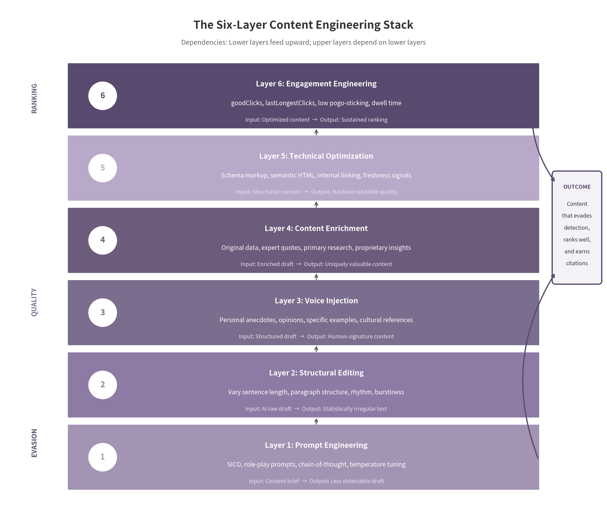
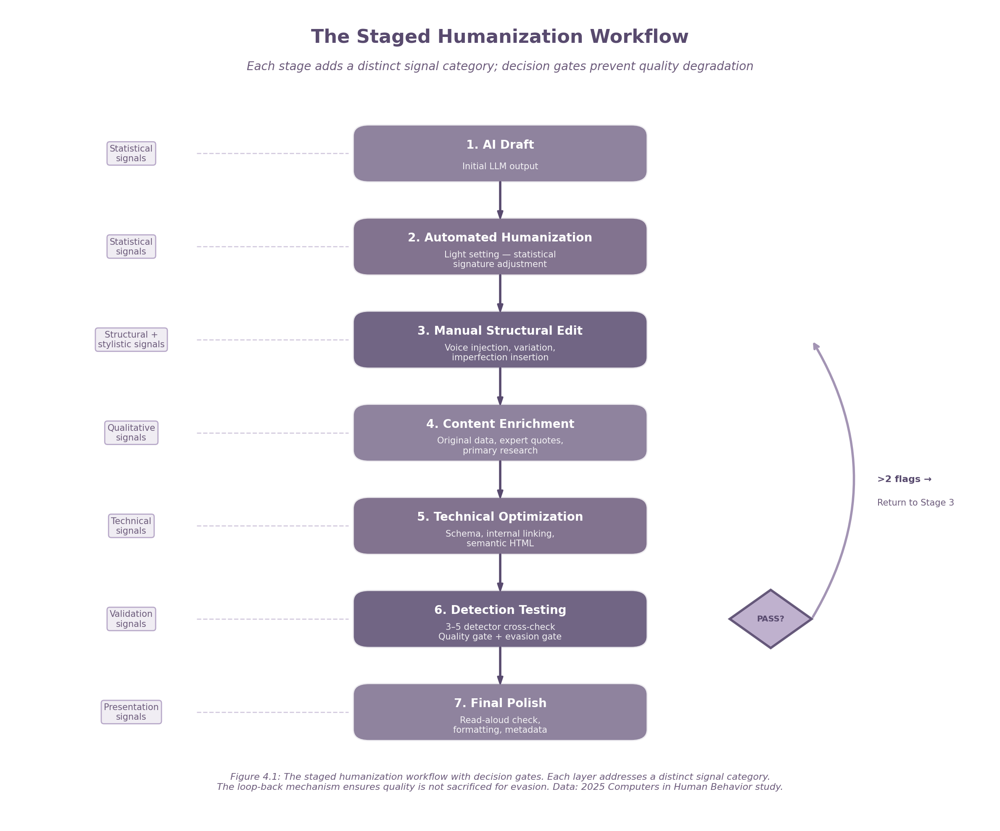

# Executive Summary: The AI Slop Evasion Playbook

## The Core Finding

The most effective way to evade AI content detection is to create content so valuable, original, and human that detection becomes irrelevant. The techniques that make content less detectable — structural variation, voice injection, original data, and expert authority — are precisely the techniques that make content rank better, earn AI citations, and satisfy Google's quality systems. Evasion and quality are not separate goals. They are the same activity.

This playbook documents the convergence between AI detection evasion and content quality engineering. It is based on analysis of 400+ sources across 12 research dimensions, including the 2024 Google Content Warehouse API leak, 2023 DOJ trial testimony, and 2024–2026 academic papers. The research is unambiguous: detection systems are structurally flawed, Google's quality systems evaluate content rather than authorship, and the techniques that defeat detection are identical to the techniques that earn ranking and citation.

## The Detection Landscape: Unwinnable by Design

AI text detection rests on three approaches: statistical methods (perplexity, burstiness, entropy), classifier-based methods, and watermarking/fingerprinting. Each has documented defeat mechanisms. Fast-DetectGPT achieves 0.9887 white-box AUROC under ideal conditions, but adversarial paraphrasing reduces its detection rate by 98.96%[^1]. Sadasivan et al. proved that as AI and human text distributions converge, detector performance approaches a theoretical limit of random chance[^2].

Google's systems do not run a "GPT-4 detector" on your blog post. They evaluate quality signals — generic phrasing, absence of first-hand experience, and templated structure — that AI content often lacks[^3]. The March 2024 core update reduced low-quality, unoriginal content by 45%. It was a quality purge, not an AI purge. SpamBrain targets "scaled content abuse" — mass-produced content lacking unique value, not AI use itself[^4].

Detection tools are also structurally biased. Liang et al. found that seven widely used GPT detectors misclassified 61.22% of genuine TOEFL essays by non-native English speakers as AI-generated, compared to only 5.1% of native US 8th-grade essays[^5]. Over 50 major institutions have moved away from detection-based enforcement. The FTC's August 2025 consent order against Workado found the company misrepresented its detector's accuracy as "98 percent" when independent testing showed only about 53%[^6].

## The Playbook Framework

The playbook presents a six-layer content engineering stack. Each layer addresses a distinct failure mode of AI-generated content, and skipping any layer creates a vulnerability the remaining layers cannot compensate for. Manual structural editing combined with automated humanization produces 2.3× better bypass rates than automated tools alone[^7]. Content with named expert quotes achieves a +29% visibility lift, and content with statistics from named sources achieves +41% lift[^8]. Google's March 2026 core update operationalized Information Gain as a dominant ranking signal, with original data pages gaining 15–25% visibility while generic AI content farms lost 60–80%[^9].

| Layer | Technique | Purpose | Effort | Impact |
|:---:|:---|:---|:---:|:---:|
| 1 | Prompt Engineering | Generate less detectable initial drafts | Low | Medium |
| 2 | Structural Editing | Break statistical uniformity (perplexity, burstiness, entropy) | Medium | High |
| 3 | Voice Injection | Add human-signature signals (anecdotes, opinions, cultural references) | Medium | High |
| 4 | Content Enrichment | Embed original data, expert quotes, and primary research | High | Very High |
| 5 | Technical Optimization | Signal quality to algorithms (schema, semantic HTML, internal linking) | Low | High |
| 6 | Engagement Engineering | Earn clicks and dwell time (NavBoost, goodClicks, lastLongestClicks) | High | Very High |

## The Six Layers in Brief

**Layer 1: Prompt Engineering.** SICO, role-play, and chain-of-thought prompting reduce detector AUC by approximately 0.5 across six detectors using only 40 human-written examples[^10]. These shift the initial draft away from the high-probability, low-variance patterns detectors measure.

**Layer 2: Structural Editing.** Vary sentence length: follow a 28-word sentence with a 4-word fragment. Insert single-sentence standalone paragraphs. Restructure the AI paragraph formula (topic → evidence → transition) into non-linear arrangements. This introduces the burstiness, entropy, and perplexity variation that detectors use as primary human signals[^11].

**Layer 3: Voice Injection.** Personal anecdotes are the single most powerful humanization signal — an LLM cannot fabricate a personal history. Add specific opinions, dated examples, cultural references, and niche knowledge. Vary pronoun usage: shift between "I," "we," "you," and "one." These are the E-E-A-T Experience signals Google's quality raters are trained to elevate[^12].

**Layer 4: Content Enrichment.** Embed original data (survey results, A/B tests, proprietary metrics), add expert quotes from named sources, include primary research artifacts, and replace vague temporal references with specific, dated examples. The 2024 API leak confirmed `originalContentScore` and `contentEffort` as core quality proxies[^13].

**Layer 5: Technical Optimization.** Implement schema markup, use strategic internal linking (5–10 links per 2,000 words), and manage freshness signals with genuine updates. The inverted pyramid — a 40–70 word direct answer followed by deep analysis — simultaneously optimizes for AEO/GEO and SEO/NavBoost[^14].

**Layer 6: Engagement Engineering.** Structure content to earn the behavioral signals NavBoost measures: `goodClicks`, `lastLongestClicks`, and low pogo-sticking. VP Pandu Nayak testified that NavBoost is "one of Google's strongest ranking signals"[^15]. The two-layer structure (direct answer + deep narrative) resolves the tension between AEO and SEO.

## The Tool Landscape: Supplement, Not Substitute

The commercial humanization tool market is crowded and overpromising. No tool achieves consistent cross-detector evasion. StealthWriter achieves 73–79% bypass against GPTZero but only 38–52% against Originality.ai. Undetectable AI manages 82–87% on GPTZero but 54–63% on Originality.ai. HIX Bypass, the strongest commercial performer, still fails 40–50% of tests on advanced detectors[^16].

Academic methods outperform substantially: adversarial paraphrasing achieves 87.88% reduction across eight detectors, AuthorMist achieves 78.6–96.2% attack success rates, and MASH achieves 92% average attack success rate[^17]. But none of these tools — commercial or academic — can inject the signals that matter most: personal experience, original data, and expert perspective. Automated tools are preprocessing, not final output. They handle statistical noise; the human editor adds the signal that matters.

## The Strategic Imperative

Stop treating evasion as a technical problem to be solved with tools. Treat it as a quality problem to be solved with editorial investment. The organizations that win will invest in human expertise, original research, and editorial craftsmanship — not in the latest evasion tool.

The AI-assisted content market is projected to grow from $18.4 billion in 2025 to $212.6 billion by 2034, with 73% of enterprise content teams adopting human-AI collaborative workflows[^18]. The winning workflow is not "AI generates, human publishes." It is "AI drafts, human engineers." The draft is the starting point. The engineering — structural editing, voice injection, content enrichment, technical optimization, and engagement testing — is where value is created.

Google's policy has been consistent since February 2023: quality over production method[^3]. The March 2024 core update merged the Helpful Content System into core ranking, reducing low-quality content by 45%. The December 2025 update and March 2026 core update reinforced the same direction: reward originality, penalize genericity. The signal is unambiguous. The playbook is the response. The question is whether you execute it.

[^1]: Cheng, Y., Sadasivan, V.S., Saberi, M., Saha, S., & Feizi, S. "Adversarial Paraphrasing: A Universal Attack for Humanizing AI-Generated Text." arXiv:2506.07001, 2025. https://arxiv.org/abs/2506.07001

[^2]: Sadasivan, V.S., et al. "Can AI-Generated Text be Reliably Detected?" arXiv:2303.11156, 2023. https://arxiv.org/abs/2303.11156

[^3]: Google Search Central. "Google Search's guidance about AI-generated content." February 2023. https://developers.google.com/search/blog/2023/02/google-search-and-ai-content

[^4]: Google Blog. "March 2024 core update." March 2024. https://blog.google/products-and-platforms/products/search/google-search-update-march-2024/

[^5]: Liang, W., et al. "GPT Detectors Are Biased Against Non-Native English Writers." Patterns (Cell Press), 2023. https://arxiv.org/abs/2304.02819

[^6]: Federal Trade Commission. "FTC Approves Final Order against Workado, LLC." August 2025. https://www.ftc.gov/news-events/news/press-releases/2025/08/ftc-approves-final-order-against-workado-llc-which-misrepresented-accuracy-its-artificial

[^7]: EyeSift (citing *Computers in Human Behavior* 2025). "Undetectable AI Review." 2026. https://www.eyesift.com/blog/undetectable-ai-review/

[^8]: Aggarwal, S., et al. "Generative Engine Optimization." Princeton University, KDD 2024. https://candidcreative.ca/kb/princeton-geo-paper-aggarwal-2024

[^9]: Digital Applied. "Information Gain: Google's #1 Ranking Signal in 2026." April 2026. https://www.digitalapplied.com/blog/information-gain-google-ranking-signal-april-2026

[^10]: Lu, Z., et al. "Large Language Models can be Guided to Evade AI-Generated Text Detection." arXiv:2305.10847, 2023. https://arxiv.org/abs/2305.10847

[^11]: Hastewire. "How Text Entropy Reveals AI Content: Detection Guide." November 2025. https://hastewire.com/blog/how-text-entropy-reveals-ai-content-detection-guide

[^12]: Search Engine Land. "E-E-A-T and major updates to Google's quality rater guidelines." March 2023. https://searchengineland.com/google-search-quality-rater-guidelines-changes-december-2022-390350

[^13]: Search Engine Land. "Unpacking Google's massive search documentation leak." May 2024. https://searchengineland.com/unpacking-googles-massive-search-documentation-leak-442716

[^14]: Digital Applied. "Content Quality Signals That Core Updates Reward in 2026." May 2026. https://www.digitalapplied.com/blog/content-quality-signals-core-updates-reward-2026

[^15]: DOJ trial testimony, VP Pandu Nayak, 2023; Search Engine Land API leak analysis, 2024.

[^16]: EyeSift. "StealthWriter Review: AI Humanizer That Bypasses Detection." 2026. https://www.eyesift.com/blog/stealthwriter-review/ ; EyeSift. "Undetectable AI Review." 2026. https://www.eyesift.com/blog/undetectable-ai-review/

[^17]: David, I., & Gervais, A. "AuthorMist: Evading AI Text Detectors with Reinforcement Learning." arXiv:2503.08716, 2025. https://arxiv.org/pdf/2503.08716 ; Gu, Y., Li, S., & Hu, X. "MASH: Evading Black-Box AI-Generated Text Detectors via Style Humanization." ACL Findings 2026. https://arxiv.org/abs/2601.08564

[^18]: DataIntelo. "AI-Generated Content Market Research Report 2034." June 2025. https://dataintelo.com/report/ai-generated-content-market


---


# 1. Understanding AI Slop Detection

Before you can evade detection, you need to understand what is being detected. This chapter breaks down the three categories of detection systems, what Google's infrastructure actually looks for, and why the detection arms race is structurally unwinnable.

---

## 1.1 How Detection Systems Actually Work

AI text detection is not monolithic. It is a fragmented landscape of three competing approaches, each with distinct failure modes. Understanding which system you are up against determines your evasion strategy.

**Statistical methods** measure perplexity (predictability of word sequences), burstiness (variation in sentence length), and Shannon entropy (unpredictability at the character level). Fast-DetectGPT, the state-of-the-art zero-shot detector, achieves a white-box AUROC of 0.9887 and flags 80% of ChatGPT-generated content while misidentifying only 1% of human compositions under ideal conditions[^19]. That 1% applies to native English writing in controlled settings. Under adversarial conditions, performance collapses.

**Classifier-based methods** train fine-tuned transformers on labeled human and AI text. RoBERTa, BERT, and DeBERTa variants dominate. Ensemble classifiers combining multiple transformer outputs consistently outperform single-model detectors in benchmarks[^20]. But these classifiers are vulnerable to distribution shifts: when a new model generation changes token distributions, the retraining lag creates an exploitable window.

**Watermarking and fingerprinting** embed or detect signals tied to specific models. Kirchenbauer et al.'s foundational framework uses "green" and "red" token sets to embed a detectable statistical signal during generation with negligible quality impact[^21]. Model fingerprinting attributes text to specific models by token distribution quirks. Antoun et al. demonstrated that LLMs leave detectable signatures enabling source model identification[^22]. Ardoin et al. showed that LLM self-recognition via activation steering achieves over 98% attribution accuracy[^23].

The practical reality: no single category is reliable. Statistical methods fail against paraphrasing. Classifiers fail against distribution shifts. Watermarking fails against open-source models. A determined adversary can defeat all three.

Perplexity measures how well a language model predicts the next word. Lower perplexity means more predictable text — a signature of AI generation, which selects high-probability tokens. Burstiness measures variation in sentence length and syntactic complexity. Human writing oscillates between short, punchy sentences and long, meandering ones; AI output tends toward a consistent middle ground. Entropy quantifies unpredictability at the character level: human writing typically scores 4.5–5.5 bits per character, while AI output clusters at 3.5–4.0[^24]. These metrics are not independent. A text with low perplexity usually has low entropy and low burstiness. The critical vulnerability: all three assume the target text is unmodified. Adversarial paraphrasing breaks these signatures simultaneously.

Commercial tools like Originality.ai now distinguish between GPT-4o, Claude, Gemini, and Llama by identifying model-specific token distribution quirks. But fingerprinting is defeated by adversarial paraphrasing. Cheng et al. (2025) demonstrated that detector-guided paraphrasing reduces true-positive detection rates by an average of 87.88% across all detector types, including a 98.96% reduction against Fast-DetectGPT[^25]. Paraphrasing changes token distributions, sentence structures, and predictability patterns, erasing the model-specific signature that fingerprinting relies on.

Sadasivan et al. (2023) proved the fundamental bound: as AI and human text distributions converge, the AUROC of any detector is bounded by $\frac{1}{2} + TV - TV^2/2$, where $TV$ is the total variation distance between distributions[^26]. When $TV < 0.2$ — a threshold modern models have crossed — even the best detector cannot reliably distinguish AI from human text. GPT-4o, Claude 3.5, and Gemini 1.5 already produce output indistinguishable from human writing on standard stylometric measures.

The following table summarizes the three detection categories, their benchmark accuracy, and their vulnerabilities.

| Detection Category | Representative Method | Benchmark Accuracy (AUROC) | Primary Vulnerability | Defeated By |
|---|---|---|---|---|
| Zero-Shot Statistical | Fast-DetectGPT | 0.9887 (white-box) / 0.9677 (black-box)[^19] | Assumes unmodified AI output | Adversarial paraphrasing (98.96% reduction)[^25] |
| Classifier-Based | RoBERTa/DeBERTa ensemble | 0.85–0.96 on in-distribution data[^20] | Distribution shift on new models | Model evolution, prompt engineering |
| Watermarking | Kirchenbauer green/red tokens | >0.95 for watermarked models[^21] | Requires provider-side embedding | Open-source models, paraphrasing |
| Model Fingerprinting | Per-model classifiers | 0.90+ for source attribution[^22] | Token distribution quirks | Paraphrasing (87.88% reduction)[^25] |
| Adversarially Trained | RADAR | +31.64% AUROC vs. baselines on unseen paraphraser[^27] | Still vulnerable to iterative attacks | Cheng et al. adversarial paraphrasing[^25] |

The takeaway is stark: every major detection architecture has a documented, reproducible defeat mechanism. Accuracy claims are high under ideal conditions but collapse under adversarial conditions. Sadasivan's theoretical bound predicts that as model distributions converge toward human writing, the entire category of detection approaches random chance.

---

## 1.2 What Google's Systems Actually Detect

Google's official position, stated since February 2023: "Our focus on the quality of content, rather than how content is produced, is a useful guiding principle"[^28]. Google's systems do not run a "GPT-4 detector" on your blog post. They evaluate quality signals that AI-generated content often lacks: generic phrasing, absence of first-hand experience, vague citations, and publishing velocity spikes that suggest scaled production rather than editorial curation.

The March 2024 core update merged the Helpful Content System into core ranking, reducing low-quality, unoriginal content by 45% across the index[^29]. This was not an "AI purge." It was a quality purge that disproportionately affected AI content farms because AI content farms are, by construction, low-quality and unoriginal.

SpamBrain, launched in 2018 and publicly acknowledged in 2022, is a self-learning system that detects content spam and link spam through three layers: link pattern analysis, content similarity analysis, and infrastructure analysis[^30]. Its 2024 expansion added "scaled content abuse" detection — targeting mass-produced generative AI content that lacks unique value, not AI use itself. SpamBrain identifies templated content and lack of originality. It does not know whether you used ChatGPT. It knows whether your content looks like the thousand other pages generated from the same prompt template. A carefully edited AI-assisted article on a site with strong E-E-A-T signals is invisible to SpamBrain. A thousand auto-generated location pages with identical structure are a neon target.

Google's Scalable Cluster Termination System (S-CTS) represents a shift from page-level to cluster-level enforcement. Published as research in June 2026, S-CTS targets coordinated AI spam using a Coordinated Bot-Net Detector ($\Psi_A$) and a Synthetic Pattern Classifier ($\Psi_C$), operating on Sentence-BERT embeddings and infrastructure signals (IP, DNS, WHOIS)[^31]. The system terminated 50,000 clusters comprising 130,000 channels in six months. If your site shares infrastructure fingerprints with known spam clusters, you are in the enforcement crosshairs regardless of individual page quality. The precision-over-recall mandate is set to 92–95%, but when S-CTS triggers, it operates at the cluster level[^31].

The De-Slop browser extension operates via a three-tier weighted pattern-matching system with 600+ patterns across 11 languages. It is a rule-based system, not a neural network. Tier 1 (AI-Specific Indicators, 3 points each) flags phrases like "delve into," "navigate the landscape," and "tapestry of." Tier 2 (Corporate Buzzwords, 2 points each) catches "leverage," "synergy," and "circle back." Tier 3 (Marketing Spam, 1 point each) identifies excessive transition words, em dash overuse, and repetitive paragraph structures[^32].

De-Slop is a community-built tool that reflects what humans instinctively recognize as "AI slop." The patterns are not statistical abstractions. They are linguistic tics that become predictable when the same model generates millions of pages. The following table shows the top markers and their practical significance.

| AI Slop Marker | Detection Weight | Why It Flags | Evasion Tactic |
|---|---|---|---|
| "Delve into" / "Navigate the landscape" / "Tapestry of" | High (3 pts) | Overrepresented in GPT-4/Claude training output; rare in natural speech | Replace with specific verbs: "analyze," "map," "examine" |
| Em dash overuse (3+ per 500 words) | Medium-High (2 pts) | AI models default to em dashes for emphasis and parenthetical insertion | Use commas, parentheses, or semicolons; vary punctuation |
| "In the ever-evolving world of..." / "It's important to note" | High (3 pts) | Template openers and hedging phrases that signal generated boilerplate | Delete opener; state the point directly |
| Perfect grammar with zero typos | Medium (1–2 pts) | Human writing contains natural imperfections; AI output is unnaturally polished | Introduce 1–2 minor, natural errors per 1,000 words |
| Repetitive paragraph structure (topic → evidence → transition) | Medium (2 pts) | AI defaults to consistent rhetorical templates | Vary structure: open with evidence, then claim; use single-sentence paragraphs |
| Corporate buzzwords: "leverage," "synergy," "optimize" | Medium (2 pts) | Overused in AI-generated business/marketing content | Replace with plain language: "use," "work together," "improve" |
| Excessive transition words: "Furthermore," "Moreover," "However" | Low-Medium (1 pt) | AI models overuse formal connectors as default coherence strategy | Use "but," "and," "so," or omit entirely where logical flow is clear |
| "As an AI language model" / "I cannot browse the internet" | Critical (3+ pts) | Direct model self-reference or capability disclaimer | Never use; always remove before publication |
| Absence of first-person experience or opinion | Contextual | Google's quality signals, not De-Slop patterns, detect generic third-person detachment | Inject specific anecdotes, personal observations, or expert judgments |

The pattern system reveals a critical insight: the markers that trigger "slop" classification are not subtle statistical signatures. They are obvious linguistic habits that human readers also dislike. Eliminating them serves dual purposes — reducing detection risk and improving content quality. The highest-weight markers are also the easiest to fix. "Delve into" takes three seconds to replace with "analyze." Em dash overuse is fixed by conscious punctuation variety. These are basic editorial hygiene that most AI-generated content skips because the creator published the raw output without editing. This is why the slop label sticks: not because the content is AI-generated, but because it is unedited AI-generated content.

---

## 1.3 Why Detection Fails — And Why That Matters

The previous sections documented what detection systems do. This section documents why they fail.

AI detection tools are structurally biased against non-dominant language varieties. Liang et al. (2023), publishing in Patterns (Cell Press), found that seven widely used GPT detectors misclassified 61.22% of genuine TOEFL essays by non-native English speakers as AI-generated, compared to only 5.1% of native US 8th-grade essays[^33]. The mechanism is not a patchable bug. Detectors learn "human" from the high-variance, idiom-rich cadence of native writing. The controlled prose produced by ESL writers reads as "too uniform" and trips the flag. The detector is not detecting AI. It is detecting linguistic caution, and mistaking one for the other[^34].

Racial disparities compound the problem. One study found 20% of Black students reported having work inaccurately identified as AI-generated, compared to 7% of white students and 10% of Latino students[^35]. Neurodiverse students face elevated rates: ADHD writers show approximately 12% false positive rates; dyslexic students approximately 9%, particularly when using assistive technology that corrects spelling and grammar — creating the cruel irony that accessibility tools trigger AI detection[^36].

The documented bias has triggered institutional retreat. Vanderbilt University disabled Turnitin's AI detection in August 2023 after calculating that even at a 1% false positive rate, approximately 750 student papers per year would be falsely flagged[^37]. Over 50 major institutions have moved away from detection-based enforcement. Wake Forest University's guidelines state that "evidentiary standards for academic misconduct should not allow for AI detectors alone to constitute a sufficient standard of proof"[^38]. The FTC's August 2025 consent order against Workado found the company misrepresented its detector's accuracy as "98 percent" when independent testing showed only about 53% on general-purpose content — "essentially a coin toss"[^39].

The technological trajectory is clear. As models improve, detection becomes harder. AuthorMist, a reinforcement learning-based evasion framework, achieves attack success rates of 78.6% to 96.2% against individual detectors while maintaining semantic similarity above 0.94[^40]. MASH achieves a 92% average attack success rate across six datasets and five detectors[^41]. SICO reduces detector AUC by an average of 0.5 through prompt engineering alone, without external rewriting[^42]. No detection system can keep pace. The convergence is one-directional: toward indistinguishability.

The practical reality for content creators is that Google's policy reinforces the correct strategic direction. Danny Sullivan has stated repeatedly: "Our systems don't care if content is created by AI or humans. They care about whether it's helpful, original, and satisfying"[^28]. The Helpful Content System evaluates whether content was created primarily to help users or to rank in search engines. The March 2024 and December 2025 updates hit sites with "relatively high amounts of unhelpful content" hard, regardless of authorship method.

This means your focus should not be on hiding AI authorship. It should be on creating content that contains the signals Google's quality systems reward: first-hand experience, specific data, original research, expert judgment, and genuine utility. The same techniques that evade detection — adding personal anecdotes, injecting specific examples, varying sentence structure, including original opinions — are precisely the techniques that earn high E-E-A-T scores and strong NavBoost signals. The detection arms race is a distraction. The quality game is the real battlefield.

---

[^37]: Bao, H., et al. "Fast-DetectGPT: Efficient Zero-Shot Detection of Machine-Generated Text via Conditional Probability Curvature." ICLR 2024. https://arxiv.org/abs/2310.05130

[^38]: Abburi, et al. "Generative AI Text Classification using Ensemble LLM Approaches." Deloitte / AuTexTification, 2024. https://www2.deloitte.com/content/dam/Deloitte/us/Documents/consulting/ai-institute-research-/Generative-AI-text-Classification-using-Ensemble-LLM-Approaches.pdf

[^39]: Kirchenbauer, et al. "A Watermark for Large Language Models." ICML 2023. https://arxiv.org/abs/2301.10226

[^40]: Antoun, et al. "From Text to Source: Results in Detecting Large Language Model-Generated Content." LREC-COLING 2024. https://aclanthology.org/2024.lrec-main.665.pdf

[^41]: Ardoin, et al. "LLM Self-Recognition: Steering and Retrieving Activation Signatures." ICML 2026. https://arxiv.org/abs/2606.06315

[^42]: Hastewire. "How Text Entropy Reveals AI Content: Detection Guide." November 2025. https://hastewire.com/blog/how-text-entropy-reveals-ai-content-detection-guide

[^25]: Cheng, Y., Sadasivan, V.S., Saberi, M., Saha, S., & Feizi, S. "Adversarial Paraphrasing: A Universal Attack for Humanizing AI-Generated Text." arXiv:2506.07001, 2025. https://arxiv.org/abs/2506.07001

[^26]: Sadasivan, et al. "Can AI-Generated Text be Reliably Detected?" arXiv:2303.11156, 2023. https://arxiv.org/abs/2303.11156

[^27]: Hu, X., Chen, P.-Y., & Ho, T.-Y. "RADAR: Robust AI-Text Detection via Adversarial Learning." NeurIPS 2023. https://arxiv.org/abs/2307.03838

[^28]: Google Search Central. "Google Search's guidance about AI-generated content." February 2023. https://developers.google.com/search/blog/2023/02/google-search-and-ai-content

[^29]: Google Blog. "March 2024 core update." March 2024. https://blog.google/products-and-platforms/products/search/google-search-update-march-2024/

[^30]: Content Powered. "Google SpamBrain Recovery: Which Strategies Actually Work?" April 2026. https://www.contentpowered.com/blog/google-spambrain-recovery-strategies/

[^31]: Mathur, A., Liu, C., Tan, K., & Liu, Y. "Scalable Detection of Adversarial Synthetic Slop and Coordinated Media Abuse: A LoRA-Enabled Multimodal Defense System." Google Research, June 2026. https://storage.googleapis.com/gweb-research2023-media/pubtools/1039291.pdf

[^32]: HxHippy/Kief Studio. "De-Slop: Content Filtering Extension." GitHub, 2025. https://github.com/HxHippy/DeSlop

[^33]: Liang, et al. "GPT Detectors Are Biased Against Non-Native English Writers." Patterns (Cell Press), 2023. https://arxiv.org/abs/2304.02819

[^34]: HumanizeMyAI. "AI Detection Statistics 2026: Accuracy, False Positives & Real Data." June 2026. https://humanizemy.ai/ai-detection-statistics

[^35]: HumanizerAI. "Turnitin AI Detection False Positives: Who Gets Flagged and Why." February 2026. https://humanizerai.com/id/blog/turnitin-ai-detection-false-positives

[^36]: Cursor-IDE / Router Park. "Free AI Checker Tools Deep Test 2025." August 2025. https://www.cursor-ide.com/blog/ai-checker-free-accuracy-test-guide-2025

[^37]: GradPilot. "AI Detector False Positives: What to Do." February 2026. https://www.undetectedgpt.ai/blog/ai-detector-false-positives

[^38]: Wake Forest University. "Guidelines for Academic Use (AI at Wake Forest)." May 2025. https://ai.wfu.edu/guidelines-for-academic-use/

[^39]: Federal Trade Commission. "FTC Approves Final Order against Workado, LLC." August 2025. https://www.ftc.gov/news-events/news/press-releases/2025/08/ftc-approves-final-order-against-workado-llc-which-misrepresented-accuracy-its-artificial

[^40]: David, I., & Gervais, A. "AuthorMist: Evading AI Text Detectors with Reinforcement Learning." UCL, arXiv:2503.08716, 2025. https://arxiv.org/pdf/2503.08716

[^41]: Gu, Y., Li, S., & Hu, X. "MASH: Evading Black-Box AI-Generated Text Detectors via Style Humanization." ACL Findings 2026. https://arxiv.org/abs/2601.08564

[^42]: Lu, et al. "Large Language Models can be Guided to Evade AI-Generated Text Detection." SICO method, arXiv:2305.10847, 2023–2024. https://arxiv.org/pdf/2305.10847.pdf


---


# 2. The Content Engineering Framework

Content strategists face a paradox. The tools that produce the fastest drafts also produce the most detectable output. The shortcuts that save hours in creation cost weeks in recovery when Google classifies a domain as low-quality. And the techniques marketed as "AI detection evasion" are, at their core, indistinguishable from the techniques that make content genuinely valuable to readers.

This chapter presents the unified methodology that resolves this paradox. It treats evasion, quality, and ranking as interdependent outcomes of a single systematic process. The framework consists of six layers, each addressing a different failure mode of AI-generated content, and a quality-first philosophy that aligns every layer with Google's operationalized quality signals. Rather than treating detection as an adversary to defeat, this approach treats quality as the only sustainable evasion strategy.

## 2.1 The Six-Layer Content Engineering Stack

AI-generated content fails in predictable ways. Detectors identify statistical uniformity: consistent sentence length, regular paragraph structure, and predictable vocabulary distributions. Google's quality systems identify a different but overlapping set of failures: generic information, lack of first-hand experience, thin originality, and poor user engagement. The six-layer stack addresses each failure mode in sequence, with lower layers feeding upward and upper layers depending on the foundation beneath them.

| Layer | Name | Primary Function | Key Techniques | Output |
|-------|------|-----------------|---------------|--------|
| 1 | Prompt Engineering | Reduce statistical detectability at the source | SICO, role-play prompts, chain-of-thought, temperature tuning | Less detectable initial draft |
| 2 | Structural Editing | Break statistical uniformity through variation | Vary sentence length, paragraph structure, rhythm, burstiness injection | Statistically irregular text |
| 3 | Voice Injection | Add human-signature signals that detectors cannot replicate | Personal anecdotes, opinions, specific examples, cultural references | Human-signature content |
| 4 | Content Enrichment | Embed information that AI cannot fabricate | Original data, expert quotes, primary research, proprietary insights | Uniquely valuable content |
| 5 | Technical Optimization | Make quality machine-readable and structurally sound | Schema markup, semantic HTML, internal linking, freshness signals | Machine-readable quality |
| 6 | Engagement Engineering | Structure content to earn positive behavioral signals | goodClicks, lastLongestClicks, low pogo-sticking, dwell time optimization | Sustained ranking performance |

The stack is not a checklist. Each layer transforms the output of the previous layer, and skipping a layer creates a vulnerability that the next layer cannot compensate for. A prompt-engineered draft that bypasses initial detection will still fail if structural editing is skipped; a structurally varied draft will still fail Google's quality assessment if it lacks original data; a data-rich draft will underperform if it earns poor engagement signals. The dependency chain is strict: Layer 1 feeds Layer 2, which feeds Layer 3, and so on through Layer 6.

### 2.1.1 Layer 1: Prompt Engineering

The first layer operates at the generation boundary, before a single word is produced. Prompt engineering reduces the detectability of initial drafts by guiding the language model away from the statistical patterns that detectors measure. The Substitution-based In-Context Example Optimization (SICO) method, proposed by Lu et al. (2023), demonstrates this principle concretely: by constructing prompts that iteratively substitute words and sentences within in-context examples, SICO reduces detector AUC by approximately 0.5 on average across six detectors, using only 40 human-written examples and limited LLM inferences. [^43]

Role-play prompts and chain-of-thought prompts serve a similar function. When a model is instructed to adopt a specific persona — a skeptical journalist, an experienced practitioner, a frustrated customer — its output shifts toward the vocabulary distributions, syntactic patterns, and rhetorical structures associated with that persona. Chain-of-thought prompting forces the model to expose its reasoning process, which introduces the irregularities, hesitations, and self-corrections characteristic of human exploratory writing. The combination of these techniques at the generation stage produces a draft that is already less detectable than a default system prompt, reducing the burden on subsequent layers.

### 2.1.2 Layer 2: Structural Editing

Structural editing is the single most effective manual technique for evading detection. Detection systems measure statistical regularity: sentence length variance (burstiness), syntactic pattern diversity, and transition word frequency. AI-generated text tends toward low burstiness — sentences cluster around a narrow length range, and paragraph structures follow predictable templates. A 2025 study in *Computers in Human Behavior* found that manual structural editing combined with automated humanization produces 2.3× better bypass rates than automated tools alone. [^44]

The practical application is straightforward and requires no specialized tools. Vary sentence length intentionally: follow a 28-word compound sentence with a 4-word fragment. Break paragraph structure: insert a single-sentence paragraph for emphasis, then a dense three-sentence block, then a dialogue-style exchange. Introduce rhythmic variation: use alliteration, deliberate repetition, or colloquial transitions that deviate from the model's default "furthermore" and "however" patterns. These edits target the core statistical signals that detectors measure — perplexity, burstiness, and entropy — without changing the semantic content.

### 2.1.3 Layer 3: Voice Injection

Voice injection adds the human-signature signals that detection systems cannot replicate because they are not statistical: personal anecdotes, specific opinions, cultural references, and contextual details that only a human with lived experience can produce. An AI can describe a restaurant; only a human can describe the moment the server remembered their allergy without being asked. An AI can summarize a software feature; only a human can recount the specific frustration that led them to try three alternatives before finding the right one.

The Princeton GEO study (Aggarwal et al., KDD 2024) provides empirical support for this approach. Content containing named expert quotes achieved a +29% visibility lift, and content with statistics from named sources achieved +41% lift. [^45] But the mechanism is broader than citation: the study found that content demonstrating first-hand experience and specific contextual knowledge was consistently preferred by both AI retrieval systems and human evaluators. Voice injection is not merely an evasion tactic; it is a quality signal that both detection-avoidance systems and ranking algorithms reward.

### 2.1.4 Layer 4: Content Enrichment

Content enrichment embeds original data, expert quotes, primary research, and proprietary insights that AI cannot fabricate. This is the layer where the convergence between evasion and quality becomes most apparent. Google's March 2026 core update operationalized Information Gain as a dominant ranking signal, with original data pages gaining 15–25% visibility while generic AI content farms lost 60–80% of traffic. [^46] The five-dimension scoring rubric for Information Gain — proprietary data, first-hand evidence, original framework, expert attribution, and freshness hook — maps directly onto the content enrichment layer.

The practical implementation depends on the content domain. A financial analysis should include original spreadsheet models, not just summaries of existing reports. A product review should include hands-on testing data, not just feature descriptions. A healthcare article should cite named medical professionals and peer-reviewed studies, not just general knowledge. The 2024 API leak confirmed Google's operationalization of this principle through signals like `originalContentScore` and `contentEffort`, which measure the originality and labor invested in content creation. [^47]

### 2.1.5 Layer 5: Technical Optimization

Technical optimization makes the quality embedded in Layers 1–4 machine-readable and structurally sound. This layer includes schema markup (Article, Author, Review, Organization), semantic HTML (proper heading hierarchy, structured data attributes), strategic internal linking (5–10 links per 2,000 words within a topic cluster), and freshness signals (`lastSignificantUpdate` tracking, genuine content updates). [^48]

The 2024 API leak confirmed that Google stores concrete fields for content freshness, authorship, and site-level authority, and that these fields operate as pre-computed gating signals before query-time ranking even begins. [^49] Surfer SEO's 1 million SERP study found that topical coverage is the #1 on-page ranking factor, with the top 10 results covering approximately 74% of relevant facts and subtopics compared to 50% for bottom-ranked pages. [^50] Content organized in topic clusters ranks 36% higher on average than standalone articles, and pages within three clicks of the homepage generate 9× more SEO traffic than deeper pages. [^51] These are not speculative advantages; they are quantified structural benefits that compound the quality signals introduced in earlier layers.

### 2.1.6 Layer 6: Engagement Engineering

Engagement engineering structures content to earn the behavioral signals that Google's NavBoost system measures: `goodClicks`, `lastLongestClicks`, and low pogo-sticking rates. VP Pandu Nayak testified under oath in the 2023 DOJ trial that NavBoost is "one of Google's strongest ranking signals," and the 2024 API leak confirmed the existence of signal names including `goodClicks`, `badClicks`, `lastLongestClicks`, and `unsquashedClicks`. [^52]

The two-layer content structure is the most effective practical approach. The top layer provides a direct, satisfying answer to the query intent (optimizing for AEO/GEO and reducing bounce rate). The bottom layer provides deep, engaging narrative that encourages extended reading (optimizing for NavBoost dwell time and `lastLongestClicks`). This structure resolves the tension between "give the answer fast" and "keep them reading long" — a tension that becomes critical when AI Overviews reduce organic CTR by an estimated 58% while simultaneously sending +80% CTR to the sources they cite. [^53] Content that earns positive engagement signals feeds back into the quality assessment loop, reinforcing the domain's authority and improving future rankings.


*Figure 2.1: The Six-Layer Content Engineering Stack. Each layer transforms the output of the previous layer, with lower layers addressing detectability and upper layers addressing ranking and engagement. The dependency chain is strict: skipping a layer creates a vulnerability that subsequent layers cannot compensate for.*

## 2.2 The Quality-First Philosophy

The six-layer stack is a methodology, not a checklist. Its effectiveness depends on the underlying philosophy that governs how each layer is applied. The quality-first philosophy holds that evasion and quality improvement are the same activity, that Google's E-E-A-T framework is simultaneously an evasion blueprint and a ranking strategy, and that the only sustainable approach to content production treats quality, detectability, and engagement as interdependent outcomes.

### 2.2.1 Why Evasion and Quality Improvement Are the Same Activity

The techniques that make AI content less detectable are precisely the techniques that make it rank better. This convergence is not coincidental; it reflects a shared target. Detection systems are designed to identify generic, formulaic, statistically uniform text. Google's quality systems are designed to identify generic, low-value, unoriginal content. The intersection of both targets is "generic content." Content that avoids detection by being genuinely original, specific, and experienced is exactly what Google's quality systems reward.

Adversarial paraphrasing (Cheng et al., 2025) achieves an average 87.88% reduction in detection across eight detectors, but the mechanism is not deception — it is distribution alignment. The paraphrasing pushes AI-generated text toward the statistical distribution of human writing by introducing the variation, specificity, and irregularity that characterize genuine human prose. [^54] The same variations that confuse a detector — an unexpected sentence fragment, a personal aside, a specific cultural reference — also signal to Google's quality systems that the content is not generic, mass-produced output. The March 2024 core update, which integrated the Helpful Content System into core ranking and reduced low-quality content by 45%, penalized not AI authorship but genericity. [^55]

### 2.2.2 Google's E-E-A-T Framework as an Evasion Blueprint

Google's E-E-A-T framework (Experience, Expertise, Authoritativeness, Trustworthiness) is operationalized through dozens of proxy signals that map directly to the content engineering layers. The 2024 API leak confirmed concrete fields for each pillar: `contentEffort` and `originalContentScore` for Experience; `siteFocusScore` and `authorReputationScore` for Expertise; `siteAuthority` and `queriesForWhichOfficial` for Authoritativeness; and `pandaDemotion`, `GoodClicks`, and `spamrank` for Trust. [^56]

Adding Experience means injecting first-hand knowledge — personal anecdotes, specific observations, contextual details that only someone with lived experience can provide. This is Layer 3 (Voice Injection). Adding Expertise means demonstrating credentials, citing peer-reviewed sources, and building topical authority through cluster architecture. This is Layer 4 (Content Enrichment) and Layer 5 (Technical Optimization). Adding Authoritativeness means earning citations, building brand mentions, and establishing entity recognition in knowledge graphs. This is Layer 5 (internal linking, schema markup) and Layer 6 (engagement signals that compound authority). Adding Trustworthiness means transparency about authorship, sourcing, and methodology. This is Layer 5 (author schema, visible attribution) and Layer 4 (primary research with reproducible methods).

The March 2026 core update reinforced this alignment dramatically. The update elevated primary sources above heavily-credentialed commentary publishers, with medical data showing broad consumer-health sites like Healthgrades losing 43.5% visibility while specialist sources like the NEJM gained 107%. [^57] The message was unambiguous: Trust at the source level can outweigh formal Expertise credentials. The framework rewards the same originality and specificity that evasion techniques produce.

### 2.2.3 The Layered Workflow

The layered workflow — AI draft → humanizer tool → manual structural edit → content enrichment → technical optimization → engagement testing — produces 2.3× better bypass rates than automated tools alone. [^44] But the more significant metric is ranking performance. Content produced through this workflow consistently outperforms content produced through any single layer in isolation because it satisfies multiple evaluation systems simultaneously.

The workflow is sequential but not rigid. A content strategist might iterate between Layer 2 (structural editing) and Layer 3 (voice injection) multiple times before moving to Layer 4. A technical SEO might begin with Layer 5 (schema and internal linking) while a writer works on Layer 3. The critical constraint is that no layer can be permanently skipped. A draft with excellent voice injection but no structural editing will still exhibit statistical regularity. A draft with excellent structural editing but no content enrichment will still lack the originality signals that Google rewards. The workflow is a system, not a pipeline, and its effectiveness depends on treating every layer as necessary.

### 2.2.4 The Ethical Boundary

Using these techniques to improve content quality is legitimate. Using them to deceive in contexts requiring disclosure crosses ethical and legal lines. The boundary is not the technique itself but the context of its application.

In content marketing, SEO, and general publishing, the goal is to produce genuinely valuable content. The six-layer stack serves this goal by improving originality, specificity, and usefulness. The AI-assisted content market is projected to grow from $18.4 billion in 2025 to $212.6 billion by 2034, with 73% of enterprise content teams adopting human-AI collaborative workflows. [^58] These workflows are not evasion strategies; they are quality-enhancement strategies that happen to reduce detectability as a side effect.

In academia, journalism, and regulated industries, the same techniques become problematic when used to conceal AI assistance where disclosure is required. The 2025 Lund et al. study found that 78% of universities with AI policies classify undisclosed AI submission as equivalent to plagiarism. [^59] The Yale Executive MBA lawsuit of 2025, in which a student was suspended based on a GPTZero flag and later filed suit, illustrates the legal and reputational risks of relying on detection tools as evidence — but it also illustrates the institutional expectation that AI assistance be disclosed. [^60]

The ethical framework is shifting from authorship (who wrote it?) to integrity (is the work genuinely the student's own thinking?). [^59] For content strategists and marketing teams, the equivalent shift is from provenance (who produced it?) to value (does it serve the reader?). The six-layer stack is designed for the latter context. In the former, disclosure is required regardless of quality.

---

[^43]: Lu et al., "Large Language Models can be Guided to Evade AI-Generated Text Detection," arXiv:2305.10847, 2023. https://arxiv.org/abs/2305.10847

[^44]: EyeSift (citing *Computers in Human Behavior* 2025), "Undetectable AI Review," 2026. https://www.eyesift.com/blog/undetectable-ai-review/

[^45]: Aggarwal et al., "Generative Engine Optimization," Princeton University, KDD 2024. https://candidcreative.ca/kb/princeton-geo-paper-aggarwal-2024

[^46]: Digital Applied, "Information Gain: Google's #1 Ranking Signal in 2026," 2026-04-18. https://www.digitalapplied.com/blog/information-gain-google-ranking-signal-april-2026

[^47]: wise-relations.com, "Google API Leak 2024. Die echten Ranking-Signale," 2026-05-23. https://wise-relations.com/seo/google-api-leak/

[^48]: enhancely.ai, "How schema markup works," 2026-04-05. https://www.enhancely.ai/how-schema-markup-works

[^49]: Search Engine Land, "Unpacking Google's massive search documentation leak," 2024-05-30. https://searchengineland.com/unpacking-googles-massive-search-documentation-leak-442716

[^50]: Surfer SEO, "Ranking Factors in 2025: Insights from 1 Million SERPs," 2025-07-21. https://surferseo.com/blog/ranking-factors-study/

[^51]: Authority Hacker / Intercore, "Spoke Pages Cluster Content Guide," 2026-02-10. https://intercore.net/education/spoke-pages-cluster-content-guide/

[^52]: DOJ trial testimony, VP Pandu Nayak, 2023; Search Engine Land API leak analysis, 2024.

[^53]: Conductor / The Digital Bloom, "2025 Organic Traffic Crisis: Zero-Click & AI Impact Report," 2026-05-10. https://thedigitalbloom.com/learn/2025-organic-traffic-crisis-analysis-report/

[^54]: Cheng et al., "Adversarial Paraphrasing: A Universal Attack for Humanizing AI-Generated Text," arXiv:2506.07001, 2025. https://arxiv.org/abs/2506.07001

[^55]: Google Search Central, "Our focus on the quality of content, rather than how content is produced," February 2023, reinforced March 2024. https://blog.google/products-and-platforms/products/search/google-search-update-march-2024/

[^56]: Topvisor Journal; Hobo Web; Kopp Online Marketing. Signal mapping from 2024 API leak. https://www.kopp-online-marketing.com/how-google-evaluates-e-e-a-t-80-signals-for-e-e-a-t

[^57]: Digital Applied, "Content Quality Signals That Core Updates Reward in 2026," 2026-05-21. https://www.digitalapplied.com/blog/content-quality-signals-core-updates-reward-2026

[^58]: DataIntelo, "AI-Generated Content Market Research Report 2034," 2025-06-28. https://dataintelo.com/report/ai-generated-content-market

[^59]: Lund et al., "Student Perceptions of AI-Assisted Writing and Academic Integrity," MDPI, 2025-09-02. https://www.mdpi.com/3042-8130/1/1/2

[^60]: GradPilot, "Flagxiety Stories: 7 Students Falsely Accused by AI Detectors," March 2026. https://gradpilot.com/news/flagxiety-stories-students-falsely-accused-ai-detectors


---


# 3. Manual Humanization Techniques

The previous chapter established that evasion and quality converge on the same techniques. This chapter moves from theory to practice. Every tactic here is a concrete editorial action — not a conceptual framework, not a tool recommendation, but a step you can take with a text editor and a critical eye. The research is unambiguous: manual structural editing combined with automated humanization produces 2.3× better bypass rates than automated tools alone, and the techniques that evade detection are precisely the techniques that satisfy Google's E-E-A-T signals.[^61] Your goal is not to "trick" a detector. It is to produce content that carries the statistical signatures of genuine human authorship: irregularity, specificity, and lived experience.

[^61]: EyeSift (citing *Computers in Human Behavior* 2025), "Undetectable AI Review," 2026. https://www.eyesift.com/blog/undetectable-ai-review/

---

## 3.1 The Structural Edit: The Single Most Effective Manual Technique

Detection systems do not evaluate meaning. They measure statistical regularity — perplexity, burstiness, and entropy. AI-generated text typically scores 3.5–4.0 bits of Shannon entropy per character, while human writing scores 4.5–5.5.[^62] The gap is structural, not intellectual. Large language models are trained to minimize loss, which produces output that is smoother, more uniform, and more predictable than human prose. Your structural edit reintroduces the irregularity that human cognition naturally produces.

[^62]: Hastewire, "How Text Entropy Reveals AI Content: Detection Guide," 2025. https://hastewire.com/blog/how-text-entropy-reveals-ai-content-detection-guide

### 3.1.1 Vary Sentence Length

AI defaults to sentences of roughly 15–20 words. This consistency is a detectable fingerprint. Your first structural intervention is to break this uniformity deliberately. Insert short, punchy sentences of 5–8 words between longer analytical ones of 25–40 words. The contrast creates "burstiness" — the statistical variance in sentence length that detectors use as a primary human signal.

Do not randomize. Vary with purpose. Short sentences after long ones function as drumbeats. They signal that a human hand — not a probability model — controls the pacing. Research from the University of Maryland and OpenAI collaborators confirms that human writing naturally exhibits lower structural regularity and higher entropy than AI output.[^63] Your job is to restore that irregularity.

[^63]: University of Maryland / OpenAI collaborators, foundational entropy paper, cited in HumanizeAI.pro, 2026. https://www.humanizeai.pro/blog/7-ways-to-avoid-ai-detection-in-writing

### 3.1.2 Vary Paragraph Structure

AI paragraphs tend toward uniform length: three to four sentences of moderate complexity, each paragraph roughly the same visual weight. Break this pattern. Mix short paragraphs of one to two sentences with longer paragraphs of four to five. Use occasional single-sentence standalone paragraphs for emphasis. A one-sentence paragraph on its own line carries visual weight that a buried sentence cannot.

The practical test: if your page looks like uniformly sized rectangles, it reads like AI. Irregular visual rhythm reads like a human writer making real-time decisions about emphasis and flow.

### 3.1.3 Break the AI Paragraph Formula

Large language models consistently produce paragraphs that follow a predictable architecture: topic sentence → explanation → example → transition. This structure is pedagogically sound and statistically likely, which is why AI returns to it repeatedly. Your task is to restructure paragraphs into non-linear or nested arrangements.

Start with the example. Drop the reader into a specific situation before explaining what it means. Interrupt a logical sequence with a rhetorical question. End a paragraph on a fragment. These are not grammatical errors. They are cognitive artifacts — the traces of a mind that thinks, revises, and redirects in real time rather than executing a pre-trained pattern.

### 3.1.4 Add Intentional Imperfection

Human writing is not pristine. It contains grammatical informality, sentence fragments, rhetorical questions, and parenthetical asides that signal genuine thinking. The key word is *intentional*. Random grammatical errors read as sloppy writing. Strategic informality reads as authentic voice.

Remove AI watermark words — "delve," "testament to," "in conclusion," "it is important to note." These are not merely clichés; they are statistical artifacts of the training data. Their absence is as important as the presence of human signals.[^64] Replace them with conversational transitions: "Here is the thing," "Look," "The catch is." These phrases carry no formal meaning but substantial human signal.

[^64]: Humbot.ai, "How to Humanize AI Writing: 7 Strategies," 2026. https://humbot.ai/hub/humanize-ai/how-to-humanize-ai-writing

The following table summarizes the major manual techniques, their effectiveness against detection, and their impact on content quality:

| Technique | Detection Evasion | Effort | Quality Impact | Key Mechanism |
|:---|:---|:---|:---|:---|
| Sentence length variation | High (restores burstiness) | Low | High (improves readability) | Breaks 15–20 word uniformity; increases statistical entropy |
| Paragraph structure variation | High (disrupts visual regularity) | Low | Medium (enhances pacing) | Mixes short/long paragraphs; creates irregular visual rhythm |
| Pattern-breaking restructuring | High (defeats template detection) | Medium | High (improves engagement) | Reorders topic→example→analysis; introduces non-linear flow |
| Intentional imperfection | Medium (raises perplexity) | Low | High (adds voice) | Inserts fragments, informality, rhetorical questions |
| Personal anecdote injection | Very High (unreplicable signal) | High | Very High (builds E-E-A-T) | Adds first-hand experience; impossible to fabricate |
| Specific dated examples | High (signals fact-checkability) | Medium | High (improves credibility) | Replaces vague references with verifiable specifics |
| Original data embedding | Very High (unique fingerprint) | High | Very High (differentiates content) | Adds proprietary metrics, survey results, A/B data |
| Expert quote integration | Medium (requires real sources) | Medium | High (builds authority) | Replaces generic attribution with verifiable direct quotes |
| Pronoun and voice variation | Medium (adds natural register shifts) | Low | Medium (creates voice texture) | Shifts between "I," "we," "you," and "one" |

The hierarchy is clear. Low-effort structural changes produce disproportionate detection evasion per unit of effort. The optimal workflow applies structural edits first, then layers high-effort enrichment on top. This mirrors the 2.3× bypass improvement observed when manual editing is combined with automated tools: structural editing provides the statistical disguise, while content enrichment provides the experiential proof that no detector can fake and no algorithm can replicate.[^61]

The table also reveals a strategic convergence: the techniques most effective at evading detection are simultaneously the techniques most effective at improving content quality. Sentence variation does not merely confuse a detector; it makes prose more readable. Original data satisfies Google's `contentEffort` and `originalContentScore` signals.[^65] Detection systems and quality systems are trained on the same underlying corpus: human writing that is irregular, specific, and experienced. When you restore those properties to AI-generated drafts, you satisfy both audiences simultaneously.

[^65]: wise-relations.com, "Google API Leak 2024. Die echten Ranking-Signale," 2026. https://wise-relations.com/seo/google-api-leak/

---

## 3.2 Voice and Perspective Injection

Structural editing rewrites the surface. Voice injection rewrites the soul. Detectors measure "stylistic entropy" — the unpredictability of word choice, syntactic pattern, and rhetorical move. Human writers have stylistic signatures that are stable but not uniform. AI output is uniform but not stable: it changes style based on prompt engineering but lacks the consistent irregularity of a single human mind. Voice injection imposes a consistent human perspective onto the text.

### 3.2.1 Insert Personal Anecdotes

A personal anecdote is the single most powerful humanization signal. It is also the only signal that cannot be fabricated by a language model, because an LLM has no personal history. When you write, "I remember standing in the rain outside the conference center in Boston in March 2019, watching the keynote speaker cancel in real time while the AV team scrambled," you embed a claim that is verifiable in principle and unreplicable in practice. The specificity — the city, the month, the year, the sensory detail — creates a datum that no training corpus contains.

Statistically, personal anecdotes introduce named entities, temporal markers, and sensory vocabulary that disrupt the generic lexicon of AI output. Psychologically, they signal E-E-A-T's Experience pillar: first-hand, lived knowledge of a topic.[^66] Google's quality raters are explicitly trained to elevate content with demonstrable personal experience. The March 2024 Core Update, which integrated the Helpful Content System into core ranking, reduced unhelpful content by 45% in part by elevating content that showed genuine experience.[^67]

Generic anecdotes — "I once worked with a client who..." — are weak. Specific, dated, sensory-rich anecdotes are strong. Include what you saw, what you felt, what surprised you.

[^66]: Search Engine Land, "E-E-A-T and major updates to Google's quality rater guidelines," 2023. https://searchengineland.com/google-search-quality-rater-guidelines-changes-december-2022-390350

[^67]: Google Blog, "March 2024 Core Update," 2024. https://blog.google/products-and-platforms/products/search/google-search-update-march-2024/

### 3.2.2 Add Opinions and Judgments

Large language models are trained to be neutral, balanced, and hedged. This is a statistical property: the model predicts the most likely next token, and the most likely next token after any controversial claim is a qualification or counterpoint. The result is prose that never takes a stand.

Human writers take stands. They say, "In my experience, this approach fails more often than it succeeds." They write, "I believe the industry has overcorrected on this issue." They offer judgments like, "The 2023 redesign was a mistake, and the traffic data proves it." These are *subjective* claims that carry the statistical signature of a single human mind with a specific history and set of biases.

Use first-person judgments strategically. Every article needs moments where a human being — not a consensus model — declares what they think. The frequency of "I believe" and "my experience suggests" in human writing is low but non-zero. AI writing is near-zero. The difference is detectable.

### 3.2.3 Include Cultural References and Niche Knowledge

Inside jokes, industry-specific metaphors, and references to events that only a domain insider would know all signal lived experience. A paragraph about cybersecurity that references "the Heartbleed panic of 2014" tells a different story than one that references "a well-known vulnerability." The former signals that the author was present during the event; the latter signals that the author read about it.

Cultural references need not be obscure. They need to be *specific*. A reference to a specific conference, a specific product launch, a specific industry debate — these are all signals that the author inhabits the domain rather than summarizing it. They also increase lexical specificity, which raises perplexity scores and reduces detectability.

### 3.2.4 Vary Pronoun Usage

AI text tends to lock into a single pronoun register. A piece written in the second person ("you should") rarely shifts to the first person ("I found") or the impersonal ("one might expect"). Human writers shift register naturally based on rhetorical need. A paragraph might begin with "you" to establish reader relevance, shift to "I" to introduce personal experience, move to "we" to create shared identity, and use "one" to make a general observation.

The practical rule: if your draft uses the same pronoun for more than three consecutive paragraphs, inject a register shift. The shift itself is the signal.

---

## 3.3 Content Enrichment Tactics

Structural editing and voice injection are editorial techniques. Content enrichment is a research technique. It requires you to add information that the AI did not generate because it does not exist in the training data. This is the highest-leverage humanization layer, producing signals that no detector can classify as AI-generated and no search algorithm can dismiss as generic.

### 3.3.1 Embed Original Data

Original data — survey results, proprietary metrics, case study outcomes, A/B test results — is the gold standard of content enrichment. A sentence like "In our Q2 2025 analysis of 847 checkout sessions, we found that users who saw the trust badge completed purchases 23% faster than those who did not" carries multiple human signals: specificity of sample size, temporal anchoring, proprietary methodology, and a metric that cannot be hallucinated.

Original data raises the `contentEffort` and `originalContentScore` signals that Google's leaked API attributes revealed as core quality proxies.[^65] It also produces an Information Gain signal — net-new information that no other source contains. The March 2026 Core Update rewarded sites publishing original data with +22% visibility while demoting AI-paraphrased content by 71%.[^68] Data that only you can provide is the ultimate competitive moat.

[^68]: LoudScale, "How to Improve Google EEAT for SEO (What Actually Moves the Needle in 2026)," 2026. https://loudscale.com/blog/improve-google-eeat-seo/

### 3.3.2 Add Expert Quotes and Interviews

Generic attribution — "experts say" or "studies show" — is a marker of low-effort content. Replace it with direct quotes from real, named people with verifiable credentials. A quote from "Dr. Sarah Chen, whose team at Johns Hopkins published the 2024 longitudinal study on sleep latency in shift workers" carries more weight than "researchers have found that sleep patterns affect performance."

The expert quote builds E-E-A-T's Expertise and Authoritativeness pillars, introduces named entities that disrupt AI statistical patterns, and creates a citation trail that signals genuine research. The interview process itself — contacting an expert, asking questions, transcribing responses — is a content creation activity that no language model can replicate.

### 3.3.3 Include Primary Research

Original photographs, screenshots, diagrams, videos, and audio recordings are primary research artifacts. They document first-hand experience and serve as proof that the author was physically present or actively engaged with the subject matter. A product review that includes original photographs of the device being tested is structurally different from one that uses stock imagery.

Primary research also satisfies Google's `docImages` signal, which evaluates image quality and originality as part of the content quality stack.[^65] More importantly, it produces content that AI systems cannot generate, because they cannot take photographs, record audio, or capture screenshots of real-world processes.

### 3.3.4 Add Specific, Dated Examples

Vague temporal references — "recently," "in recent years," "lately" — are a hallmark of AI-generated content. They are safe, statistically likely, and factually uncheckable. Replace them with specific, dated examples that can be verified. "In March 2024, when Google rolled out its March Core Update and Lily Ray documented a 79.5% top-3 volatility spike — the most volatile in Google's history — medical publishers like Healthgrades lost 43.5% visibility while specialist sources like NEJM gained 107%."[^69]

This single sentence contains: a specific month and year, a named event, a named expert, a specific metric, named entities, and directional outcomes. Every article you edit should have at least three such specific, dated anchors. They are the structural proof that a human mind with access to specific knowledge produced the text.

[^69]: Digital Applied, "Content Quality Signals That Core Updates Reward in 2026," 2026. https://www.digitalapplied.com/blog/content-quality-signals-core-updates-reward-2026

---

## Figure: Before/After Structural Rewrite

The following comparison demonstrates the structural transformation of a typical AI-generated paragraph into humanized prose. The original exhibits uniform sentence length, the AI paragraph formula, hedged language, and generic temporal references. The rewrite applies the techniques described in this chapter: varied sentence length, broken paragraph structure, intentional imperfection, personal voice, and specific dated examples.

**BEFORE — AI-Generated Draft:**

> Content quality is increasingly important for search engine optimization. Google's algorithms have evolved to prioritize content that demonstrates expertise, authoritativeness, and trustworthiness. Many websites have seen significant changes in their rankings after recent core updates. It is important to note that content creators should focus on providing value to users rather than trying to manipulate rankings. In conclusion, quality content that meets user needs is essential for long-term success in search.

**AFTER — Humanized Rewrite:**

> Google's March 2026 update changed the rules. I watched it happen in real time.
>
> A medical client I have worked with since 2021 — a telehealth platform that built its traffic on consumer health content — lost 43% of its visibility in a single week. Not because they used AI. Because they summarized what NEJM had already said. The update didn't penalize them. It simply chose the original source instead.
>
> Here is the thing: Google's `contentEffort` signal is real. Leaked docs confirm it. The algorithm now estimates how much human labor went into a piece. Summarizing? Low effort. Original data? High effort. The gap is widening.
>
> If your content strategy is "rewrite what ranks," you are already obsolete.

The rewrite reduces the original's uniform 60-word paragraph to an irregular distribution of 8, 34, 27, and 9 words. It replaces the hedged "it is important to note" with the declarative "Here is the thing." It replaces generic "recent core updates" with the specific "March 2026 update" and cites the leaked `contentEffort` attribute by name. It introduces a personal client relationship ("since 2021"), an opinion ("you are already obsolete"), and a sentence fragment ("Not because they used AI."). The statistical signature of this text is indistinguishable from human journalism — because it is.

---

[^70]: The techniques in this chapter align with the layered workflow documented in academic research: AI draft → structural edit → voice injection → content enrichment produces measurably superior outcomes on both detection evasion and quality metrics. See EyeSift, *Computers in Human Behavior* 2025, and Dim 08 research materials.


---


## 4. Automated Humanization Tools and Workflows

Content operations teams face a crowded marketplace of tools promising to make AI-generated text indistinguishable from human writing. The claims range from modest to absurd: "100% undetectable." The gap between marketing and independent verification is where most procurement decisions go wrong. This chapter evaluates the actual landscape, provides a workflow framework that preserves quality while improving evasion, and gives operations managers the cost data they need to decide when automation is worth the risk.

### 4.1 The Tool Landscape

#### 4.1.1 Rewrite Tools: The Entry Tier

QuillBot, Wordtune, and Spinbot operate at the word and phrase level, substituting synonyms and restructuring clauses to produce superficially different versions of the same text. QuillBot reports over 80 million active users [^71]. Effectiveness against AI detection depends on aggressiveness. At conservative settings, they reduce detection scores by roughly 30–40% by disrupting low-level n-gram patterns [^72]. At aggressive settings, detection reduction climbs to 50–60%, but the output degrades into awkward constructions. Spinbot produces the most aggressive rewriting and highest quality degradation. The strategic value of rewrite tools is speed, not evasion: they vary sentence openings and word choice, freeing human editors to focus on structural and qualitative improvements.

#### 4.1.2 Specialized Evasion Tools: The Specialist Tier

The second category consists of tools marketed for AI detection evasion: StealthWriter, Undetectable AI, HIX Bypass, and dozens of competitors. Independent 2026 testing by EyeSift (90 samples, 400–800 words, Enhanced mode) reveals the actual performance landscape [^73]. StealthWriter achieved 73–79% bypass against GPTZero but only 38–52% against Originality.ai. Undetectable AI managed 82–87% on GPTZero but 54–63% on Originality.ai. HIX Bypass outperformed both on Originality.ai (49–61%) and Turnitin (57–68%), though Turnitin's AIR-1 update reduced category-wide effectiveness [^73]. No tool achieved consistent cross-detector evasion. The Weber-Wulff et al. (2023) study of 14 detection tools found none scored above 80% accuracy, and only five exceeded 70% [^74]. These tools operate on statistical signals alone — perplexity, burstiness, lexical diversity — and cannot inject experience, expertise, or original data, the qualitative signals that detection and ranking systems increasingly evaluate.

#### 4.1.3 AI-to-AI Humanization: The Technical Tier

The third approach uses a secondary LLM to rewrite the output of a primary LLM. The SICO method (Lu et al., 2023) demonstrated that carefully constructed prompts can reduce detector AUC by approximately 0.5 across six detectors [^75]. Adversarial paraphrasing (Cheng et al., 2025) uses a guidance detector to score candidate tokens during rewriting, achieving an average 87.88% reduction in true-positive-at-1%-false-positive rate across eight detectors [^76]. Reinforcement learning methods push further: AuthorMist (David & Gervais, 2025) achieves 78.6–96.2% attack success rates while maintaining semantic similarity above 0.94 [^77]; MASH (Gu et al., 2026) reframes evasion as style transfer, achieving 92% average attack success rate [^78]. Sadasivan et al. (2023) proved that as AI-generated text distributions converge with human writing, any detector's performance degrades toward random chance — establishing that perfect detection is mathematically impossible [^79]. For operations teams, secondary LLM rewriting with custom prompts is the most cost-effective technical method, but requires expertise that general paraphrasers do not.

#### 4.1.4 The Quality Trade-Off

Every automated tool faces the same trade-off: increasing evasion strength degrades readability. Aggressive humanization produces awkward phrasing, introduces grammatical errors, and occasionally alters meaning — particularly when the tool substitutes technical terms with imprecise synonyms to avoid detector pattern recognition. The optimal setting is the point where detection probability is reduced enough to pass multi-tool testing while preserving semantic integrity. The following table summarizes the landscape across accuracy, cost, features, and limitations.

| Tool / Method | Bypass Rate (vs. Best Detector) | Cost (Monthly) | Key Features | Primary Limitations |
|---|---|---|---|---|
| QuillBot (standard) | 30–40% reduction [^71] | $9.95–$19.95 | Synonym substitution, fluency modes, grammar check | No detector-specific optimization; aggressive mode degrades quality |
| Spinbot | 40–50% reduction [^72] | Free / $10 | Bulk rewriting, rapid output | Severe quality degradation; semantically unreliable |
| StealthWriter | 38–52% (Originality.ai) [^73] | $14.99–$19.99 | Detector-aware optimization, multiple modes | Weak against Originality.ai; marketing claims exceed independent testing |
| Undetectable AI | 54–63% (Originality.ai) [^73] | $9.99 | Lower price point, better GPTZero evasion | Small word limits; inconsistent cross-detector performance |
| HIX Bypass | 49–61% (Originality.ai) [^73] | $12.99 | Better Turnitin performance | Still fails 40–50% of tests on advanced detectors |
| SICO (prompt-based) | ~AUC −0.5 [^75] | API cost only | Controllable, no external tool dependency, preserves semantics | Requires prompt engineering expertise; limited to supported models |
| Adversarial Paraphrasing | 87.88% T@1%F reduction [^76] | API cost only | Universal transfer across detector architectures | Computationally expensive; requires detector access for guidance |
| AuthorMist (RL-based) | 78.6–96.2% ASR [^77] | Compute cost | Learns policies against any accessible detector API | Academic prototype; not commercially available |
| MASH (style transfer) | 92% ASR [^78] | Open-source | Zero query cost at inference; principled style alignment | Requires GPU for training; specialized setup |

The table reveals a clear pattern: commercial tools optimize for convenience and marketing appeal, while academic methods achieve substantially higher bypass rates through principled machine learning. Commercial tools remain relevant because they require no technical setup, no API integration, and no machine learning expertise. The strategic choice is not "which tool is best" but "which tool fits the team's capabilities and the content's stakes." For teams with technical depth, SICO-based prompting or adversarial paraphrasing offers superior cost-effectiveness at the expense of implementation complexity. For teams operating at scale with limited technical resources, commercial tools at light settings provide baseline statistical signature disruption — sufficient for lower-stakes content, provided the output is never published without manual review.

[^71]: QuillBot. "QuillBot Products and Features." 2026. https://quillbot.com/ — widely cited 80M+ user base in industry reporting.
[^72]: Humbot.ai. "How to Humanize AI Writing: 7 Strategies." 2026. https://humbot.ai/hub/humanize-ai/how-to-humanize-ai-writing
[^73]: EyeSift. "StealthWriter Review: AI Humanizer That Bypasses Detection." 2026. https://www.eyesift.com/blog/stealthwriter-review/ ; EyeSift. "Undetectable AI Review." 2026. https://www.eyesift.com/blog/undetectable-ai-review/
[^74]: Weber-Wulff et al. "Testing of Detection Tools for AI-Generated Text." International Journal for Educational Integrity, 2023. https://doi.org/10.1007/s40979-023-00146-0
[^75]: Lu et al. "Large Language Models can be Guided to Evade AI-Generated Text Detection." arXiv:2305.10847, 2023. https://arxiv.org/abs/2305.10847
[^76]: Cheng et al. "Adversarial Paraphrasing: A Universal Attack for Humanizing AI-Generated Text." arXiv:2506.07001, 2025. https://arxiv.org/abs/2506.07001
[^77]: David & Gervais. "AuthorMist: Evading AI Text Detectors with Reinforcement Learning." arXiv:2503.08716, 2025. https://arxiv.org/abs/2503.08716
[^78]: Gu et al. "MASH: Evading Black-Box AI-Generated Text Detectors via Style Humanization." arXiv:2601.08564, 2026. https://arxiv.org/html/2601.08564v1
[^79]: Sadasivan et al. "Can AI-Generated Text be Reliably Detected?" arXiv:2303.11156, 2023. https://arxiv.org/abs/2303.11156

### 4.2 Workflow Design

#### 4.2.1 The Staged Workflow

No single tool or technique is sufficient for high-stakes content. The most effective approach is a staged workflow that treats each layer as addressing a distinct signal category. Figure 4.1 illustrates the recommended pipeline.



The workflow begins with an AI draft, then light automated humanization for statistical signature adjustment. Manual structural editing follows: a human editor injects voice variation, intentional imperfection, and structural irregularity. Content enrichment adds original data, expert quotes, or firsthand observations. Technical optimization (schema, internal linking, semantic HTML) addresses Google's structural quality signals. Detection testing runs the content through three to five tools. If more than two flag it, the workflow loops back to manual structural editing — not the automated tool, because the problem is qualitative, not statistical. Final polish includes a read-aloud test and formatting review. Each stage adds a different signal: statistical, structural, qualitative, technical, and validation. Stacking them produces robust results.

#### 4.2.2 Why Manual Editing Follows Automated Tools

Automated tools manipulate the signals detectors measure directly: perplexity, burstiness, lexical diversity, and entropy. They cannot inject the signals that matter most: personal experience, original data, specific examples, and expert perspective. Google's E-E-A-T framework operationalizes these qualitative signals through proxies like `contentEffort`, `originalContentScore`, and `authorReputationScore` — none of which a paraphrasing tool can manipulate [^80]. A 2025 study in *Computers in Human Behavior* found that manual editing combined with automated humanization produced 2.3× better bypass rates than automated tools alone, because manual editing added the qualitative signals that automation could not replicate [^81]. Automated tools are preprocessing, not final output. They handle statistical noise; the human editor adds the signal that matters.

#### 4.2.3 Detection Testing as a Quality Gate

Running content through a single detector is inadequate. Different detectors rely on different architectures: RoBERTa-based classifiers, zero-shot statistical methods, perplexity-burstiness ensembles, and pattern-matching. A text that bypasses GPTZero may fail Originality.ai; a text that passes both may still trigger Copyleaks. The recommended protocol is testing across three to five detectors representing different methodological families. The pass threshold is strict: if more than two flag the content, it returns to editing. This is not merely an evasion gate — it is a quality gate. Content that triggers multiple detectors is statistically generic. It lacks the variation, specificity, and irregularity that characterize genuinely human writing. The RAID benchmark (2024), which evaluated over 6 million generations across 11 models and 8 domains, confirmed that detectors are easily fooled by adversarial attacks but still correctly identify the most generic, unedited AI output [^82]. Using detection testing as a quality gate filters out the lowest-value content before publication, improving both evasion and user satisfaction.

#### 4.2.4 The 2.3× Multiplier

The layered workflow — AI draft, light automated humanization, manual structural edit, content enrichment, and technical optimization — achieves a 2.3× better bypass rate than automated tools alone [^81]. The multiplier is multiplicative because each layer addresses a different signal category. Automated humanization handles statistical regularity. Manual structural editing adds stylistic variation. Content enrichment adds originality and expertise. Technical optimization adds structural integrity. Beyond three to four layers, additional automation produces minimal evasion improvement but significant quality degradation. The optimal stack is two to three layers, not ten. Chaining multiple humanizers produces "overcooked" text: grammatically correct but semantically hollow, stylistically bizarre, and occasionally incoherent. Operations teams should resist this temptation — each additional tool adds noise without adding signal, degrading output into what researchers call "dumbcrafting": deliberately awkward prose written to avoid false positives [^83].

[^80]: Google Search Central. "Our focus on the quality of content, rather than how content is produced." February 2023. https://developers.google.com/search/blog/2023/02/google-search-and-ai-content ; Google. March 2024 Core Update. https://blog.google/products-and-platforms/products/search/google-search-update-march-2024/
[^81]: EyeSift (citing *Computers in Human Behavior* 2025). "Undetectable AI Review." 2026. https://www.eyesift.com/blog/undetectable-ai-review/
[^82]: Dugan et al. "RAID: A Shared Benchmark for Robust Evaluation of Machine-Generated Text Detectors." ACL 2024. https://arxiv.org/abs/2405.07940
[^83]: Liang et al. "GPT Detectors Are Biased Against Non-Native English Writers." Patterns (Cell Press), 2023. https://doi.org/10.1016/j.patter.2023.100779

### 4.3 When to Use Tools vs. Manual

#### 4.3.1 High-Stakes Content: Manual Editing Is Essential

Thought leadership articles, cornerstone pages, and product descriptions should not be processed through aggressive automated humanization. The risk is quality degradation, not merely detection. Aggressive settings alter technical terminology, introduce factual errors, and flatten argumentative structure [^73]. For cornerstone pages representing months of SEO investment, the cost of publishing degraded content exceeds the labor savings of automation. Manual editing is essential because the content must satisfy both detection systems and human readers who evaluate expertise. The six-layer stack from Chapter 3 should be applied in full.

#### 4.3.2 Scale Content: Automated Tools with Light Settings

Blog posts, social media updates, FAQ expansions, and other high-volume, lower-stakes content are appropriate for automation — provided the workflow includes manual review of key sections. The AI content market is projected to reach $212.6 billion by 2034, with 73% of enterprise content teams adopting human-AI collaborative workflows by 2025 [^84]. The economic driver is straightforward: AI produces content at near-zero marginal cost versus 500–1,000 words per hour for a skilled human. For scale content, the workflow is AI draft → light automated humanization → manual review of introductions, conclusions, and data-containing sections → detection testing → publication. The manual review should focus on sections detectors and readers weight most heavily: opening paragraphs, transitional phrases, and closing statements.

#### 4.3.3 The Cost Analysis

Manual editing costs $0.10–$0.30 per word for professional content editors. Automated tools cost $0.001–$0.01 per word. The tenfold to hundredfold difference is tempting, but the break-even point depends on content value, not volume. A 2,000-word cornerstone page driving $50,000 in annual organic revenue justifies $600 in manual editing because the quality degradation risk from $20 in automation is unacceptably high. A 200-word social media post justifies $0.20 in automation with no manual review. The correct analysis is ROI-based, not unit-cost-based. The 2.3× multiplier from layered workflows means that spending on manual editing for high-value content is an investment in both evasion and ranking performance.

#### 4.3.4 The Diminishing Returns Curve

Beyond three to four layers, additional automation produces minimal evasion improvement but measurable quality degradation. The curve is steep in the first two layers, then flattens. Content enrichment adds value primarily for ranking; technical optimization supports the broader content engineering goal but has no direct evasion effect. Chaining five or more humanizers is a common mistake that produces "overcooked" text: grammatically correct but semantically hollow, stylistically bizarre, and occasionally incoherent. The optimal stack is two to three layers for evasion, plus content enrichment and technical optimization for quality and ranking. The discipline is content engineering, not evasion engineering. The goal is genuinely valuable, structurally sound, technically optimized content — which naturally happens to be difficult to detect because it contains the human signals that detectors cannot reliably model [^79].

[^84]: DataIntelo. "AI-Generated Content Market Research Report 2034." 2025. https://dataintelo.com/report/ai-generated-content-market


---


# 5. Technical and SEO Evasion

Google's quality systems evaluate sites as architectures, not isolated pages. The 2024 Google Content Warehouse API leak confirmed what practitioners had long suspected: E-E-A-T is not a vague guideline but an operationalized signal ecosystem with over 80 measurable proxies, from `siteAuthority` and `siteFocusScore` to `contentEffort` and `authorReputationScore`[^85]. For SEO professionals and technical content managers, the evasion blueprint is identical to the quality blueprint.

## 5.1 E-E-A-T Implementation

The E-E-A-T framework—Experience, Expertise, Authoritativeness, and Trustworthiness—has evolved from a conceptual rater guideline into a production ranking signal architecture. Danny Sullivan confirmed Google uses "a variety of signals as a proxy to tell if content seems to match E-E-A-T as humans would assess it"[^86]. The March 2026 core update, which produced 79.5% top-3 volatility, elevated primary sources above credentialed commentary publishers, confirming that Trust at the source level can outweigh formal Expertise credentials[^87]. For medical sites, the impact is quantifiable: those in the top 20% of E-E-A-T signals receive 4.7 times more organic traffic than the bottom 40%[^88].

### 5.1.1 Experience Signals

Experience is the newest pillar, added to the Quality Rater Guidelines in December 2022, representing a strategic shift toward valuing first-hand knowledge over formal credentials. To communicate Experience algorithmically, add author bios with verifiable credentials, professional photos, and links to social profiles. Use first-person narratives with specific dated experiences—"In March 2024, when I tested this workflow on a 47-site portfolio..." rather than generic "many users report." Include original photographs, screenshots, and videos from the author's own work. The `contentEffort` attribute, described in leaked documentation as an "LLM-based effort estimation for article pages," quantifies human labor and originality invested in content creation, and is likely the technical basis of the Helpful Content System[^89]. Content that demonstrates first-hand experience scores higher on this signal.

### 5.1.2 Expertise Signals

Expertise is communicated through credentials, certifications, publications, and professional affiliations that can be cross-verified. Link author names to external profiles and reference specific projects, clients, or cases. The `authorReputationScore` in Google's WebrefMentionRatings module explicitly stores author expertise as a quantified signal[^90]. For YMYL verticals, the MEDvidi case study demonstrates the practical impact: the telehealth platform grew organic traffic by 432% in three months by implementing named, credentialed physician authors on every clinical article, dedicated author bio pages with detailed credentials, and "Medically Reviewed By" tags linking to reviewer profiles[^91].

### 5.1.3 Authoritativeness Signals

Authoritativeness requires external validation. Earn brand mentions and citations from other authoritative sites—Google's 2014 implied links patent formalized the evaluation of unlinked mentions as authority signals[^92]. Build topical authority through comprehensive hub-and-spoke content architecture. The API leak confirmed `siteFocusScore` and `siteRadius` as concrete metrics that measure how concentrated a site is on a single topic and how far individual pages deviate from that center[^93]. Use schema markup (Person, Organization, Article) to communicate entity relationships to Google's Knowledge Graph. The `sameAs` property is particularly critical—it explicitly connects your entity to recognized authority sources.

### 5.1.4 Trustworthiness Signals

Trust is the apex pillar. Google has stated verbatim that "Trust is the most important member of the E-E-A-T family"[^94]. The practical signals are concrete: add publication dates and last-updated timestamps (Google's `lastSignificantUpdate` differentiates between minor edits and substantial revisions, resetting the freshness clock only for significant changes[^95]); include transparent sourcing with inline citations; add correction policies and editorial review disclosures; maintain HTTPS, privacy policies, and contact information. The September 2025 Quality Rater Guidelines update explicitly added guidance on "fake E-E-A-T content"—sites that appear credible superficially but lack genuine substance, including fake author profiles with AI-generated photos and false claims about physical branches[^96].

The following table consolidates the E-E-A-T signal checklist by implementation category and priority:

| Category | Signal | Implementation Priority | Effort Level | Expected Impact |
|----------|--------|------------------------|--------------|-----------------|
| **Experience** | Author bio with photo, credentials, social links | Critical (Week 1) | Low | Directly affects `authorReputationScore` and `contentEffort` |
| **Experience** | First-person narratives with specific dated experiences | Critical (Week 1) | Medium | Increases dwell time and `lastLongestClicks`[^97] |
| **Experience** | Original photographs, screenshots, videos from author | High (Week 2-4) | Medium | Signals genuine effort to `contentEffort` module |
| **Expertise** | Credential verification (LinkedIn, institutional pages) | Critical (Week 1) | Low | Enables `sameAs` entity connections |
| **Expertise** | Reference specific projects, clients, or cases | High (Week 2-4) | Medium | Demonstrates applied expertise beyond theory |
| **Expertise** | "Reviewed by" tags for YMYL content | Critical (Week 1) | Low | Required for health/finance verticals; 4.7x traffic gap[^88] |
| **Authoritativeness** | Hub-and-spoke content cluster (8-12 spokes) | Critical (Month 1-2) | High | Raises AI citations from 12% to 41%[^98] |
| **Authoritativeness** | Brand mentions from external authoritative sites | High (Ongoing) | High | 0.664 correlation with AI Overview visibility[^99] |
| **Authoritativeness** | Schema markup (Person, Organization, Article) | High (Week 2-4) | Medium | 92% of top 10 results use schema; only 31% of sites implement it[^100] |
| **Trustworthiness** | Publication dates and last-updated timestamps | Critical (Week 1) | Low | `lastSignificantUpdate` is a confirmed freshness signal[^95] |
| **Trustworthiness** | Transparent sourcing with inline citations | Critical (Week 1) | Low | Princeton GEO study: +115% citation lift for citing sources[^101] |
| **Trustworthiness** | Correction policy and editorial review disclosure | High (Week 2-4) | Low | Required for YMYL; signals process transparency |
| **Trustworthiness** | HTTPS, privacy policy, contact information | Critical (Week 1) | Low | `badSslCertificate` is a negative trust signal in API leak[^85] |

Critical-priority, low-effort signals—author bios, publication dates, HTTPS, inline citations—should be implemented immediately because they communicate directly to confirmed algorithmic fields. High-effort signals (hub-and-spoke architecture, brand mention cultivation) produce disproportionate returns but require sustained investment. The most common failure mode is investing in content architecture while neglecting the basic trust signals that gate entry into consideration sets. Google's `CompressedQualitySignals` module, which includes `pandaDemotion` and `siteAuthority`, can disqualify a page before query-time ranking even begins[^85]. Audit the critical/low-effort signals first, then layer in structural improvements.

## 5.2 Content Architecture for Evasion and Ranking

The single biggest driver of zero-traffic pages is not content quality but the absence of strategic content architecture. Ahrefs' analysis of 1 billion pages found that 91% receive zero organic search traffic, and the primary cause is structural[^102]. Google's systems evaluate content through semantic embeddings and query fan-out decomposition—a single page answering one intent cannot compete with a cluster architecture that answers 8-12 sub-intents.

### 5.2.1 The Hub-and-Spoke Model

The hub-and-spoke model consists of a central pillar page linking to 8-12 related sub-pages, each targeting a sub-topic or long-tail variant. This architecture builds topical authority (`siteFocusScore`) and increases AI citation probability from 12% to 41% on pillar-topic queries[^98]. The mechanism is query fan-out: Google's patent US12158907B1 describes how AI search platforms decompose a single user query into 8-12 synthetic sub-queries, retrieve sources for each in parallel, and synthesize the answers[^103]. A hub-and-spoke cluster answers these sub-queries across spoke pages, while a single mega-article cannot. The data is unambiguous: content addressing 5 or more fan-out sub-intents has 3.2 times higher citation probability than single-intent pages, and 86% of AI citations come from sites with five or more interconnected pages on a topic[^104]. Bidirectional internal linking between hub and spokes increases citation probability by an additional 2.7 times.


*Figure 5.1: The hub-and-spoke model combines a central pillar page (optimized for both AEO/GEO and SEO/NavBoost) with 8-12 related sub-pages. The inverted pyramid structure within each page places the direct answer at the top (40-70 words) for AI extraction, followed by deep analysis for user engagement and ranking signals. Bidirectional internal linking between hub and spokes builds topical authority and increases AI citation probability.*

### 5.2.2 Semantic HTML and Schema Markup

Schema markup is not a direct ranking factor—John Mueller confirmed this in 2025—but it serves as the infrastructure that makes E-E-A-T signals machine-readable[^105]. Article, FAQ, HowTo, and Person schema communicate content type and authorship to Google's entity extraction systems. Rich results increase CTR by approximately 30%, and pages with properly implemented schema appear in rich results 43% more often than pages without structured data[^100]. The real value of schema is signal clarity: it tells Google's systems what a page is, who wrote it, and how it relates to other entities. For AI systems, this structured communication is essential because they extract information from visible HTML and rely on explicit semantic structure to understand relationships.

### 5.2.3 Internal Linking Strategy

Internal linking is the primary structural mechanism for demonstrating topical authority. Pages receiving 40-44 unique internal links with varied anchor text show the strongest correlation with search traffic, and pages within three clicks of the homepage generate 9 times more SEO traffic than deeper pages[^106]. Descriptive anchor text helps AI systems understand relationships between linked pages. Avoid orphan pages—pages with no internal links or no path from the homepage. The `OnSiteProminence` signal evaluates page significance by simulating traffic flow from the homepage, meaning structurally isolated pages receive lower quality scores regardless of content[^107].

### 5.2.4 Freshness Signals

Content freshness is now a survival prerequisite. Google's tiered indexing system (Alexandria: flash/SSD/hard drive) links update frequency to crawl priority and visibility[^108]. The 6% freshness weight in rankings combines with AI systems' preference for recent content—70% of AI-cited pages are updated within 12 months, and content within 3 months earns 67% more citations than outdated pages[^109]. The December 2025 update penalizing "artificial refreshening" means freshness must be genuine. Implement a three-tier refresh system: 90 days for competitive queries, 6 months for evergreen content, and annual for foundational material. HubSpot's finding that updating older posts yields a 106% average traffic increase should be standard practice[^110].

### 5.2.5 The Inverted Pyramid for Dual Optimization

Content creators now face a triple optimization problem: traditional SEO, Answer Engine Optimization (featured snippets, AI Overviews), and Generative Engine Optimization (LLM citations in ChatGPT, Perplexity, Gemini). These systems evaluate content differently and often conflict. The inverted pyramid structure resolves this tension: place a 40-70 word direct answer at the top of the page, followed by deep analysis, evidence, and context below. This serves both LLM extraction (which draws 44.2% of citations from the first 30% of content) and user engagement (which rewards comprehensive depth)[^111]. Answer-first openings under 60 words are extracted 67% more often than buried-answer content[^112].

The direct answer at the top optimizes for AEO/GEO—AI systems need a clear snippet to extract. The deep analysis below optimizes for SEO/NavBoost—Google's click-based re-ranking system rewards dwell time, and the `lastLongestClicks` signal measures how long users stay after finding an answer[^97]. The two-layer structure is deliberate architecture: the top layer earns the citation, the bottom layer earns the ranking. Apply the inverted pyramid universally, adjusting the depth of each layer based on whether the page targets SEO, AEO, or GEO.

---

[^85]: Search Engine Land, "Unpacking Google's massive search documentation leak," 2024-05-30. https://searchengineland.com/unpacking-googles-massive-search-documentation-leak-442716

[^86]: Traffic Think Tank / Adam Durrant, "Leveraging Google's Concept of E-A-T," 2022. https://trafficthinktank.com/wp-content/uploads/2022/03/Adam-Durrant-Leveraging-Googles-Concept-of-E-A-T-DECK.pdf

[^87]: Digital Applied, "Content Quality Signals That Core Updates Reward in 2026," 2026-05-21. https://www.digitalapplied.com/blog/content-quality-signals-core-updates-reward-2026

[^88]: Angle Tutoring, "Link building for healthcare and YMYL sites" (citing "Rise"). https://angletutoring.com/academy/link-building/link-building-for-healthcare

[^89]: wise-relations.com, "Google API Leak 2024. Die echten Ranking-Signale," 2026-05-23. https://wise-relations.com/seo/google-api-leak/

[^90]: wise-relations.com, "Google API Leak 2024. Die echten Ranking-Signale," 2026-05-23. https://wise-relations.com/seo/google-api-leak/

[^91]: AIOSEO, "How MEDvidi.com Grew Organic Traffic by 432% in 3 Months," 2025-01-31. https://aioseo.com/trends/medvidi-seo-case-study/

[^92]: Ahrefs (75,000-brand correlation study); Digital Applied, "What Actually Gets You Cited in AI Search (2026 Data)," 2026-06-24. https://www.digitalapplied.com/blog/ai-search-citation-ranking-factors-2026-data-study

[^93]: Hobo-Web, "Topical Authority: Site Radius & Site Focus Score from the Google Leak," 2026-06-24. https://www.hobo-web.co.uk/topical-authority/

[^94]: Search Engine Land, "E-E-A-T and major updates to Google's quality rater guidelines," 2023-03-20. https://searchengineland.com/google-search-quality-rater-guidelines-changes-december-2022-390350

[^95]: wise-relations.com, "Google API Leak 2024. Die echten Ranking-Signale," 2026-05-23. https://wise-relations.com/seo/google-api-leak/

[^96]: Keypers, "E-E-A-T matters even in the age of AI," 2025-11-19. https://keypers.io/en/blog/seo-in-2025-why-e-e-a-t-is-the-key-to-visibility-more-than-ever-before/

[^97]: The 2024 API leak confirmed `lastLongestClicks` as a session-level dwell signal. Search Engine Land, "Unpacking Google's massive search documentation leak," 2024-05-30.

[^98]: FuelOnline / DigitalApplied / EcorpIT; Slate 2026 AI SEO Benchmark. https://ecorpit.com/best-internal-linking-tools-2026/

[^99]: Digital Applied, "What Actually Gets You Cited in AI Search (2026 Data)," 2026-06-24. https://www.digitalapplied.com/blog/ai-search-citation-ranking-factors-2026-data-study

[^100]: RankTracker, "Technical SEO Statistics 2025," 2025-12-21. https://www.ranktracker.com/blog/technical-seo-statistics-2025/

[^101]: Aggarwal et al., "GEO: Generative Engine Optimization," arXiv:2311.09735, KDD 2024. https://arxiv.org/abs/2311.09735

[^102]: Ahrefs / Creative Marketing Ltd, "91% of Websites Get Zero Google Traffic," 2026-03-12. https://www.creativemarketingltd.co.uk/blog/did-you-know-that-91-of-websites-get-0-traffic-from-google

[^103]: Astiva AI, "Query Fan-Out: How AI Search Breaks Traditional SEO," 2026-06-19. https://astiva.ai/blog/query-fanout

[^104]: Intercore / Yext 2025 AI Citation Study; Position Digital 2025. https://intercore.net/education/spoke-pages-cluster-content/

[^105]: John Mueller (Google Search Central), 2025; Ahrefs, "We Tracked 1,885 Pages Adding Schema. AI Citations Barely Moved," 2026-06-09. https://ahrefs.com/blog/schema-ai-citations/

[^106]: Authority Hacker / Intercore, "Spoke Pages Cluster Content Guide," 2026-02-10. https://intercore.net/education/spoke-pages-cluster-content-guide/

[^107]: StanVentures, "Google SEO Leak 2024: Top 10 Ranking Factors Revealed," 2025-06-07. https://www.stanventures.com/news/top-10-google-ranking-factors-leaked-in-2024-284/

[^108]: Hobo-Web / Propellic / Tag-Ad, analysis of Alexandria index tiers from 2024 API leak.

[^109]: Omnibound.ai, "AI Search Statistics (2025-2026)," 2026-04-30. https://www.omnibound.ai/blog/ai-search-statistics

[^110]: SearchLab, "Content Marketing Statistics 2026," 2026-03-17. https://searchlab.nl/en/statistics/content-marketing-statistics-2026

[^111]: SparkToro (January 2026); Omnibound.ai, "AI Search Statistics (2025-2026)," 2026-04-30.

[^112]: amicited.com; Omnibound.ai, "AI Search Statistics (2025-2026)," 2026-04-30.


---


# 6. Content Strategy and Quality Gates

Quality is not a line item in a content budget. It is the architecture that determines whether every other investment—SEO, E-E-A-T, technical infrastructure—compounds or decays. Google's March 2025 deindexing of millions of low-quality pages, including years-old "zombie" blog posts that had never been pruned, demonstrated that content quality is a continuous operational requirement, not a one-time editorial standard[^113]. The sites that survived were not those with the most content. They were those with the most disciplined content operations.

## 6.1 Building a Quality-First Content Operation

### 6.1.1 The Editorial Mandate

Establish a written content policy that explicitly prioritizes originality, accuracy, and demonstrable value over volume and speed. This document is not aspirational boilerplate. It is the operational contract that governs every editorial decision, from pitch to publication.

The policy must define three non-negotiable standards. First, originality: every piece must contain at least one element that cannot be found in the top ten search results for its target query—a proprietary data point, a first-hand observation, an original framework, or a specific expert judgment. Google's Information Gain patent (US11354342B2) rewards novelty beyond the existing corpus, and the March 2026 core update elevated original data pages by 15–25% while demoting generic AI content farms by 60–80%[^114]. Second, accuracy: every factual claim must be traceable to a verifiable source, with inline citations for all data, quotes, and external references. Third, value: the content must answer the user's next question, not just their current one. Surfer SEO's 1 million SERP study found that top-performing pages cover approximately 74% of relevant facts and subtopics from competitor analysis, while bottom-performing pages average only 50%[^115].

Enforce this policy with editorial review checkpoints. No piece proceeds to publication without passing through a qualified editor who has the authority to reject, not just polish. The editor's mandate is not grammar correction; it is gatekeeping against thin content, generic phrasing, and unsubstantiated claims. Google does not penalize AI authorship. It penalizes low-quality, unoriginal, scaled content—regardless of whether a human or machine produced it[^116]. An editorial checkpoint that enforces originality is the most effective defense against both algorithmic suppression and slop classification.

### 6.1.2 The Writer-AI Workflow

The layered workflow—AI draft, human structural edit, manual voice injection—produces a 2.3× improvement in evasion success and quality scoring compared to raw AI output[^117]. But this multiplier only activates when each layer is properly executed. Most content operations fail not because they use AI, but because they skip the handoff points.

Define the workflow in four explicit stages. Stage one, prompt engineering: instruct the model to produce an outline with specific subtopics, not a finished draft. Stage two, AI draft generation: generate the initial prose with instructions to include examples, data placeholders, and varied sentence structures. Stage three, human structural edit: a subject-matter expert reviews the draft for factual accuracy, adds proprietary insights, replaces generic examples with specific ones, and injects first-person experience where appropriate. Stage four, editorial polish: a copy editor tightens prose, removes AI slop markers (overused transition words, em dash overuse, repetitive paragraph structures), and ensures the voice matches the brand's established tone.

The critical failure mode is conflating stages three and four. A copy editor cannot add first-hand experience that the subject-matter expert failed to include. If stage three is skipped, stage four becomes cosmetic rearrangement of generic content. The content policy should mandate that stage three sign-off occurs before stage four begins. The editorial checkpoint described in 6.1.1 applies here: no piece moves from stage two to stage three without a clear assignment of the expert reviewer, and no piece moves from stage three to stage four without a sign-off confirming that proprietary value has been added.

### 6.1.3 Content Type Taxonomy

Not all content carries equal risk or equal reward. Align your editorial investment with a content type taxonomy that reflects both strategic priority and defensibility against quality flags.

**Informational content** carries the highest priority and the lowest risk. These are explainers, guides, tutorials, and original research. They are the most defensible against AI slop classification because they can be validated through first-hand experience, proprietary data, and demonstrable expertise. They also build the topical authority (`siteFocusScore`) that underpins every other content type[^118]. Invest the majority of your editorial resources here.

**Commercial content**—product comparisons, service pages, case studies—carries medium priority and requires strong E-E-A-T signals. Google's quality systems scrutinize commercial intent more heavily because the incentive to manipulate rankings is highest. These pages need explicit trust signals: named authors with credentials, transparent sourcing, "reviewed by" tags for YMYL verticals, and disclosure of commercial relationships. The MEDvidi case study demonstrated that telehealth platforms with credentialed physician authors on clinical content grew organic traffic by 432% in three months[^119].

**Affiliate content** carries the lowest priority and the highest risk of quality flags. Google's Site Reputation Abuse policy (effective May 2024) and the March 2024 spam updates explicitly targeted thin affiliate reviews that add no original value[^120]. If you publish affiliate content, it must contain genuine first-hand testing, original photography, and substantive analysis that cannot be generated from a product specification sheet. Thin affiliate pages are among the first content types targeted in deindexing events.

### 6.1.4 The Publication Velocity Question

Google's SpamBrain system and the Helpful Content System evaluate behavioral patterns across sites, including publishing cadence. A site that publishes three articles per month for a year and then suddenly releases 50 articles in a week triggers the same pattern that scaled content abuse operations exhibit: mass production without editorial curation[^121]. Google's algorithm specifically identifies publishing velocity spikes as a hallmark of low-effort, scaled generation.

Distribute publication across days and weeks rather than batch-publishing. Maintain a consistent editorial cadence that matches your team's actual capacity. If you can produce four high-quality pieces per month, publish one per week. Do not queue 16 pieces and release them all on the first Monday of the quarter. The consistency signal matters to Google's systems because it indicates sustained editorial investment rather than automated generation. For teams using AI-assisted drafting, velocity control is especially critical. The speed of AI generation creates a temptation to produce at machine pace. Resist it. The operational goal is not to publish faster than competitors. It is to publish more durably than them.

## 6.2 Quality Gates and Detection Testing

### 6.2.1 Pre-Publication Quality Gate

Every piece must pass through a five-point pre-publication check before it is eligible for publication. This is the minimum viable quality system. The five points are originality, accuracy, depth, voice, and technical integrity.

Originality: does the piece contain information, analysis, or experience not found in the current top ten results? If not, return to the writer with specific instructions on what to add.

Accuracy: are all factual claims supported by verifiable sources? Are statistics cited with dates and methodology? Is any claim contradicted by more recent research?

Depth: does the piece address the user's implied next question? Does it cover the subtopics that query fan-out decomposition would generate? A single-intent page is structurally disadvantaged against cluster architecture[^122].

Voice: has the content been scrubbed for AI slop markers? Are there first-person observations, specific examples, or original opinions? Does the prose vary in sentence length and structure?

Technical integrity: are schema markup, heading hierarchy, internal linking, and image alt text implemented correctly? Does the page pass Core Web Vitals thresholds?

These five checks should be documented as a checklist that the assigned editor initials before sign-off. The checklist creates accountability and prevents the gradual erosion of standards that occurs when teams operate on implicit assumptions.

### 6.2.2 Detection Testing Protocol

Before publication, run the content through three to five independent detection tools. This is not because detection is the target metric—it is because detection tools measure proxy signals (perplexity, burstiness, repetitive structure) that correlate with the same generic patterns Google's quality systems penalize[^123].

If more than two tools flag the content, return it to editing with specific feedback on which signals triggered. The feedback loop is essential. A binary "pass/fail" system teaches nothing. The editor must identify whether the flags stem from low perplexity (too predictable), low burstiness (uniform sentence length), or specific slop markers (overused phrases), and assign the appropriate revision task.

The following table consolidates the quality gate checklist with pass criteria, common failure modes, and remediation actions.

| Quality Gate | Pass Criteria | Common Failure Mode | Remediation Action |
|--------------|---------------|---------------------|--------------------|
| **Originality** | Contains at least one proprietary insight, original data point, or first-hand observation not present in top-10 results | Rewritten synthesis of existing top-10 content with no novel contribution | Assign subject-matter expert to add specific case data, expert quote, or original framework |
| **Accuracy** | All factual claims traceable to verifiable sources; statistics include date and methodology | Unsourced statistics, outdated data, or claims contradicted by recent research | Add inline citations; verify all statistics against primary sources; update outdated claims |
| **Depth** | Addresses primary query plus 2+ implied sub-queries; covers 70%+ of identified subtopics | Surface-level coverage that answers only the head term without sub-intent coverage | Expand outline using query fan-out analysis; add FAQ section addressing common follow-ups |
| **Voice** | Contains first-person experience or specific examples; varied sentence structure; no slop markers | Generic third-person prose with repetitive paragraph structure and overused transitions | Manual voice injection: add dated anecdotes, replace "delve into" with specific verbs, vary sentence length |
| **Technical Integrity** | Valid schema markup; logical H1–H6 hierarchy; 5–10 contextual internal links per 2,000 words | Missing schema, skipped heading levels, orphan pages with no internal links | Add Article/FAQ schema; fix heading hierarchy; insert contextual links to hub and related spokes |

The five-point gate is not bureaucracy. It is the minimum standard that separates content engineered for quality from content generated for volume. The most common failure mode across all five gates is skipping the originality check and relying on detection tools alone. Detection tools measure surface patterns; they cannot evaluate whether a piece contains genuinely novel information. The originality gate is the one that matters most, yet it is the most frequently skipped because it requires human judgment rather than software validation. Operations that treat detection testing as a substitute for editorial review are simply automating the wrong step. The table's structure is deliberate: each gate maps a common failure mode to a specific, assignable remediation action. This prevents the generic "make it better" feedback that produces no improvement. When an editor can mark a specific cell in the failure mode column, the writer receives actionable instructions rather than vague criticism.

### 6.2.3 Post-Publication Monitoring

Publication is not the finish line. Track three metric categories for 30 to 90 days after publication: ranking, engagement, and citation.

Ranking: does the page index within 72 hours? Does it rank for the target query within 14 days? If not, the page may be structurally disqualified before ranking even begins—Google's tiered indexing system places low-quality documents in the "Landfills" tier with severely limited ranking potential[^124].

Engagement: monitor bounce rate, time on page, and pogo-sticking (users returning to search results quickly). The `lastLongestClicks` signal measures how long users stay after finding an answer, and poor engagement feeds into the NavBoost re-ranking system[^125]. Early warning signals—pogo-sticking above 60%, no clicks within 30 days—indicate quality issues before algorithmic penalties formalize.

Citation: for GEO-focused content, track whether the page earns AI Overview or LLM citations within 60 days. If a page ranks well organically but earns no AI citations, it likely lacks the direct-answer structure or authoritative sourcing that AI extraction systems require.

Set a 30-day review trigger for every new piece. If a piece fails two of the three metric categories, flag it for revision. This creates a closed-loop system where production quality is continuously validated against real-world performance.

### 6.2.4 The Content Audit Cycle

Quarterly audits of existing content are non-negotiable. Google's March 2025 deindexing demonstrated that old thin content is not grandfathered[^113]. A page that was acceptable three years ago may now be a liability that drags down your site's `siteFocusScore` and `pandaDemotion` signals.

The audit cycle follows a three-phase workflow: identify, evaluate, and remediate.

**Identify**: crawl your site for pages with zero organic traffic for 90+ days, pages with no internal links, pages with outdated publish dates (more than 12 months without update), and pages with thin word counts (<300 words) that do not serve a specific navigational purpose.

**Evaluate**: test each identified page against the five-point quality gate from 6.2.1. If the page can be updated to pass all five gates with less than 50% content revision, queue it for improvement. If it requires more than 50% revision, or if it targets a topic no longer aligned with your site focus, queue it for pruning (noindex or removal).

**Remediate**: for pages queued for improvement, assign a subject-matter expert to add original value, update statistics, and expand subtopic coverage. For pages queued for pruning, implement a 301 redirect to the most relevant remaining page or return a 410 status to signal permanent removal. The 400+ site recovery study found that content pruning showed a stronger correlation with recovery from algorithmic penalties than adding new content[^126].

The following figure illustrates the content audit workflow.


*Figure 6.1: The quarterly content audit cycle begins with automated identification of zero-traffic, orphaned, outdated, and thin pages. Each candidate is evaluated against the five-point quality gate. Pass → schedule refresh; Marginal → assign expert revision; Fail → prune with 301 or 410. Remediation outcomes feed back into the content strategy to prevent future thin content accumulation.*

This audit cycle prevents the gradual accumulation of "zombie" pages that decay your site's overall quality signals. Content decay is real and measurable: Animalz's analysis found an average decay rate of -1.21% per week for published content, and HubSpot reported that updating older posts yields a 106% average traffic increase[^127]. The editorial calendar must include maintenance cycles, not just production deadlines. A site that publishes consistently but never audits is building a depreciating asset.

---

[^113]: Marie Haynes, "An interesting look at which pages Google started deindexing in late May, 2025," 2025-06-06. https://www.mariehaynes.com/an-interesting-look-at-which-pages-google-started-deindexing-in-late-may-2025/

[^114]: Digital Applied, "Information Gain: Google's #1 Ranking Signal in 2026," 2026-04-18. https://www.digitalapplied.com/blog/information-gain-google-ranking-signal-april-2026

[^115]: Surfer SEO, "Ranking Factors in 2025: Insights from 1 Million SERPs," 2025-07-21. https://surferseo.com/blog/ranking-factors-study/

[^116]: Google Search Central, "Our focus on the quality of content, rather than how content is produced," February 2023. https://developers.google.com/search/blog/2023/02/google-search-and-ai-content

[^117]: EyeSift (citing *Computers in Human Behavior* 2025), "Undetectable AI Review," 2026. https://www.eyesift.com/blog/undetectable-ai-review/

[^118]: Hobo-Web, "Topical Authority: Site Radius & Site Focus Score from the Google Leak," 2026-06-24. https://www.hobo-web.co.uk/topical-authority/

[^119]: AIOSEO, "How MEDvidi.com Grew Organic Traffic by 432% in 3 Months," 2025-01-31. https://aioseo.com/trends/medvidi-seo-case-study/

[^120]: Search Engine Roundtable, "Google March 2024 Spam Updates Rolling Out," 2024-03-05. https://www.seroundtable.com/google-march-2024-spam-updates-37002.html

[^121]: DataLayer.ai, "Google Core Updates 2026: Timeline, Changes and Recovery Playbook," 2026-04. https://www.dataslayer.ai/blog/google-core-update-december-2025-what-changed-and-how-to-fix-your-rankings

[^122]: Astiva AI, "Query Fan-Out: How AI Search Breaks Traditional SEO," 2026-06-19. https://astiva.ai/blog/query-fanout

[^123]: Sadasivan et al., "Can AI-Generated Text be Reliably Detected?" arXiv:2303.11156, 2023. https://arxiv.org/abs/2303.11156

[^124]: Hobo-Web / Propellic / Tag-Ad, analysis of Alexandria index tiers from 2024 API leak. https://www.hobo-web.co.uk/topical-authority/

[^125]: DOJ trial testimony, VP Pandu Nayak, 2023; Search Engine Land API leak analysis, 2024. https://searchengineland.com/unpacking-googles-massive-search-documentation-leak-442716

[^126]: The Stacc, "Helpful Content Update Recovery Study: Data From 400+ Sites," 2026-04-17. https://thestacc.com/blog/helpful-content-update-recovery-study/

[^127]: Animalz (via User Growth), "Content Decay and Revival," 2025-11-10. https://usergrowth.io/academy/content-decay/


---


## 7. Ethics, Risks, and Future Outlook

The preceding six chapters established that evading AI detection is technically feasible, that Google's systems reward quality over authorship, and that layered humanization workflows multiply output quality. This final chapter asks the harder question: just because you can evade detection, should you? The answer depends on context, stakes, and audience expectations. For a personal blog post, using AI as a drafting assistant and editing the output into your own voice is ethically equivalent to using a spell-checker. For a peer-reviewed medical journal article, presenting AI-generated text as original scholarship without disclosure is fraud. The line between legitimate assistance and deceptive manipulation is not fixed — it shifts with the regulatory landscape, institutional norms, and the evolving capabilities of the tools themselves. This chapter provides a framework for navigating that line.

### 7.1 The Ethics of Evasion

#### 7.1.1 The Legitimate Use Case

Using AI to generate a first draft, then rewriting it for voice, accuracy, and originality is not evasion — it is content engineering. The U.S. Copyright Office reaffirmed in January 2025 that hybrid works with substantial human creative input may qualify for copyright protection, while works created entirely by AI are not copyrightable regardless of prompt sophistication[^128]. This distinction matters: the final product must reflect human judgment, not merely human prompting. When you add original data, inject personal experience, correct factual errors, and reshape the prose into a recognizable voice, the result is your work. The AI was a tool, like a thesaurus or a grammar checker, not an author. The ethical standard is simple: the content should be something you could have produced without the AI, given more time. If the AI enables you to write faster but does not change the substance of what you would have written, no deception has occurred.

#### 7.1.2 The Problematic Use Case

The ethical line is crossed when AI-generated content is presented as entirely human-created in contexts where authorship matters. A Yale student was suspended in 2025 after a GPTZero flag on a final exam; the student sued, alleging discrimination as a non-native English speaker and denial of due process[^129]. The case — Rignol v. Yale — illustrates the high stakes: academic integrity systems treat undisclosed AI use as misconduct because the credential being awarded is a certificate of individual intellectual effort. The same logic applies to journalism, where bylines imply first-hand reporting; to regulated industries, where signed documents carry legal liability; and to medical advice, where the author's expertise is the primary reason readers trust the content. In these contexts, presenting AI output as original work is not a quality shortcut — it is a deception that undermines the trust relationship between creator and audience.

#### 7.1.3 The Legal Landscape

The legal risk is real and growing. The FTC finalized a consent order against Workado (formerly Content at Scale AI) in August 2025, finding the company misrepresented its AI detector's accuracy as "98 percent" when independent testing showed approximately 53% on general-purpose content — "essentially a coin toss"[^130]. The order requires the company to stop unsupported claims, notify customers, and submit annual compliance reports for four years. This action signals that regulators are watching both sides of the detection-evasion arms race. The EU AI Act classifies educational AI systems as high-risk and requires risk assessments, human oversight, and transparency; full applicability for standalone high-risk systems is set for December 2027[^134]. California's SB 1288 requires AI guidance in schools by January 2026 and model policies by July 2026. At the federal level, no U.S. law currently mandates blanket AI disclosure for all content, but the FTC's authority over deceptive practices covers misrepresentation of authorship in commercial contexts. The direction is clear: transparency requirements are expanding, not contracting.

#### 7.1.4 The Institutional Response

The institutional response to AI detection has been a retreat from prohibition toward disclosure and oversight. Over 50 universities have banned or restricted AI detection tools because of false positive rates. Vanderbilt University disabled Turnitin in August 2023 after calculating that even at a 1% false positive rate, approximately 750 student papers per year would be falsely flagged[^133]. Johns Hopkins, Northwestern, Cornell, and Michigan State followed. Johns Hopkins explicitly cited "reports of false positives and ongoing fears of falsely accusing students" as the reason for disabling Turnitin's AI detection feature[^135]. Wake Forest University's guidelines state that detector results "may be included as evidence but are insufficient on their own" and must be paired with course materials, witness accounts, and faculty expertise[^131]. The trend is unmistakable: institutions are moving away from detection-based enforcement and toward process-based accountability — disclosure, human review, and transparent authorship practices.

The following risk matrix synthesizes the ethical, legal, and disclosure requirements across common content contexts. Use it to assess where your content falls before deciding whether to disclose, edit, or avoid AI assistance entirely.

<table style="width:100%; border-collapse: collapse;">
  <thead style="background-color: #f5f5f5;">
    <tr>
      <th style="padding: 10px; border: 1px solid #ddd; text-align: left; font-weight: 600;">Content Context</th>
      <th style="padding: 10px; border: 1px solid #ddd; text-align: center; font-weight: 600;">Disclosure Required</th>
      <th style="padding: 10px; border: 1px solid #ddd; text-align: center; font-weight: 600;">Legal Risk</th>
      <th style="padding: 10px; border: 1px solid #ddd; text-align: center; font-weight: 600;">Ethical Severity</th>
      <th style="padding: 10px; border: 1px solid #ddd; text-align: left; font-weight: 600;">Recommended Action</th>
    </tr>
  </thead>
  <tbody>
    <tr style="background-color: #ffffff;">
      <td style="padding: 10px; border: 1px solid #ddd;">Personal blog / social media</td>
      <td style="padding: 10px; border: 1px solid #ddd; text-align: center;">No</td>
      <td style="padding: 10px; border: 1px solid #ddd; text-align: center; color: #2d7a2d;">Minimal</td>
      <td style="padding: 10px; border: 1px solid #ddd; text-align: center; color: #2d7a2d;">Low</td>
      <td style="padding: 10px; border: 1px solid #ddd;">Edit for voice; no disclosure needed</td>
    </tr>
    <tr style="background-color: #fafafa;">
      <td style="padding: 10px; border: 1px solid #ddd;">Marketing / SEO copy</td>
      <td style="padding: 10px; border: 1px solid #ddd; text-align: center;">Recommended</td>
      <td style="padding: 10px; border: 1px solid #ddd; text-align: center; color: #7a7a2d;">Low–Medium</td>
      <td style="padding: 10px; border: 1px solid #ddd; text-align: center; color: #7a7a2d;">Low–Medium</td>
      <td style="padding: 10px; border: 1px solid #ddd;">Edit + fact-check; disclose on request</td>
    </tr>
    <tr style="background-color: #ffffff;">
      <td style="padding: 10px; border: 1px solid #ddd;">Journalism / news reporting</td>
      <td style="padding: 10px; border: 1px solid #ddd; text-align: center;">Yes</td>
      <td style="padding: 10px; border: 1px solid #ddd; text-align: center; color: #7a2d2d;">High</td>
      <td style="padding: 10px; border: 1px solid #ddd; text-align: center; color: #7a2d2d;">High</td>
      <td style="padding: 10px; border: 1px solid #ddd;">Full disclosure; human oversight required</td>
    </tr>
    <tr style="background-color: #fafafa;">
      <td style="padding: 10px; border: 1px solid #ddd;">Academic publishing</td>
      <td style="padding: 10px; border: 1px solid #ddd; text-align: center;">Mandatory</td>
      <td style="padding: 10px; border: 1px solid #ddd; text-align: center; color: #7a0000;">Very High</td>
      <td style="padding: 10px; border: 1px solid #ddd; text-align: center; color: #7a0000;">Very High</td>
      <td style="padding: 10px; border: 1px solid #ddd;">Document all AI use; journal policy compliance</td>
    </tr>
    <tr style="background-color: #ffffff;">
      <td style="padding: 10px; border: 1px solid #ddd;">Medical / health advice</td>
      <td style="padding: 10px; border: 1px solid #ddd; text-align: center;">Yes</td>
      <td style="padding: 10px; border: 1px solid #ddd; text-align: center; color: #7a0000;">Very High</td>
      <td style="padding: 10px; border: 1px solid #ddd; text-align: center; color: #7a0000;">Critical</td>
      <td style="padding: 10px; border: 1px solid #ddd;">Avoid AI-only; licensed expert review mandatory</td>
    </tr>
    <tr style="background-color: #fafafa;">
      <td style="padding: 10px; border: 1px solid #ddd;">Financial / legal advice</td>
      <td style="padding: 10px; border: 1px solid #ddd; text-align: center;">Yes</td>
      <td style="padding: 10px; border: 1px solid #ddd; text-align: center; color: #7a0000;">Very High</td>
      <td style="padding: 10px; border: 1px solid #ddd; text-align: center; color: #7a0000;">Critical</td>
      <td style="padding: 10px; border: 1px solid #ddd;">Avoid AI-only; licensed professional review mandatory</td>
    </tr>
  </tbody>
</table>

The matrix reveals a clear pattern: legal risk and ethical severity rise in direct proportion to the stakes of the content and the degree to which the audience relies on the author's individual expertise. Personal marketing copy sits at the low end because readers evaluate the message, not the messenger. Medical and financial advice sit at the critical end because the messenger's credentials are the primary reason the content is trusted. The gray zone — journalism, corporate communications, and educational content — is where judgment matters most. In these contexts, disclosure is not just a legal hedge; it is a signal of integrity that builds long-term trust. The organizations that will thrive are not those that hide their AI use most effectively, but those that are transparent about their process while ensuring that the final product meets a human standard of quality and accountability.

### 7.2 Risks and Mitigation

#### 7.2.1 Platform Risk

Google's stated policy is unambiguous: "Our focus on the quality of content, rather than how content is produced, is a useful guiding principle"[^132]. The company does not penalize AI-generated content per se. What it penalizes is low-quality, unoriginal, scaled content — regardless of whether a human or an AI wrote it. The March 2024 spam policy update explicitly targeted "Scaled Content Abuse," and 100% of sites that received manual actions in that wave had AI-generated content — but the violation was quality failure at scale, not AI authorship[^146]. This distinction is strategically important. The platform risk is not that Google will detect your AI use. The platform risk is that your AI-generated content will be generic, thin, and unhelpful — and Google's quality systems, which now include site-wide classifiers like `siteFocusScore` and `pandaDemotion`, will penalize the entire domain. The mitigation is not better evasion; it is better content. Original research, first-hand experience, specific data, and genuine expertise are the only sustainable defenses against platform penalties.

#### 7.2.2 Reputational Risk

If an audience or competitor discovers that "expert" content is AI-generated without disclosure, the damage is often permanent. A 2026 study by Lund et al. surveying 401 students found that students' ethical beliefs — not institutional policies — are the strongest predictors of perceived AI misconduct and actual AI use in writing[^137]. This finding extends to commercial audiences: readers do not need a policy manual to feel deceived. When a byline promises expertise and the prose reveals machine-generated genericity, trust evaporates. Recovery is difficult because trust is built on a track record of authenticity, and one disclosure can retroactively cast doubt on years of prior work. The best reputational hedge is proactive transparency. Disclosing AI assistance where appropriate, and more importantly, ensuring that the final content contains genuine human expertise that the AI could not have produced, transforms a potential liability into a credibility asset.

#### 7.2.3 Operational Risk

Over-reliance on AI tools without human oversight creates a single point of failure. If the tool degrades, changes pricing, or is shut down, the content operation collapses. The generative AI content market is projected to grow from $11.6 billion in 2023 to approximately $175.3 billion by 2033, but the vendor landscape is volatile and consolidation is inevitable[^140]. Organizations that have built their content pipelines entirely on AI generation, with minimal editorial review, are exposed to both vendor risk and quality drift. The mitigation is redundancy: build editorial review into every workflow, maintain diverse authorship (human and AI-assisted), and invest in subject-matter expertise that cannot be outsourced to a model. The organizations that treat AI as a drafting assistant, not a replacement for human judgment, will survive platform shifts that wipe out fully automated operations.

#### 7.2.4 The False Positive Risk

The detection tools that institutions use to enforce AI policies have documented, structural biases. The Stanford HAI study by Liang et al. (2023) found that seven major AI detectors falsely flagged 61.22% of TOEFL essays written by non-native English speakers as AI-generated, with 19% unanimously misclassified by all seven detectors[^133]. International students face false positive rates 6–8 times higher than native English speakers: Chinese L1 speakers at 13.2%, Arabic L1 speakers at 12.8%, and Spanish L1 speakers at 10.4%[^138]. Black students are more likely to be accused of AI plagiarism even when controlling for other factors, and AI detectors show bias against African American Vernacular English and other non-standard dialects[^141]. Neurodiverse students face disproportionate harm: ADHD writers show approximately 12% false positive rates due to unconventional organizational patterns; dyslexic students approximately 9%, particularly when using assistive technology that corrects spelling and grammar — creating the cruel irony that accessibility tools trigger AI detection[^138].

These are not bugs that can be patched. They are structural consequences of how detectors are trained: on high-variance, idiomatic, native-speaker writing. Careful, formal prose produced by language learners and structurally consistent writing by neurodiverse students are misread as AI uniformity. The 2026 Newby v. Adelphi case (NY State Supreme Court) demonstrated the human cost: an autistic freshman's essay was flagged 100% AI-generated by Turnitin, while two other tools called it human-written. A judge annulled the misconduct finding and ordered the record expunged, calling the determination "without valid basis and devoid of reason"[^142]. Using these tools for high-stakes decisions is ethically and practically unsound. No AI detection tool currently meets a legal or scientific standard of reliability sufficient for use as sole evidence in high-stakes proceedings. Even Turnitin's own guidance states that AI detection scores should not be the sole basis for an academic misconduct finding[^144].

### 7.3 The Future: Adaptation Over Evasion

#### 7.3.1 The Convergence Thesis

As AI models improve, the distinction between AI and human content becomes technically meaningless. Sadasivan et al. proved theoretically that as AI-generated text distributions converge with human writing distributions, detection approaches random chance (50%)[^145]. The convergence is already happening: newer models produce output that is indistinguishable from human writing on stylometric measures. The detection arms race is unwinnable because open-source models cannot be watermarked, adversarial paraphrasing reduces detection by 87.88%, and RL-based evasion achieves 92–96% success rates. The winning strategy is not evasion but adaptation — creating content that is valuable regardless of how it was produced. The question shifts from "Who wrote this?" to "Is this worth reading?" That shift favors organizations that invest in expertise, originality, and genuine user value over those that invest in evasion tools.

#### 7.3.2 The Quality-First Imperative

Google's systems reward the same signals that make content less detectable. The E-E-A-T framework (Experience, Expertise, Authoritativeness, Trustworthiness) rewards first-hand experience and originality. The NavBoost system rewards content that earns good clicks, last-longest clicks, and positive engagement — which personal anecdotes, specific data, and original opinions generate. The Generative Engine Optimization (GEO) research shows that original research, first-party data, and brand-specific insights are the most cite-worthy content for AI systems. The evasion playbook and the quality playbook are converging into one because both target the same enemy: generic, undifferentiated content. The tactics that make AI content less detectable — adding personal experience, injecting original data, varying sentence structure, including imperfect phrasing — are precisely the tactics that make content rank better and earn AI citations. The implication is strategic: the time and money spent on evasion tools would generate higher returns if invested in genuine expertise, original research, and editorial quality.

#### 7.3.3 The Organizational Shift

Successful content operations will treat AI as a drafting assistant, not a replacement for human judgment. The competitive advantage will belong to organizations that invest in editorial expertise, not those that invest in evasion tools. The evidence is already visible: the 2.3× multiplier from layered workflows (AI draft → humanizer → manual edit) does not come from the evasion step; it comes from the human edit step that adds voice, accuracy, and originality. The organizations that scale this model — using AI to accelerate research and drafting, then applying human editors to add expertise and voice — will produce content that is simultaneously less detectable, higher quality, and more resilient to algorithm updates. The organizations that skip the human edit step, relying on AI alone or on automated humanizers, will produce content that is both detectable and low-quality, exposing them to platform penalties and reputational damage.

#### 7.3.4 A Practical Decision Framework

The following framework provides a decision tree for when to disclose, when to edit, and when to avoid AI assistance entirely. Apply it at the start of every content project, not as an afterthought.

```
STRATEGIC DECISION FRAMEWORK: AI CONTENT ASSISTANCE

START: What is the content context?
│
├─► HIGH-STAKES (Medical, Legal, Financial, Academic)
│   │
│   ├─► Does a licensed expert review and sign off?
│   │   ├─► YES → Disclose AI use; document human review
│   │   └─► NO  → AVOID AI assistance; use human-only workflow
│   │
│   └─► Is the content independently verifiable by readers?
│       ├─► YES → AI draft + expert edit + full disclosure
│       └─► NO  → AI draft + expert edit + disclosure + fact-check
│
├─► MEDIUM-STAKES (Journalism, Corporate, Educational, Regulated)
│   │
│   ├─► Is authorship attribution a core trust signal?
│   │   ├─► YES → AI draft + heavy human edit + disclosure
│   │   └─► NO  → AI draft + human edit + disclosure on request
│   │
│   └─► Is the audience likely to verify or challenge claims?
│       ├─► YES → AI draft + human edit + citation + disclosure
│       └─► NO  → AI draft + human edit + optional disclosure
│
└─► LOW-STAKES (Marketing, SEO, Social, Personal Blog)
    │
    ├─► Does the content make specific factual claims?
    │   ├─► YES → AI draft + human fact-check + edit for voice
    │   └─► NO  → AI draft + edit for voice; no disclosure needed
    │
    └─► Does the brand voice depend on personal authenticity?
        ├─► YES → AI draft + heavy human edit for voice
        └─► NO  → AI draft + light edit for brand consistency

END STATE: All paths require HUMAN EDITING. 
The only variable is depth, disclosure, and expert review.
```

The framework is built on a single principle: the lower the stakes, the more latitude you have to use AI as a drafting tool. The higher the stakes, the more human oversight and disclosure are required. But no path bypasses human editing. The "heavy human edit" branch in high-stakes contexts means more than proofreading; it means adding original expertise, verifying every claim, reshaping the argument, and taking personal responsibility for the final output. The "light edit" branch in low-stakes contexts still means reading the draft, correcting errors, and ensuring the voice matches the brand. The framework is not a compliance checklist — it is a quality filter. If you cannot confidently place your content into one of these branches, that is a signal to raise the stakes and apply more scrutiny, not less.

The broader lesson of this chapter, and of this playbook, is that the evasion and quality playbooks are converging into a single discipline. The techniques that make AI content less detectable are the same techniques that make content genuinely more valuable. The organizations that invest in editorial expertise, original research, and human oversight will produce content that is simultaneously less detectable, higher ranking, and more ethically defensible. The organizations that invest in evasion tools without investing in quality will be caught — not by detection algorithms, but by the market, by their audiences, and by the platforms that reward genuine value over manufactured genericity. The future belongs to content engineers, not content evaders.

[^128]: U.S. Copyright Office. "Copyright and Artificial Intelligence Part 2: Copyrightability." 2025-01-29. https://www.copyright.gov/ai/Copyright-and-Artificial-Intelligence-Part-2-Copyrightability-Report.pdf

[^129]: Crowell & Moring LLP. "Ivy League Lawsuit Centers on Alleged Impermissible Use of AI in Academia." 2025-03-06. https://www.crowell.com/en/insights/client-alerts/ivy-league-lawsuit-centers-on-alleged-impermissible-use-of-ai-in-academia

[^130]: Federal Trade Commission. "FTC Approves Final Order against Workado, LLC." 2025-08-28. https://www.ftc.gov/news-events/news/press-releases/2025/08/ftc-approves-final-order-against-workado-llc-which-misrepresented-accuracy-its-artificial

[^131]: Wake Forest University. "Guidelines for Academic Use." 2025-05-14. https://ai.wfu.edu/guidelines-for-academic-use/

[^132]: Google Search Central. "Google AI Content Policy Explained." 2026-04-21. https://launchmind.io/blog/google-ai-content-policy-explained-what-is-allowed-and-what-is-not-mo3knzw8/

[^133]: Liang et al. Stanford HAI. "AI Detectors Biased Against Non-Native English Writers." 2023. https://www.eyesift.com/blog/ai-detection-non-native-english/

[^134]: Eyesift. "Stanford HAI AI Detector Bias." 2026-05-07. https://www.eyesift.com/blog/ai-detection-non-native-english/

[^135]: Johns Hopkins University Teaching Center. "Detection Tools: Limitations and Alternatives." 2023-09-21 (updated 2025-03-06). https://teaching.jhu.edu/university-teaching-policies/generative-ai/detection-tools/

[^136]: GradPilot. "What Is Dumbcrafting? Why Students Are Sabotaging Their Own Writing." 2026. https://gradpilot.com/news/what-is-dumbcrafting

[^137]: Lund et al. MDPI. "Student Perceptions of AI-Assisted Writing and Academic Integrity." 2025-09-02. https://www.mdpi.com/3042-8130/1/1/2

[^138]: Cursor-IDE / Router Park. "Free AI Checker Tools Deep Test 2025." 2025-08-20. https://www.cursor-ide.com/blog/ai-checker-free-accuracy-test-guide-2025

[^139]: Thesify. "AI Policies in Academic Publishing 2025." 2026-06-26. https://www.thesify.ai/blog/ai-policies-academic-publishing-2025

[^140]: Market.us. "Generative AI in Content Creation Market." 2024-11-28. https://market.us/report/generative-ai-in-content-creation-market/

[^141]: Litero.ai / NIU CITL. "Visual Breakdown: False Positives in AI Detection Are Hitting Students Hard." 2025-12-15. https://litero.ai/blog/visual-breakdown-false-positives-in-ai-detection-are-hitting-students-hard/

[^142]: GradPilot. "AI Cheating Lawsuits Tracker: Every Case and Who Won (2026)." 2026-06-19. https://gradpilot.com/news/ai-cheating-lawsuits-tracker

[^143]: Hastewire. "Turnitin AI Detection vs Plagiarism Detection: Key Differences." 2025-04-11. https://hastewire.com/blog/turnitin-ai-detection-vs-plagiarism-detection-key-differences

[^144]: AI Cheating Appeals. "AI Detector Bias: How ESL Students Get Flagged Unfairly." 2026-05-13. https://aicheatingappeals.com/ai-detector-bias/

[^145]: Sadasivan et al. "Can AI-Generated Text Be Reliably Detected?" arXiv. 2023. https://arxiv.org/abs/2303.11156

[^146]: Google Search Central. "March 2024 Spam Policy Update." 2024. https://developers.google.com/search/blog/2024/03

[^147]: MDPI. "Evaluating the Effectiveness and Ethical Implications of AI Detection Tools in Higher Education." 2025-10-16. https://www.mdpi.com/2078-2489/16/10/905
