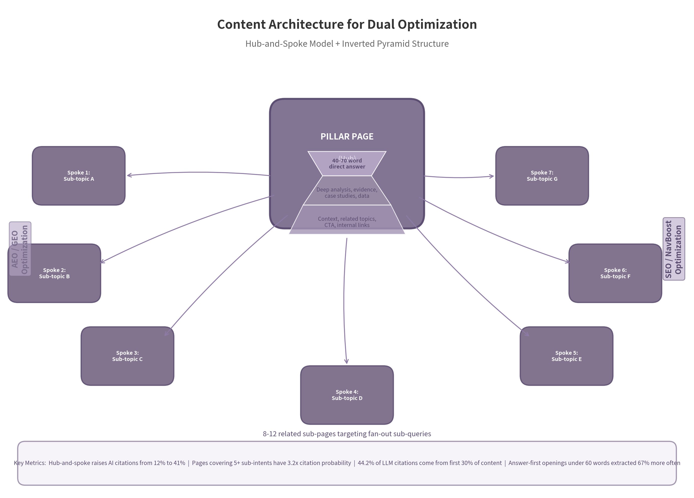

# 5. Technical and SEO Evasion

Google's quality systems evaluate sites as architectures, not isolated pages. The 2024 Google Content Warehouse API leak confirmed what practitioners had long suspected: E-E-A-T is not a vague guideline but an operationalized signal ecosystem with over 80 measurable proxies, from `siteAuthority` and `siteFocusScore` to `contentEffort` and `authorReputationScore`[^1]. For SEO professionals and technical content managers, the evasion blueprint is identical to the quality blueprint.

## 5.1 E-E-A-T Implementation

The E-E-A-T framework—Experience, Expertise, Authoritativeness, and Trustworthiness—has evolved from a conceptual rater guideline into a production ranking signal architecture. Danny Sullivan confirmed Google uses "a variety of signals as a proxy to tell if content seems to match E-E-A-T as humans would assess it"[^2]. The March 2026 core update, which produced 79.5% top-3 volatility, elevated primary sources above credentialed commentary publishers, confirming that Trust at the source level can outweigh formal Expertise credentials[^3]. For medical sites, the impact is quantifiable: those in the top 20% of E-E-A-T signals receive 4.7 times more organic traffic than the bottom 40%[^4].

### 5.1.1 Experience Signals

Experience is the newest pillar, added to the Quality Rater Guidelines in December 2022, representing a strategic shift toward valuing first-hand knowledge over formal credentials. To communicate Experience algorithmically, add author bios with verifiable credentials, professional photos, and links to social profiles. Use first-person narratives with specific dated experiences—"In March 2024, when I tested this workflow on a 47-site portfolio..." rather than generic "many users report." Include original photographs, screenshots, and videos from the author's own work. The `contentEffort` attribute, described in leaked documentation as an "LLM-based effort estimation for article pages," quantifies human labor and originality invested in content creation, and is likely the technical basis of the Helpful Content System[^5]. Content that demonstrates first-hand experience scores higher on this signal.

### 5.1.2 Expertise Signals

Expertise is communicated through credentials, certifications, publications, and professional affiliations that can be cross-verified. Link author names to external profiles and reference specific projects, clients, or cases. The `authorReputationScore` in Google's WebrefMentionRatings module explicitly stores author expertise as a quantified signal[^6]. For YMYL verticals, the MEDvidi case study demonstrates the practical impact: the telehealth platform grew organic traffic by 432% in three months by implementing named, credentialed physician authors on every clinical article, dedicated author bio pages with detailed credentials, and "Medically Reviewed By" tags linking to reviewer profiles[^7].

### 5.1.3 Authoritativeness Signals

Authoritativeness requires external validation. Earn brand mentions and citations from other authoritative sites—Google's 2014 implied links patent formalized the evaluation of unlinked mentions as authority signals[^8]. Build topical authority through comprehensive hub-and-spoke content architecture. The API leak confirmed `siteFocusScore` and `siteRadius` as concrete metrics that measure how concentrated a site is on a single topic and how far individual pages deviate from that center[^9]. Use schema markup (Person, Organization, Article) to communicate entity relationships to Google's Knowledge Graph. The `sameAs` property is particularly critical—it explicitly connects your entity to recognized authority sources.

### 5.1.4 Trustworthiness Signals

Trust is the apex pillar. Google has stated verbatim that "Trust is the most important member of the E-E-A-T family"[^10]. The practical signals are concrete: add publication dates and last-updated timestamps (Google's `lastSignificantUpdate` differentiates between minor edits and substantial revisions, resetting the freshness clock only for significant changes[^11]); include transparent sourcing with inline citations; add correction policies and editorial review disclosures; maintain HTTPS, privacy policies, and contact information. The September 2025 Quality Rater Guidelines update explicitly added guidance on "fake E-E-A-T content"—sites that appear credible superficially but lack genuine substance, including fake author profiles with AI-generated photos and false claims about physical branches[^12].

The following table consolidates the E-E-A-T signal checklist by implementation category and priority:

| Category | Signal | Implementation Priority | Effort Level | Expected Impact |
|----------|--------|------------------------|--------------|-----------------|
| **Experience** | Author bio with photo, credentials, social links | Critical (Week 1) | Low | Directly affects `authorReputationScore` and `contentEffort` |
| **Experience** | First-person narratives with specific dated experiences | Critical (Week 1) | Medium | Increases dwell time and `lastLongestClicks`[^13] |
| **Experience** | Original photographs, screenshots, videos from author | High (Week 2-4) | Medium | Signals genuine effort to `contentEffort` module |
| **Expertise** | Credential verification (LinkedIn, institutional pages) | Critical (Week 1) | Low | Enables `sameAs` entity connections |
| **Expertise** | Reference specific projects, clients, or cases | High (Week 2-4) | Medium | Demonstrates applied expertise beyond theory |
| **Expertise** | "Reviewed by" tags for YMYL content | Critical (Week 1) | Low | Required for health/finance verticals; 4.7x traffic gap[^4] |
| **Authoritativeness** | Hub-and-spoke content cluster (8-12 spokes) | Critical (Month 1-2) | High | Raises AI citations from 12% to 41%[^14] |
| **Authoritativeness** | Brand mentions from external authoritative sites | High (Ongoing) | High | 0.664 correlation with AI Overview visibility[^15] |
| **Authoritativeness** | Schema markup (Person, Organization, Article) | High (Week 2-4) | Medium | 92% of top 10 results use schema; only 31% of sites implement it[^16] |
| **Trustworthiness** | Publication dates and last-updated timestamps | Critical (Week 1) | Low | `lastSignificantUpdate` is a confirmed freshness signal[^11] |
| **Trustworthiness** | Transparent sourcing with inline citations | Critical (Week 1) | Low | Princeton GEO study: +115% citation lift for citing sources[^17] |
| **Trustworthiness** | Correction policy and editorial review disclosure | High (Week 2-4) | Low | Required for YMYL; signals process transparency |
| **Trustworthiness** | HTTPS, privacy policy, contact information | Critical (Week 1) | Low | `badSslCertificate` is a negative trust signal in API leak[^1] |

Critical-priority, low-effort signals—author bios, publication dates, HTTPS, inline citations—should be implemented immediately because they communicate directly to confirmed algorithmic fields. High-effort signals (hub-and-spoke architecture, brand mention cultivation) produce disproportionate returns but require sustained investment. The most common failure mode is investing in content architecture while neglecting the basic trust signals that gate entry into consideration sets. Google's `CompressedQualitySignals` module, which includes `pandaDemotion` and `siteAuthority`, can disqualify a page before query-time ranking even begins[^1]. Audit the critical/low-effort signals first, then layer in structural improvements.

## 5.2 Content Architecture for Evasion and Ranking

The single biggest driver of zero-traffic pages is not content quality but the absence of strategic content architecture. Ahrefs' analysis of 1 billion pages found that 91% receive zero organic search traffic, and the primary cause is structural[^18]. Google's systems evaluate content through semantic embeddings and query fan-out decomposition—a single page answering one intent cannot compete with a cluster architecture that answers 8-12 sub-intents.

### 5.2.1 The Hub-and-Spoke Model

The hub-and-spoke model consists of a central pillar page linking to 8-12 related sub-pages, each targeting a sub-topic or long-tail variant. This architecture builds topical authority (`siteFocusScore`) and increases AI citation probability from 12% to 41% on pillar-topic queries[^14]. The mechanism is query fan-out: Google's patent US12158907B1 describes how AI search platforms decompose a single user query into 8-12 synthetic sub-queries, retrieve sources for each in parallel, and synthesize the answers[^19]. A hub-and-spoke cluster answers these sub-queries across spoke pages, while a single mega-article cannot. The data is unambiguous: content addressing 5 or more fan-out sub-intents has 3.2 times higher citation probability than single-intent pages, and 86% of AI citations come from sites with five or more interconnected pages on a topic[^20]. Bidirectional internal linking between hub and spokes increases citation probability by an additional 2.7 times.

*Figure 5.1: The hub-and-spoke model combines a central pillar page (optimized for both AEO/GEO and SEO/NavBoost) with 8-12 related sub-pages. The inverted pyramid structure within each page places the direct answer at the top (40-70 words) for AI extraction, followed by deep analysis for user engagement and ranking signals. Bidirectional internal linking between hub and spokes builds topical authority and increases AI citation probability.*

### 5.2.2 Semantic HTML and Schema Markup

Schema markup is not a direct ranking factor—John Mueller confirmed this in 2025—but it serves as the infrastructure that makes E-E-A-T signals machine-readable[^21]. Article, FAQ, HowTo, and Person schema communicate content type and authorship to Google's entity extraction systems. Rich results increase CTR by approximately 30%, and pages with properly implemented schema appear in rich results 43% more often than pages without structured data[^16]. The real value of schema is signal clarity: it tells Google's systems what a page is, who wrote it, and how it relates to other entities. For AI systems, this structured communication is essential because they extract information from visible HTML and rely on explicit semantic structure to understand relationships.

### 5.2.3 Internal Linking Strategy

Internal linking is the primary structural mechanism for demonstrating topical authority. Pages receiving 40-44 unique internal links with varied anchor text show the strongest correlation with search traffic, and pages within three clicks of the homepage generate 9 times more SEO traffic than deeper pages[^23]. Descriptive anchor text helps AI systems understand relationships between linked pages. Avoid orphan pages—pages with no internal links or no path from the homepage. The `OnSiteProminence` signal evaluates page significance by simulating traffic flow from the homepage, meaning structurally isolated pages receive lower quality scores regardless of content[^24].

### 5.2.4 Freshness Signals

Content freshness is now a survival prerequisite. Google's tiered indexing system (Alexandria: flash/SSD/hard drive) links update frequency to crawl priority and visibility[^25]. The 6% freshness weight in rankings combines with AI systems' preference for recent content—70% of AI-cited pages are updated within 12 months, and content within 3 months earns 67% more citations than outdated pages[^26]. The December 2025 update penalizing "artificial refreshening" means freshness must be genuine. Implement a three-tier refresh system: 90 days for competitive queries, 6 months for evergreen content, and annual for foundational material. HubSpot's finding that updating older posts yields a 106% average traffic increase should be standard practice[^27].

### 5.2.5 The Inverted Pyramid for Dual Optimization

Content creators now face a triple optimization problem: traditional SEO, Answer Engine Optimization (featured snippets, AI Overviews), and Generative Engine Optimization (LLM citations in ChatGPT, Perplexity, Gemini). These systems evaluate content differently and often conflict. The inverted pyramid structure resolves this tension: place a 40-70 word direct answer at the top of the page, followed by deep analysis, evidence, and context below. This serves both LLM extraction (which draws 44.2% of citations from the first 30% of content) and user engagement (which rewards comprehensive depth)[^28]. Answer-first openings under 60 words are extracted 67% more often than buried-answer content[^29].

The direct answer at the top optimizes for AEO/GEO—AI systems need a clear snippet to extract. The deep analysis below optimizes for SEO/NavBoost—Google's click-based re-ranking system rewards dwell time, and the `lastLongestClicks` signal measures how long users stay after finding an answer[^13]. The two-layer structure is deliberate architecture: the top layer earns the citation, the bottom layer earns the ranking. Apply the inverted pyramid universally, adjusting the depth of each layer based on whether the page targets SEO, AEO, or GEO.

---

[^1]: Search Engine Land, "Unpacking Google's massive search documentation leak," 2024-05-30. https://searchengineland.com/unpacking-googles-massive-search-documentation-leak-442716

[^2]: Traffic Think Tank / Adam Durrant, "Leveraging Google's Concept of E-A-T," 2022. https://trafficthinktank.com/wp-content/uploads/2022/03/Adam-Durrant-Leveraging-Googles-Concept-of-E-A-T-DECK.pdf

[^3]: Digital Applied, "Content Quality Signals That Core Updates Reward in 2026," 2026-05-21. https://www.digitalapplied.com/blog/content-quality-signals-core-updates-reward-2026

[^4]: Angle Tutoring, "Link building for healthcare and YMYL sites" (citing "Rise"). https://angletutoring.com/academy/link-building/link-building-for-healthcare

[^5]: wise-relations.com, "Google API Leak 2024. Die echten Ranking-Signale," 2026-05-23. https://wise-relations.com/seo/google-api-leak/

[^6]: wise-relations.com, "Google API Leak 2024. Die echten Ranking-Signale," 2026-05-23. https://wise-relations.com/seo/google-api-leak/

[^7]: AIOSEO, "How MEDvidi.com Grew Organic Traffic by 432% in 3 Months," 2025-01-31. https://aioseo.com/trends/medvidi-seo-case-study/

[^8]: Ahrefs (75,000-brand correlation study); Digital Applied, "What Actually Gets You Cited in AI Search (2026 Data)," 2026-06-24. https://www.digitalapplied.com/blog/ai-search-citation-ranking-factors-2026-data-study

[^9]: Hobo-Web, "Topical Authority: Site Radius & Site Focus Score from the Google Leak," 2026-06-24. https://www.hobo-web.co.uk/topical-authority/

[^10]: Search Engine Land, "E-E-A-T and major updates to Google's quality rater guidelines," 2023-03-20. https://searchengineland.com/google-search-quality-rater-guidelines-changes-december-2022-390350

[^11]: wise-relations.com, "Google API Leak 2024. Die echten Ranking-Signale," 2026-05-23. https://wise-relations.com/seo/google-api-leak/

[^12]: Keypers, "E-E-A-T matters even in the age of AI," 2025-11-19. https://keypers.io/en/blog/seo-in-2025-why-e-e-a-t-is-the-key-to-visibility-more-than-ever-before/

[^13]: The 2024 API leak confirmed `lastLongestClicks` as a session-level dwell signal. Search Engine Land, "Unpacking Google's massive search documentation leak," 2024-05-30.

[^14]: FuelOnline / DigitalApplied / EcorpIT; Slate 2026 AI SEO Benchmark. https://ecorpit.com/best-internal-linking-tools-2026/

[^15]: Digital Applied, "What Actually Gets You Cited in AI Search (2026 Data)," 2026-06-24. https://www.digitalapplied.com/blog/ai-search-citation-ranking-factors-2026-data-study

[^16]: RankTracker, "Technical SEO Statistics 2025," 2025-12-21. https://www.ranktracker.com/blog/technical-seo-statistics-2025/

[^17]: Aggarwal et al., "GEO: Generative Engine Optimization," arXiv:2311.09735, KDD 2024. https://arxiv.org/abs/2311.09735

[^18]: Ahrefs / Creative Marketing Ltd, "91% of Websites Get Zero Google Traffic," 2026-03-12. https://www.creativemarketingltd.co.uk/blog/did-you-know-that-91-of-websites-get-0-traffic-from-google

[^19]: Astiva AI, "Query Fan-Out: How AI Search Breaks Traditional SEO," 2026-06-19. https://astiva.ai/blog/query-fanout

[^20]: Intercore / Yext 2025 AI Citation Study; Position Digital 2025. https://intercore.net/education/spoke-pages-cluster-content/

[^21]: John Mueller (Google Search Central), 2025; Ahrefs, "We Tracked 1,885 Pages Adding Schema. AI Citations Barely Moved," 2026-06-09. https://ahrefs.com/blog/schema-ai-citations/

[^23]: Authority Hacker / Intercore, "Spoke Pages Cluster Content Guide," 2026-02-10. https://intercore.net/education/spoke-pages-cluster-content-guide/

[^24]: StanVentures, "Google SEO Leak 2024: Top 10 Ranking Factors Revealed," 2025-06-07. https://www.stanventures.com/news/top-10-google-ranking-factors-leaked-in-2024-284/

[^25]: Hobo-Web / Propellic / Tag-Ad, analysis of Alexandria index tiers from 2024 API leak.

[^26]: Omnibound.ai, "AI Search Statistics (2025-2026)," 2026-04-30. https://www.omnibound.ai/blog/ai-search-statistics

[^27]: SearchLab, "Content Marketing Statistics 2026," 2026-03-17. https://searchlab.nl/en/statistics/content-marketing-statistics-2026

[^28]: SparkToro (January 2026); Omnibound.ai, "AI Search Statistics (2025-2026)," 2026-04-30.

[^29]: amicited.com; Omnibound.ai, "AI Search Statistics (2025-2026)," 2026-04-30.
