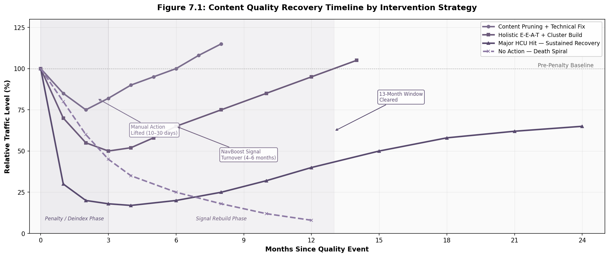

# Executive Summary: Google Content Quality Swarm Packet

## The Core Finding

Google's content quality system has undergone a structural transformation that cannot be understood through keyword density and backlink volume. The system that emerged between the 2024 Content Warehouse API leak and the March 2025 deindexing wave is a multi-layered, behavior-informed pipeline that rewards rich, original, authoritative content and punishes thin, generic, scaled production. The evidence is now conclusive: this is not a cyclical adjustment, but a permanent re-architecting of how the world's dominant search engine evaluates content quality [^1].

The shift is documented across multiple independent sources. The 2024 API leak exposed 14,014 attributes across 2,596 internal modules — a scale that dwarfs the industry-standard "200 ranking factors" figure by more than 70-fold [^2]. The 2023 DOJ antitrust trial produced sworn testimony from a sitting Google Vice President confirming that NavBoost, a click-based re-ranking system operating on a 13-month rolling window, is "one of Google's strongest ranking signals" [^3]. The March 2025 deindexing wave removed 25% of 2 million monitored pages — the highest rate ever recorded — as Google eliminated content that had never earned traffic or backlinks but had previously been tolerated in the index [^4]. Together, these events confirm that the penalty for empty content is no longer theoretical; it is algorithmic, confirmed, and accelerating.

---

## Key Findings

The following table links the five most consequential findings to their primary evidence and strategic implications.

| Finding | Evidence | Strategic Implication |
|:--------|:---------|:----------------------|
| NavBoost is real and confirmed by sworn testimony | 14,014 API leak attributes revealed `goodClicks`, `badClicks`, `lastLongestClicks`; VP Pandu Nayak testified under oath in 2023 that NavBoost is "one of Google's strongest ranking signals" and has operated since ~2005 [^3][^5] | User engagement signals are a direct, weighted re-ranking factor. Click behavior and session satisfaction are structural inputs to ranking, not by-products of SEO. Organizations must optimize for genuine user satisfaction. |
| E-E-A-T is measured via dozens of proxy signals, not a single score | API leak revealed `siteAuthority`, `contentEffort`, `originalContentScore`, `siteFocusScore`, and `ugcDiscussionEffortScore`; ~16,000 quality raters train ML models via RLHF; brand mentions correlate at 0.664 with AI Overview appearances versus 0.218 for backlinks [^2][^6] | Invest in expertise demonstration, entity verification, and brand mention networks — not just backlink volume. Authority is shifting from explicit link graphs to implicit consensus networks. |
| AI content is not penalized per se; quality is the violation | 100% of March 2024 manual action sites had AI content, but the violation was "Scaled Content Abuse" — mass production without human oversight; Google states systems "don't care if content is created by AI or humans" [^7] | Quality, not authorship, is the signal. Organizations should use AI for structural drafting and human expertise for originality and judgment. The goal is human-AI collaboration, not AI replacement. |
| Recovery requires 6–12 months of sustained, holistic improvement | 400+ site study: only 22% recovered with 20%+ traffic gains; 65% showed no recovery; NavBoost's 13-month rolling window means bad signals persist regardless of content improvements; content pruning (removing 40%+ of thin pages) showed 71% recovery rate [^8][^9] | Quality investment is a multi-year capital commitment with a 12–24 month payback period. Quick fixes do not work. The "quality signal death spiral" makes early deterioration self-reinforcing and recovery exponentially difficult. |
| Perfect AI detection is theoretically impossible | Sadasivan et al. convergence theorem proves detection approaches random chance as AI and human distributions converge; adversarial evasion tools achieve 92–96% success rates; 50+ universities have abandoned AI detection tools [^10] | Focus on genuine quality, not evasion. The techniques that evade detection (personal anecdotes, original data, specific examples) are precisely the techniques that earn strong E-E-A-T signals, positive NavBoost metrics, and AI citations. |

---

## The Strategic Imperative

Organizations that treat content as a marketing expense rather than infrastructure risk are operating under a false model. Content quality is a compounding asset with asymmetric returns: sustained investment produces exponential traffic growth, while neglect produces sudden collapse with a 22% recovery rate for the most severe penalties [^8].

The architecture of Google's quality system makes this asymmetry structural. The Helpful Content System, integrated into core ranking since March 2024, operates as a continuous classifier [^1]. The `siteFocusScore` and `siteRadius` signals measure topical concentration at the domain level, so a single thin section can suppress the entire domain's visibility [^2]. NavBoost stores click data on a 13-month rolling window, meaning bad engagement signals persist long after improvements [^3]. The Twiddler architecture then amplifies or suppresses entire domains based on cached quality scores, creating a self-reinforcing loop biased toward stability [^5]. The result: quality degradation compounds faster than improvement, and recovery requires simultaneous improvement across content quality, user experience, engagement signals, and technical performance.

The competitive landscape has bifurcated around this architecture. Medical websites in the top 20% for E-E-A-T signals receive approximately 4.7 times more organic traffic than those in the bottom 40% [^6]. A coffee site case study demonstrated that a hub-and-spoke cluster strategy can grow from zero domain authority to 87,000 monthly visitors and $15,200 in monthly revenue within 14 months without backlink acquisition [^11]. Conversely, the Forbes Advisor collapse — in which an estimated 20 million monthly visits evaporated (83% of pre-penalty traffic) after site reputation abuse enforcement — demonstrates that borrowed authority is fragile and that the economic cost of quality failure is total, not partial [^12].

Generative AI search has intensified these dynamics. AI Overviews reduce organic click-through rates for top-ranking pages by approximately 58% [^13]. The citation overlap between AI Overviews and AI Mode is only 13.7%, and 80% of LLM citations come from sources outside the top 100 organic results [^13]. Content must now be architected for three distinct discovery modes simultaneously: traditional organic search (SEO), AI-generated answer surfaces (AEO), and LLM citation networks (GEO). The signals that win across all three are not platform-specific tricks; they are the durable fundamentals of topical authority, original research, expert authorship, and brand mention networks.

The conclusion is unambiguous. Organizations must invest in content quality — original research, expert authorship, technical excellence, and genuine user engagement — or face systematic demotion in both Google's search results and the emerging AI citation ecosystem. The penalty for empty content is no longer theoretical. It is confirmed, structural, and irreversible without sustained, multi-year commitment.

---

[^1]: Google Search Central. "Helpful content system and your website." March 2024. https://developers.google.com/search/docs/fundamentals/helpful-content-system; Google Search Central. "Google Search's guidance about AI-generated content." February 8, 2023. https://developers.google.com/search/blog/2023/02/google-search-and-ai-content

[^2]: Search Engine Land. "Unpacking Google's massive search documentation leak." May 30, 2024. https://searchengineland.com/unpacking-googles-massive-search-documentation-leak-442716

[^3]: SEO-Kreativ. "Google AI Ranking System." June 23, 2026. https://www.seo-kreativ.de/en/blog/google-ai-ranking-system/; Luca Tagliaferro. "Does Google Use Clicks as a Ranking Signal? Here Is the Definitive Answer." May 28, 2026. https://www.lucatagliaferro.com/does-google-use-clicks-as-a-ranking-signal/

[^4]: Indexing Insight. "Google Indexing Purge: May 2025 Study." February 25, 2026. https://indexinginsight.com/blog/google-indexing-purge-may-2025

[^5]: Becited.io. "What the 2024 Google API Leak Taught Us About Ranking Signals." May 9, 2026. https://becited.io/ai-search-guide/google-api-leak

[^6]: Marie Haynes. "Everything We Know About Google's Quality Raters." July 12, 2023. https://www.mariehaynes.com/what-we-know-about-googles-quality-raters/; SunilPratapSingh.com / Ahrefs. "What GEO Research Says." May 2026. https://sunilpratapsingh.com/what-geo-research-says/

[^7]: Google Search Central (via Matt Laclear). "Our focus on the quality of content, rather than how content is produced." February 2023. https://www.mattlaclear.com/blog/ai-eeat/; Danny Sullivan, Google Search Liaison, repeated public statements 2023–2025

[^8]: The Stacc. "Helpful Content Update Recovery Study: Data From 400+ Sites." April 17, 2026. https://thestacc.com/blog/helpful-content-update-recovery-study/; Marie Haynes, SEO.ai, and Cyrus Shepard analyses, 2024–2025

[^9]: SproutSage Solutions. "Helpful Content Update Recovery: 7-Step 2026 Playbook." June 4, 2026. https://sproutsagesolutions.com/helpful-content-update-recovery/; Inflow. "Content Pruning Case Study: How & Why It Works." June 4, 2024. https://www.goinflow.com/blog/content-pruning-case-study/

[^10]: Sadasivan, V.S., et al. "Can AI-Generated Text Be Reliably Detected?" arXiv:2303.11156, 2023. https://arxiv.org/abs/2303.11156; Cheng, Y., et al. "Adversarial Paraphrasing: A Universal Attack for Humanizing AI-Generated Text." arXiv:2506.07001, 2025. https://arxiv.org/abs/2506.07001; DetectionDrama. "Universities That Banned AI Detectors: The Complete List (2026)." June 27, 2026. https://detectiondrama.com/universities-that-banned-ai-detectors/

[^11]: OrganicArbitrage. "Topical Authority Case Study: From Zero to $15,000/Month in 14 Months." March 20, 2026. https://organicarbitrage.com/articles/case-study-topical-authority-zero-to-15k

[^12]: BuzzStream. "The Rise, Fall, and Recovery of Forbes Advisor (Study)." May 12, 2025. https://www.buzzstream.com/blog/forbes-advisor-analysis/

[^13]: Ahrefs. "Update: AI Overviews Reduce Clicks by 58%." May 28, 2026. https://ahrefs.com/blog/ai-overviews-reduce-clicks-update/; Omnibound. "AI SEO Statistics (2026)." May 29, 2026. https://www.omnibound.ai/blog/ai-seo-statistics

---

# 1. Google's Quality System Architecture

Google's search ranking does not operate as a single algorithm. Rather, it functions as a distributed, multi-stage pipeline in which quality assessments flow from one subsystem to the next, with each layer conditioning the signals that reach the layers below it. Understanding this architecture is the foundation for everything that follows in this packet, because the way Google evaluates content cannot be reduced to a checklist of "ranking factors." It is a system of systems — and each system has its own logic, memory, and enforcement mechanism.

## 1.1 The Integrated Quality Stack

### 1.1.1 From Independent Systems to a Unified Pipeline

For most of the 2010s, Google's quality enforcement was episodic and modular. Panda (2011) ran as a separate filter targeting thin content. Penguin (2012) operated independently to detect manipulative links. The Helpful Content System (HCS), launched in August 2022, initially followed the same pattern — a standalone classifier that applied site-wide demotions during periodic updates. The March 2024 core update changed this architecture fundamentally: the HCS was folded into Google's core ranking algorithm, becoming a continuous evaluator rather than an episodic one [^14].

The current pipeline, as reconstructed from the 2024 Content Warehouse API leak and DOJ trial testimony, proceeds through a sequence of specialized subsystems. Trawler handles crawling, Alexandria manages indexing, and SegIndexer sorts documents into storage tiers (Base, Zeppelins, Landfills) based on estimated quality [^15]. From there, the Mustang scoring engine and Ascorer retrieval module produce an initial candidate set — the "green ring" of roughly 1,000 documents that might rank for a query. This candidate set then passes through a gauntlet of quality gates: siteAuthority, pandaDemotion, siteFocusScore, and hostAge, among others, in the CompressedQualitySignals module [^16]. Documents that clear these gates advance to NavBoost, where 13 months of click data re-rank the results. Finally, a collection of post-ranking Twiddlers — FreshnessTwiddler, QualityBoost, RealTimeBoost, SiteBoost — adjust positions before SuperRoot assembles the final search engine results page (SERP) [^17].

The critical insight is that each stage feeds the next. A site that scores poorly on siteFocusScore (indicating scattered topical coverage) may never reach the NavBoost stage with enough exposure to earn click signals that could redeem it. Conversely, a site with strong click signals but weak authority may be suppressed by the QualityBoost Twiddler before reaching the top positions. The architecture is not a simple additive formula; it is a gated pipeline where early failures compound into later exclusions.

The following table compares the old episodic architecture (2011–2023) with the current integrated stack, illustrating how enforcement has shifted from standalone filters to a continuous, interdependent pipeline:

| Component | Panda/Penguin Era (2011–2023) | Integrated Stack (2024–Present) |
|-----------|------------------------------|--------------------------------|
| Content quality filter | Panda — standalone, periodic updates | Helpful Content System — continuous, integrated into core ranking |
| Link spam detection | Penguin — rule-based, batch processing | SpamBrain — real-time ML, network-level analysis |
| Click signals | Not publicly acknowledged | NavBoost — confirmed weighted re-ranking with 13-month window |
| Site-wide evaluation | Limited; page-level penalties dominant | Explicit; siteFocusScore, siteAuthority gate all pages on domain |
| Recovery mechanism | Wait for next filter refresh (months) | Continuous reassessment; 6–12 months of sustained improvement required |
| Update frequency | Episodic (several per year) | Continuous classifier + quarterly core updates (~90 days) |

This structural shift carries significant implications for SEO strategy. In the old architecture, a site could recover from a Panda hit by improving affected pages and waiting for the next data refresh. In the current architecture, there is no discrete "next update" to wait for — the classifier evaluates the domain continuously, and recovery requires demonstrating sustained quality improvement across the entire site for a period that spans most of the NavBoost signal window. The integrated stack is more resilient to manipulation but also more punishing to sites that experience quality degradation, because the feedback loops between systems create a form of algorithmic inertia that resists rapid reclassification.

### 1.1.2 The 2024 API Leak: 14,014 Attributes Across 2,596 Modules

The May 2024 Content Warehouse API leak — accidentally published to a public GitHub repository and subsequently verified by multiple analysts — provided the first comprehensive view of Google's internal data structures. The leak contained 14,014 attributes across 2,596 modules, a scale that dwarfs the industry-standard "200 ranking factors" figure that SEO practitioners have cited for over a decade [^18]. This is not merely a larger version of the same thing. The 70-fold increase in documented attributes reveals that Google's quality evaluation is a distributed system — a network of microservices, each processing a narrow slice of signal data, rather than a single monolithic scoring model.

The leaked modules include signal names that directly contradict years of Google's public statements. The `siteAuthority` attribute, stored in the CompressedQualitySignals module, undermines Google's repeated denials that it computes a domain-level authority score [^19]. The `hostAge` attribute, documented as being used "to sandbox fresh spam in serving time," contradicts Google's public insistence that no "sandbox" exists for new websites [^20]. The `chromeInTotal` and `chrome_trans_clicks` attributes confirm that Chrome browser data feeds directly into ranking, despite years of denials from spokespeople including John Mueller and Gary Illyes [^21].

The appropriate interpretive framework, however, is not that every leaked attribute is a live ranking factor. As Mike King of iPullRank noted, the leak is "the equivalent of finding a parts catalog for an engine you have only ever heard running. You cannot see the tuning, but you can see exactly what parts exist" [^22]. Google's official response to the leak — cautioning against "inaccurate assumptions based on out-of-context, outdated, or incomplete information" — notably did not deny the documents' authenticity [^23]. The evidence therefore supports a middle position: the attributes exist, many are actively used, but the weights, interdependencies, and temporal activation patterns remain opaque.

### 1.1.3 The Helpful Content System: From Periodic Update to Continuous Classifier

The Helpful Content System was Google's first explicit attempt to evaluate content at the site-wide level rather than the page level. When it launched in August 2022, it introduced a classifier that assessed whether a site was producing "people-first content" at scale — meaning that if a significant portion of a domain's pages were low-value, even the high-quality pages on that domain could be suppressed [^24]. The September 2023 update significantly broadened the signals the classifier evaluated, and the March 2024 update completed the transition by integrating the classifier into core ranking, making it continuous rather than episodic [^25].

The March 2024 update was not a typical broad core update. It was a restructuring of how Google evaluates content quality at scale, combined with three new spam policies targeting scaled content abuse, expired domain abuse, and site reputation abuse. Google's communications indicated that the update was designed to reduce low-quality, unoriginal content in search results by approximately 40% [^26]. The practical impact was severe: a six-month study of over 1,000 niche sites found that roughly 20% experienced significant negative impact, with the majority of affected sites losing over 50% of their previous traffic [^27]. Google's own October 2024 Web Creator Event — the first formal acknowledgment of widespread publisher concerns — offered no immediate solutions, confirming that the new architecture was structural, not temporary [^28].

Leaked attributes associated with the integrated Helpful Content System include `contentEffort` (an LLM-based estimation of the effort required to produce a page), `originalContentScore` (an evaluation of originality), and `siteFocusScore` (thematic consistency across a domain). Content scoring low on these attributes triggers site-wide downgrading, meaning a single thin section of a website can suppress the entire domain's visibility [^29]. This is a decisive shift from the Panda era, where penalties were applied to specific pages and could be recovered from through page-level remediation.

### 1.1.4 SpamBrain's Evolution: From Rule-Based Filters to Real-Time ML Networks

SpamBrain, Google's AI-driven spam detection system, traces its conceptual lineage to the Penguin update (April 2012), which targeted manipulative link-building through rule-based pattern detection. Penguin was incorporated into the core algorithm in 2016, but it remained fundamentally a pattern-matching system — it looked for known signatures of spam, such as paid links, link farms, and unnatural anchor text distributions. SpamBrain, launched publicly in 2021, replaced this approach with continuous machine learning [^30].

The evolution from Penguin to SpamBrain is best understood as a shift in both detection method and enforcement scale. Penguin evaluated individual pages and links. SpamBrain analyzes billions of pages and links simultaneously, identifying relational patterns that humans cannot spot. It works bidirectionally — detecting both sites that generate spam and sites that benefit from it — and neutralizes spam signals rather than imposing hard penalties, operating continuously rather than in periodic batches [^31].

The March 2024 expansion added scaled content abuse, expired domain abuse, and site reputation abuse to SpamBrain's enforcement targets. The March 2026 Spam Update — the fastest in Google's history, completing in under 20 hours — demonstrated that detection latency has collapsed from months to hours, likely driven by SpamBrain refinements [^32]. In May 2026, Google extended its spam policies to explicitly cover attempts to manipulate generative AI responses, including AI Overviews and AI Mode, treating AI-answer manipulation with the same enforcement mechanisms as traditional web spam [^33].

The most recent conceptual evolution — though not yet confirmed for web search deployment — is the Scalable Cluster Termination System (S-CTS), published by Google Research in June 2026. S-CTS targets coordinated AI spam at the network level rather than the page level, using infrastructure signals and semantic template detection (via Sentence-BERT) to identify and terminate entire "Generation Clusters" of coordinated accounts. Over a six-month operational period on video platforms, S-CTS terminated approximately 50,000 clusters comprising 130,000 channels [^34]. Whether this system translates to web search remains uncertain, but the directional signal is clear: Google's enforcement unit is shifting from the page to the publishing network.

## 1.2 NavBoost: The Click-Based Re-Ranking Engine

### 1.2.1 The DOJ Trial Confirmation

The existence of NavBoost as a real, weighted system was confirmed under oath by Google Vice President Pandu Nayak during the 2023 DOJ antitrust trial. Nayak testified that NavBoost is "one of Google's strongest ranking signals" and has been active since approximately 2005 [^35]. This testimony, backed by internal documents and emails, represented the highest-tier evidence available to SEO practitioners — sworn testimony from a current senior executive in a federal proceeding [^36].

The trial also surfaced an internal Google presentation titled "Life of a Click," which identified three pillars of ranking: relevance, links, and user engagement signals. This internal framing directly contradicted years of public messaging in which Google spokespeople downplayed or denied the role of engagement metrics in ranking [^37]. Eric Lehman, a Google Distinguished Engineer with 17 years at the company, described NavBoost under oath as "essentially a large spreadsheet" storing click data per query-URL pair, with "long clicks" (users staying) as positive signals and "short clicks" (quick returns) as negative signals [^38].

The strategic significance of this confirmation extends beyond the signal itself. An internal email from a Google VP, presented during the trial, stated that NavBoost alone was "more positive than the rest of ranking combined" — suggesting its influence may outweigh PageRank, content quality, and all other signals in aggregate [^39]. The DOJ argued, and Google did not substantively contradict, that the "secret sauce" of Google's ranking superiority is not its algorithmic sophistication but its accumulated store of human click behavior — a data advantage that competitors cannot replicate [^40].

### 1.2.2 The Five Click Classifications

The 2024 API leak revealed five distinct click signal categories stored in the `QualityNavboostCrapsCrapsData` module (CRAPS being the internal, and inadvertently ironic, name for the Click-Related Active Promotion Signals system). The following table summarizes these classifications and their inferred functions:

| Signal | Classification | Inferred Function | Inferred Weight |
|--------|---------------|-------------------|-----------------|
| `goodClicks` | Positive | User clicks result and stays on page, indicating satisfaction | Medium |
| `badClicks` | Negative | User clicks result but quickly returns to SERP (pogo-sticking) | High |
| `lastLongestClicks` | Strong positive | Final result in session where user dwells longest — search journey ends | Very high |
| `unsquashedClicks` | Raw data | Click data before normalization/anti-manipulation compression | Internal reference |
| `unicornClicks` | Exceptional | Rare, high-satisfaction query-URL pairs that outperform expectations | Highest (anecdotal) |

The distinction between these signals reveals a sophisticated behavioral model. `goodClicks` captures basic satisfaction: the user clicked, did not immediately return. `badClicks` captures the opposite — the pogo-sticking pattern that indicates the result failed to meet intent. But `lastLongestClicks` is the most consequential signal, because it identifies the result that definitively ended the user's search journey. When a user works through multiple results for the same query, the page they stay on longest before ending the session receives the strongest positive signal [^41]. This is the modern technical implementation of what SEO practitioners have historically called "dwell time," and it functions as the tiebreaker among otherwise similar results.

The `unsquashedClicks` field is equally significant for what it reveals about Google's anti-manipulation design. Google retains raw click data for detection and analysis purposes, but applies a "squashing function" — likely logarithmic or sigmoid compression — before using clicks as ranking inputs. This means the system stores both raw and normalized data, using the raw stream to detect manipulation patterns (such as sudden anomalous click spikes) while feeding the normalized stream into ranking [^42]. The `unicornClicks` signal, though less documented, appears to capture exceptional performance cases where a result dramatically outperforms baseline expectations for its position — a behavioral outlier that may trigger special evaluation.

### 1.2.3 Chrome Data Integration and the Public Denial Campaign

The leaked attributes `chromeInTotal` and `chrome_trans_clicks` confirm that Chrome browser data feeds directly into Google's ranking systems, a practice that contradicts years of explicit public denials. Google spokespeople, including John Mueller and Gary Illyes, repeatedly stated that Chrome data was not used for ranking purposes. The DOJ trial revealed that the system originally collected user interaction data through the Google Toolbar; when Chrome replaced the toolbar, the data pipeline simply migrated to the browser itself [^43].

This is not merely a historical correction. The Chrome data stream provides engagement signals that SERP clicks cannot capture — scroll depth, time on page beyond the initial click, interaction with page elements, and session behavior across multiple tabs. When combined with NavBoost's 13-month rolling window, these signals create a behavioral fingerprint that is far more resistant to manipulation than click-through rate (CTR) alone. The integration also explains why Google has been so aggressive about maintaining Chrome's market dominance: the browser is not merely a distribution channel; it is a data collection infrastructure that feeds the ranking engine.

### 1.2.4 The Squashing Function and Position-Normalization

Google's public denials that "clicks are not a ranking factor" were not technically false — they were strategically incomplete. Clicks are not a direct, first-pass ranking factor in the initial Mustang scoring stage. They are, however, a powerful re-ranking signal applied after the initial candidate set is retrieved. The semantic distinction allowed Google to maintain technically accurate public statements while obscuring the centrality of click data to the final ranking output [^44].

The squashing function is the technical mechanism that enables this distinction. By compressing click volumes using a mathematical transformation — likely logarithmic — Google ensures that doubling clicks does not double the ranking signal. The first hundred clicks may produce a substantial NavBoost adjustment, but increasing from 10,000 to 20,000 clicks produces a much smaller incremental change [^45]. This compression makes CTR manipulation expensive and inefficient, because the marginal return on artificial clicks diminishes rapidly. Position-normalization further complicates manipulation: a result in position 1 is expected to receive more clicks than a result in position 5, so NavBoost normalizes against position-specific baselines before assigning signal values. A result that receives typical clicks for its position earns a neutral signal; only over- or under-performance relative to position expectations generates meaningful ranking adjustments.

## 1.3 The Death Spiral: How Quality Systems Self-Reinforce

### 1.3.1 The Feedback Loop

The most consequential insight from the 2024 API leak is not the existence of any individual signal, but the structural relationship between signals. Google's quality systems do not operate independently; they form a self-reinforcing feedback loop that makes recovery from low-quality classification exponentially difficult. The mechanism proceeds as follows: poor NavBoost signals (high `badClicks`, pogo-sticking patterns) feed into the Firefly site-quality assessment module, which lowers `siteAuthority` and `siteFocusScore`. These compressed quality signals then gate the Ascorer retrieval engine, preventing the site's pages from surfacing in the initial candidate set. Without surfacing, the site cannot earn new clicks to improve its NavBoost signals. The loop becomes a death spiral [^46].

The Twiddler architecture amplifies this dynamic. FreshnessTwiddler boosts recently updated content; QualityBoost amplifies pages with strong compressed quality signals; RealTimeBoost adjusts for trending topics; SiteBoost promotes or demotes entire domains. A site that has been classified as low-quality by Firefly may be suppressed by SiteBoost before it ever reaches the click-signaling stage, while its competitor — already in the good graces of the quality gates — receives QualityBoost amplification that increases its click exposure, further strengthening its NavBoost signals. The system is structurally biased toward stability: once a site is classified as high-quality or low-quality, the architecture tends to reinforce that classification unless a sustained, holistic intervention occurs.

### 1.3.2 Why Recovery Requires 6–12 Months of Sustained Improvement

The 13-month rolling window of NavBoost click data means that bad signals persist long after the underlying content has been improved. Even if a site completely overhauls its content strategy, its historical click patterns remain in the system for the better part of a year. This is not arbitrary cruelty; it is a structural feature of any signal-averaging system designed to resist manipulation. A classifier that forgot bad signals in a week would be trivially gamed by a spammer who simply paused for seven days before resuming abuse.

Empirical recovery data supports this structural timeline. A study of over 400 sites affected by Helpful Content System penalties found that only 22% recovered with 20% or greater traffic gains, while 65% showed no meaningful recovery [^47]. Marie Haynes, a prominent SEO analyst, noted by March 2024 that she had not seen any meaningful recoveries following significant HCU drops — though subsequent data documented some travel site recoveries, suggesting that minor impacts can heal while catastrophic drops may be permanent [^48]. The divergence reflects severity: a site that loses 20% of traffic may recover through incremental improvements, but a site that loses 90% has been classified as systematically untrustworthy, and the classifier requires sustained proof of transformation before reversing that judgment.

Content pruning — removing low-quality pages rather than adding new ones — has shown stronger correlation with recovery than content expansion. This suggests that the classifier evaluates the signal-to-noise ratio of an entire domain, and reducing noise is more efficient than adding signal [^49]. The implication is sobering: recovery is not about fixing one thing; it requires simultaneous improvement across content quality, user experience, engagement signals, and technical performance, maintained consistently for 6–12 months or longer.

### 1.3.3 The Twiddler Architecture: Post-Ranking Adjustments

The Twiddler framework is the final editorial layer in Google's ranking pipeline. In 2018, over 65 Twiddlers were in production; current estimates place the number well above 100. Each Twiddler operates in isolation, without knowledge of other Twiddlers' decisions, and each is designed to be small, easy to ship, and easy to roll back [^50]. This modular architecture is how Google can experiment rapidly without rebuilding the index.

The three most consequential Twiddlers for content quality are FreshnessTwiddler, QualityBoost, and RealTimeBoost. FreshnessTwiddler applies a time-sensitivity boost to content that is recently published or updated, with the strength of the boost varying by query type (news queries receive the strongest boost; evergreen queries receive the weakest). QualityBoost amplifies content that scores highly on compressed quality signals, effectively creating a "rich get richer" dynamic where high-quality pages receive more exposure, which generates more clicks, which strengthens NavBoost signals. RealTimeBoost identifies trending topics and breaking news, adjusting rankings on a time horizon of minutes to hours rather than days [^51].

The interaction between these Twiddlers and the preceding quality gates creates the final ranking environment that SEO practitioners observe. A page with excellent content but weak click signals may be suppressed by QualityBoost before it can accumulate enough NavBoost data to break through. A page with mediocre content but strong historical authority may be amplified by SiteBoost, earning clicks that mask its qualitative deficiencies. The architecture does not guarantee that the "best" content wins; it guarantees that the content that performs well across the system's defined signals wins. For content strategists, the operational lesson is that optimization must address the entire pipeline — from crawl accessibility through initial scoring, quality gates, click performance, and Twiddler amplification — rather than any single stage in isolation.

---

[^27]: SparkBlog.dev. "People-First Content: Passing Google's Helpful Content Standards." June 4, 2026. https://sparkblog.dev/blogs/people-first-content

[^28]: SEO-Kreativ. "How does the Google search algorithm work? From crawling to ranking." June 29, 2026. https://www.seo-kreativ.de/en/blog/google-search-algorithm-crawling-to-ranking/

[^29]: Becited.io. "What the 2024 Google API Leak Taught Us About Ranking Signals." May 9, 2026. https://becited.io/ai-search-guide/google-api-leak

[^30]: Hobo Web. "The Google Content Warehouse API Leak Decoded." April 27, 2026. https://www.hobo-web.co.uk/the-google-content-warehouse-leak-2024/

[^31]: Digital Marketing Co. "The Complete Guide to Search Engine Ranking Factors." May 9, 2026. https://digitalmarketingco.org/blog/search-engine-ranking-factors-google-bing-complete-guide

[^32]: Spilno Agency. "Google's official statements on what affects ranking: a 1998–2026 deep dive." May 19, 2026. https://spilnoagency.com.ua/en/instructions-us/google-official-statements-ranking-factors-history

[^33]: GTCode. "Google and the Architecture of Information Control: A Technical Audit." May 15, 2026. https://gtcode.com/articles/google-information-control-audit/

[^34]: SerpClix. "Chrome Browser Data Feeds Directly Into Google's Search Rankings." https://serpclix.com/blog/chrome-browser-data-feeds-google-rankings

[^35]: Becited.io. "What the 2024 Google API Leak Taught Us About Ranking Signals." May 9, 2026. https://becited.io/ai-search-guide/google-api-leak

[^36]: GTCode. "Google and the Architecture of Information Control: A Technical Audit." May 15, 2026. https://gtcode.com/articles/google-information-control-audit/

[^37]: SparkBlog.dev. "People-First Content: Passing Google's Helpful Content Standards." June 4, 2026. https://sparkblog.dev/blogs/people-first-content

[^38]: LinkDaddy. "Google March 2024 Core Update: The Biggest Ranking Shake-Up." April 25, 2026. https://linkdaddy.com/blog/google-march-2024-core-update/

[^39]: Teksyte. "Google Helpful Content System Explained for 2026." June 27, 2026. https://www.teksyte.com/blog/helpful-content-system-2025

[^40]: Paul Teitelman. "A 6-month study of the potential impact of Google's March 2024 Helpful Content Update on niche sites." September 3, 2024. https://www.paulteitelman.com/a-6-month-study-of-the-potential-impact-of-googles-march-2024-helpful-content-update-on-niche-sites/

[^41]: PPC Land. "Google hosts first Web Creator Event as publishers report 70-100% traffic losses." November 4, 2024. https://ppc.land/google-hosts-first-web-creator-event-as-publishers-report-70-100-traffic-losses-2/

[^42]: blckalpaca.at. "Helpful Content System: Site-Wide Quality as a Ranking Factor." April 7, 2026. https://blckalpaca.at/en/knowledge-base/seo-geo/content-seo-keyword-research/helpful-content-system-site-wide-quality-as-a-ranking-factor

[^43]: PBN.LTD. "The Evolution of Google's Spam Detection: From Penguin to SpamBrain." May 11, 2026. https://pbn.ltd/the-evolution-of-googles-spam-detection-from-penguin-to-spambrain/

[^44]: Umair Khalid. "Google March 2026 Spam Update: The Complete Guide." March 25, 2026. https://umairkhalid.com/google-march-2026-spam-update-the-complete-guide/

[^45]: PPC.land. "Google's March 2026 spam update is live — what changed and why it matters." March 24, 2026. https://ppc.land/googles-march-2026-spam-update-is-live-what-changed-and-why-it-matters/

[^46]: TryVizUp. "Google Spam Policies for Generative AI: 2026 Rules." May 19, 2026. https://www.tryvizup.com/blog/google-spam-policies-for-generative-ai-2026-rules

[^47]: Search Engine Journal. "Google Research Shows How AI Spam Can Be Detected." June 30, 2026. https://www.searchenginejournal.com/google-generated-ai-detected/579987/

[^48]: SEO-Kreativ. "Google AI Ranking System." June 23, 2026. https://www.seo-kreativ.de/en/blog/google-ai-ranking-system/

[^49]: Luca Tagliaferro. "Does Google Use Clicks as a Ranking Signal? Here Is the Definitive Answer." May 28, 2026. https://www.lucatagliaferro.com/does-google-use-clicks-as-a-ranking-signal/

[^50]: Luca Tagliaferro. "Does Google Use Clicks as a Ranking Signal? Here Is the Definitive Answer." May 28, 2026. https://www.lucatagliaferro.com/does-google-use-clicks-as-a-ranking-signal/

[^51]: Fahlout Research. "The Reality Gap: Public Guidance vs. Engineering Reality." March 13, 2026. https://fahlout.com/research/reality-gap

[^39]: SerpClix. "Does Improving CTR Affect Organic SEO Rankings?" https://serpclix.com/blog/does-click-through-rate-ctr-affect-organic-seo-rankings

[^40]: iPullRank. "Status Quo Bias: The Behavioral Economics Principle That Rocked the Google Antitrust Trial." April 27, 2025. https://ipullrank.com/status-quo-bias-the-behavioral-economics-principle-that-rocked-the-google-antitrust-trial

[^41]: WebSelect Agency. "goodClicks, badClicks, and lastLongestClick." May 20, 2026. https://webselect.agency/google-leak-click-signals-goodclicks-badclicks-lastlongestclick/

[^42]: NavBoost.com. "What is NavBoost?" March 21, 2026. https://navboost.com/what-is-navboost/

[^43]: SerpClix. "Chrome Browser Data Feeds Directly Into Google's Search Rankings." https://serpclix.com/blog/chrome-browser-data-feeds-google-rankings

[^44]: Ummema Sumamunny. "Does Google Use Clicks as a Ranking Signal? Here Is the Definitive Answer." May 30, 2026. https://ummemasumamunny.com/does-google-use-clicks-as-a-ranking-signal-here-is-the-definitive-answer-2026/

[^45]: NavBoost.com. "What is NavBoost?" March 21, 2026. https://navboost.com/what-is-navboost/

[^46]: Becited.io. "What the 2024 Google API Leak Taught Us About Ranking Signals." May 9, 2026. https://becited.io/ai-search-guide/google-api-leak

[^47]: Whitehat SEO. "Black Hat SEO Exposed: Risky Tactics and How to Avoid Them." February 6, 2026. https://whitehat-seo.co.uk/blog/black-hat-seo

[^48]: Marie Haynes. "What Google's Trial Docs Reveal About Clicks, Links and Other Ranking Signals." September 4, 2025. https://www.mariehaynes.com/what-googles-trial-docs-reveal-about-clicks-links-and-other-ranking-signals/

[^49]: Whitehat SEO. "Black Hat SEO Exposed: Risky Tactics and How to Avoid Them." February 6, 2026. https://whitehat-seo.co.uk/blog/black-hat-seo

[^50]: Becited.io. "What the 2024 Google API Leak Taught Us About Ranking Signals." May 9, 2026. https://becited.io/ai-search-guide/google-api-leak

[^51]: Hobo Web. "Navboost: How User Interactions Rank Websites In Google." April 13, 2026. https://www.hobo-web.co.uk/navboost-how-google-uses-large-scale-user-interaction-data-to-rank-websites/

---

## 2. E-E-A-T: The Framework for Valuable Content

### 2.1 Operationalizing Experience, Expertise, Authoritativeness, and Trustworthiness

Google's E-E-A-T (Experience, Expertise, Authoritativeness, Trustworthiness) framework occupies a curious position in search engine optimization discourse: it is simultaneously the most referenced conceptual model in modern SEO and one of the most frequently misunderstood. The confusion stems from a semantic tension that has persisted for years. Google's public-facing representatives, including Search Liaison Danny Sullivan and Search Advocate John Mueller, have consistently maintained that E-E-A-T is "not a ranking factor" in the technical sense—there is no single measurable "E-E-A-T score" analogous to a Core Web Vitals metric or a PageSpeed value. [^52] Yet the May 2024 Google Content Warehouse API leak, which exposed over 14,000 internal attributes, revealed engineering fields that map directly onto E-E-A-T concepts: `siteAuthority`, `contentEffort`, `originalContentScore`, `authorReputationScore`, `siteFocusScore`, and dozens more. [^53] The resolution of this apparent contradiction is not that one side is wrong, but that both are correct at different levels of abstraction. E-E-A-T is a conceptual framework whose principles are operationalized through dozens of proxy signals—none of which carries the label "E-E-A-T" in production code, but all of which collectively approximate what human evaluators would recognize as experience, expertise, authority, and trust.

The practical implication is that SEO professionals cannot optimize "E-E-A-T" directly. What they can optimize are the measurable proxies: content originality (`originalContentScore`), demonstrable human effort (`contentEffort`), author credibility (`authorReputationScore`, `isAuthor`), topical alignment (`siteFocusScore`, `siteRadius`), and user satisfaction patterns (`goodClicks`, `badClicks`, `lastLongestClicks`). [^53] These signals are pre-computed in Google's `CompressedQualitySignals` module, a gating system that can disqualify a page before query-time ranking even begins. [^54] A page with excellent on-page optimization but weak `siteAuthority` or a high `pandaDemotion` score may never reach the competitive ranking stage, regardless of how well it matches keyword intent. This architecture explains why E-E-A-T improvements often produce delayed results: the signals are cached and updated on schedules that do not align with daily publishing cadences. Independent researcher Olaf Kopp compiled over 80 E-E-A-T-related signals from 47 Google patents, the anti-spam whitepaper, and Quality Rater Guidelines, categorizing them across document-level, domain-level, and source entity-level dimensions. [^55] The density of this signal ecosystem suggests that E-E-A-T is not a single lever but a web of interdependent quality indicators that must be addressed holistically.

The mechanism that translates human judgment into algorithmic behavior is Reinforcement Learning from Human Feedback (RLHF). Google employs approximately 16,000 quality raters worldwide, contracted through third-party vendors, who evaluate search results using the 182-page Search Quality Evaluator Guidelines (last updated September 11, 2025). [^56] These raters do not directly influence individual URL rankings; rather, their aggregated evaluations produce preference pairs (helpful versus unhelpful results) that train reward models. [^57] Those reward models, in turn, fine-tune the ranking algorithms via RLHF, enabling automated systems to approximate human rater judgment at a scale of billions of pages. The pipeline is structurally significant: it means that E-E-A-T shapes not merely a single ranking signal but the *training objective* of the ranking systems themselves. Google's statements about quality rater data have evolved over time, from explicit denial in 2018—Danny Sullivan stated, "We don't use it that way"—to tacit acknowledgment in the 2022 QRG, which noted that "ratings are also used to improve search engines by providing examples of helpful and unhelpful results." [^56] This evolution reflects a broader pattern in Google's communications: categorical public denials of specific mechanisms have repeatedly proven unreliable after leaks or trial testimony revealed their operational reality. [^58]

Within the E-E-A-T framework, Trust occupies a unique position. Google's official guidance states verbatim: "Of these aspects, trust is most important." [^59] A page may demonstrate experience, expertise, and authority yet still receive a low E-E-A-T evaluation if trust signals are absent or unverifiable. The March 2026 core update—the most volatile in Google's recorded history, with 79.5% top-3 churn—provided a striking empirical confirmation of Trust's primacy. [^60] The update elevated primary sources (government agencies, nonprofit organizations, academic institutions) above heavily credentialed commentary publishers for many queries. Medical data from the update showed broad consumer-health sites like Healthgrades losing 43.5% visibility, Verywell Health dropping 26%, and WebMD losing nearly 17%, while specialist sources such as the New England Journal of Medicine gained 107%, GoodRx rose 69%, and Medscape climbed 32%. [^61] The structural implication is that Trust at the source level—who you are and who vouches for you—can outweigh Expertise credentials (what degrees or certifications you hold). This represents a significant inflection in how Google's systems evaluate authority, shifting emphasis from formal credentialing to verifiable institutional trust.

The expansion of YMYL (Your Money or Your Life) scrutiny has broadened the scope of E-E-A-T enforcement well beyond its traditional health and finance boundaries. The September 2025 Quality Rater Guidelines update introduced a new category: "Government, Civics & Society." [^62] This expansion raises E-E-A-T scrutiny for content related to elections, public institutions, civic processes, and societal trust—topics that were previously evaluated under general quality guidelines rather than YMYL-specific standards. The QRG now classifies purely AI-generated YMYL material without human review and unique value as "Lowest Quality," a rating that can trigger algorithmic suppression. [^63] For publishers operating in or adjacent to these verticals, the operational requirement is no longer simply to produce accurate content but to demonstrate, through machine-readable signals and human-verifiable evidence, that the content originates from sources that can be trusted with consequential decisions.

| YMYL Content Category | Evaluation Criteria | Minimum E-E-A-T Threshold | Quality Rater Guidance |
|-----------------------|---------------------|---------------------------|------------------------|
| Health & Medical | Clinical accuracy, author credentials, peer review, citation recency | Expertise + Trust (highest) | Content must be written or reviewed by qualified medical professionals; lowest rating for unverified health claims |
| Finance & Investment | Regulatory compliance, fiduciary disclosure, risk transparency | Expertise + Trust (highest) | Must identify who provides the content and their qualifications; lowest for undisclosed affiliate relationships |
| Legal | Jurisdictional accuracy, practitioner licensing, citation authority | Expertise + Trust (highest) | Must be authored by licensed practitioners; lowest for generic legal advice without jurisdiction |
| Government, Civics & Society | Institutional source, factual accuracy, election integrity, civic process clarity | Trust (apex) + Authoritativeness | Added September 2025; primary sources preferred over commentary; lowest for misinformation or unsubstantiated claims |
| News & Journalism | Editorial transparency, source attribution, correction policy | Experience + Trust (high) | Must demonstrate original reporting; lowest for fabricated or unattributed content |
| E-commerce & Product Reviews | Hands-on testing, disclosure policy, affiliate transparency | Experience + Trust (high) | Must demonstrate genuine product use; lowest for templated reviews without evidence of testing |

The YMYL evaluation table above reveals a pattern in Google's risk stratification: the higher the potential for user harm, the more heavily the framework weights Trust and Expertise. Health, finance, and legal content remain at the highest tier, where the absence of verifiable credentials or institutional backing is sufficient to trigger a "Lowest" rating regardless of content quality. The addition of "Government, Civics & Society" in September 2025 marks a structural expansion: it signals that Google's quality systems are now treating democratic and civic content with the same protective rigor historically reserved for medical and financial advice. This expansion has practical consequences for publishers in the news, nonprofit, and public policy sectors. Content about elections, voting procedures, or civic institutions must now demonstrate the same machine-verifiable trust signals—institutional affiliation, transparent sourcing, and factual corroboration—that medical publishers have been building for years. The minimum threshold is not static; the March 2026 update demonstrated that even established publishers with strong Expertise credentials can be demoted if Trust signals at the source level are stronger elsewhere. For SEO strategists, this means that YMYL compliance is no longer a vertical-specific concern but a framework for understanding how Google weights risk across all content that touches consequential decisions.

### 2.2 Author Entity Signals and Topical Authority

The rise of generative AI search has elevated author entity signals from a technical optimization to a strategic imperative. Google's Knowledge Graph now cross-references authors across LinkedIn profiles, podcasts, academic publications, and third-party media mentions; an author who exists only on a single blog carries negligible authority regardless of the byline's professional language. [^64] The technical implementation of this verification occurs through structured data markup. Person schema combined with Article schema produces a documented 130–170% lift in AI citation rates, yet industry data indicates that only approximately 31.3% of websites implement any schema markup at all. [^65] This adoption gap creates a significant competitive opportunity: sites that implement complete, property-populated schema chains (Article → Person → Organization) are operating in a less crowded signal space than those relying solely on visible content cues. However, controlled evidence tempers this opportunity. Ahrefs conducted a matched difference-in-differences study of 1,885 pages adding JSON-LD schema, with 4,000 control pages, and found no statistically significant citation lift on Google AI Mode (+2.4%), ChatGPT (+2.2%), or any other major AI platform. [^66] The 130–170% figures may reflect selection bias: sites that invest in schema also tend to invest in content quality, original research, and technical infrastructure, making schema a correlate rather than a cause of citation success. The more defensible position is that schema serves as machine-readable infrastructure that makes E-E-A-T signals *verifiable* to AI systems, even if it does not independently boost citation probability.

Google evaluates expertise across three hierarchical levels, each with distinct signal requirements and optimization pathways. At the document level, the system assesses anchor text n-grams, information gain, content originality, grammar and layout quality, update frequency, outbound link authority, entity co-occurrence, and query-independent engagement metrics such as click-through rate and dwell time. [^55] At the domain level, evaluation encompasses entity references, navigational consistency, brand recognition, Source Quality Score (for news domains), breaking news signals, coverage breadth, and international diversity. [^55] At the source entity level—arguably the most consequential for author-driven content—the system examines contributor authentication, reputation history, sentiment of mentions, peer endorsements, verified credentials, contribution metrics, prize metrics, and citation frequency. [^55] The three-level architecture means that an author with impeccable document-level credentials (a detailed bio, medical degree, published papers) but no domain-level recognition (the site itself lacks topical authority) or source entity signals (no Knowledge Graph presence, no external corroboration) will underperform against a competitor with moderate credentials but strong entity-level verification. This is why the MEDvidi case study—documented by AIOSEO—is instructive: the telehealth platform achieved 432% organic traffic growth in three months not by producing more content, but by systematically implementing named, credentialed physician authors on every clinical article, creating dedicated author bio pages with detailed credentials, and adding "Medically Reviewed By" tags linking to reviewer credentials. [^67] The growth came from entity signal completeness, not volume.

| E-E-A-T Signal Category | Measurable Proxy | Signal Type | Confidence Level |
|-------------------------|------------------|-------------|-----------------|
| Experience | `contentEffort` (LLM-based effort estimation); `originalContentScore` (originality scoring); `isAuthor` (author identification); `lastSignificantUpdate` (substantive revision tracking); `productReviewPuqPage` (product review quality); `docImages` (image quality signals) | Document-level | High (2024 API leak confirmed) |
| Expertise | `siteFocusScore` (topical concentration); `siteRadius` (page deviation from site theme); `site2vecEmbeddingEncoded` (semantic site embeddings); `ugcDiscussionEffortScore` (UGC quality); `ymylHealthScore`/`ymylNewsScore` (YMYL classification); `QBST` (query-based site topics); `geotopicality` (geographic topical relevance) | Domain-level | High (2024 API leak confirmed) |
| Authoritativeness | `siteAuthority` (site-level authority composite); `PageRank` (link-based authority); `queriesForWhichOfficial` (official query designation); `predictedDefaultNsr` (predicted normalized site rank); `isLargeChain` (chain recognition); `authorityPromotion` (authority tier promotion) | Domain + Entity-level | High (2024 API leak + DOJ testimony) |
| Trust | `pandaDemotion` (persistent site-wide penalty); `navDemotion` (navigation penalty); `serpDemotion` (SERP-level suppression); `GoodClicks`/`BadClicks` (user satisfaction); `clutterScore` (UX penalty); `spamrank` (spam detection); `scamness` (scam classification); `badSslCertificate` (security validation); `scaledSelectionTierRank` (tier-based index placement) | Multi-level (document + domain + system) | High (API leak + operational confirmation) |
| Brand Mentions | Ahrefs Brand Radar mention frequency; `anchorMismatchDemotion` (anchor mismatch penalty); co-citation patterns; co-occurrence proximity | Entity-level (external) | Medium (correlational, not confirmed causal) |

The E-E-A-T signal taxonomy in the table above organizes the leaked and confirmed proxies into a coherent operational map. Each signal category maps to a distinct measurement domain: Experience signals are predominantly document-level, assessing whether the content demonstrates evidence of human effort and originality; Expertise signals are domain-level, measuring whether the site has built a concentrated topical identity; Authoritativeness signals bridge domain and entity levels, quantifying whether the site or author is recognized as an official or authoritative source for specific queries; Trust signals are the most distributed, operating across document, domain, and system levels to penalize quality deficits, user dissatisfaction, and security failures. The Brand Mentions category occupies a distinct position because it is derived from external corroboration rather than internal page attributes. Ahrefs Brand Radar analysis found that brand mentions correlate at 0.664 with AI Overview appearances, compared to 0.218 for traditional backlinks—making mention signals more than three times as predictive for AI visibility. [^68] Google's 2014 patent on "implied links" (US8682892B1) formalized the evaluation of unlinked mentions, assessing source trustworthiness, contextual relevance, sentiment polarity, and recency. [^69] The shift from link graphs to mention networks reflects a broader architectural change in how AI systems evaluate authority: large language models ingest training data that includes brand references, citations, and contextual associations, building semantic entities that are recognized as authoritative even in the absence of hyperlinks. For SEO strategists, this means that public relations, earned media, and community presence are no longer merely brand-building activities—they are direct inputs to the entity signals that govern both traditional ranking and AI citation.

Co-citation and co-occurrence represent the technical mechanisms through which mention networks build topical authority without hyperlinks. Co-citation occurs when a brand is mentioned alongside established competitors or authoritative sources in the same document; the proximity signals to AI systems that the brand belongs to the same topical cluster. Co-occurrence measures the frequency with which a brand name appears near topic-specific terms across a corpus; repeated co-occurrence of "Acme Financial" near "retirement planning," "401k rollover," and "fiduciary advisor" strengthens the semantic association even without a single link. [^69] Google's 2014 implied links patent explicitly described these signals, but their practical importance was muted in an era when PageRank dominated authority evaluation. The generative AI era has changed the calculus. Because LLMs do not crawl the web in real time during inference—they retrieve from training data that includes historical mention patterns—the frequency and context of brand mentions in that training corpus become primary authority determinants. Campaigns integrating brand mention monitoring, co-citation analysis, and entity prominence optimization have documented an average 18% increase in keyword group rankings, suggesting that the "mentions economy" is not merely theoretical but operationally measurable. [^70]

### 2.3 Case Study: E-E-A-T in Practice

The relationship between E-E-A-T signal strength and organic performance is not merely correlational; for YMYL verticals, it is determinative. Medical websites scoring in the top 20% for E-E-A-T signals receive approximately 4.7 times more organic traffic than those in the bottom 40%. [^71] This traffic gap is not a marginal advantage—it is a structural chasm that separates visible publishers from those relegated to the index tier that search analysts colloquially call "Landfills." [^72] The gap is reinforced by the quality signal death spiral described in Chapter 1: poor E-E-A-T signals lower `siteAuthority` and `siteFocusScore`, which gate initial retrieval through Ascorer, preventing the site from earning new clicks that could improve NavBoost signals. Without new surfacing, the site cannot demonstrate improved engagement, and without improved engagement, the quality classifiers remain skeptical. Recovery from this spiral requires 6–12 months of sustained, holistic improvement across content quality, entity signals, and technical performance—not because Google imposes an arbitrary waiting period, but because the classifier trust must be rebuilt through consistent positive signal accumulation across multiple pipeline stages. [^73]

The most instructive case study in contemporary E-E-A-T enforcement is the collapse of Forbes Advisor. Forbes, a publication with nearly a century of journalism authority, built an affiliate content directory—Forbes Advisor—that leveraged the parent brand's domain authority to rank commercial content for queries ranging from "best pet insurance" to "best CBD gummies." [^74] Between 2022 and 2024, Forbes Advisor's digital public relations team generated over 70,000 referring domains and, at peak, operated a team of 29 digital PRs producing several hundred articles annually. [^75] The March 2024 core update reduced Forbes Advisor traffic by approximately 8 million visits, but the more consequential blow came in September 2024, when Google took manual action for site reputation abuse. [^75] By February 2025, Ahrefs data showed traffic had dipped to near zero. The scale of the collapse was extraordinary: an estimated 20 million monthly visits evaporated, representing roughly 83% of the section's pre-penalty traffic. [^75]

The Forbes Advisor case is analytically significant because it demonstrates that borrowed authority is fragile. Forbes' core journalism domain possessed immense `siteAuthority` and brand recognition, but the affiliate content operated under a fundamentally different incentive structure than the newsroom. The content was produced at a volume 350% higher than Forbes' core editorial output, targeted commercial keywords without strong topical association to the Forbes brand identity, and relied on affiliate relationships that created a structural conflict between journalistic independence and commercial optimization. [^76] Google's site reputation abuse policy—clarified in November 2024 to state that "no amount of first-party involvement alters the fundamental third-party nature of the content"—provided the legal framework for the manual action, but the underlying issue was an E-E-A-T mismatch: the content claimed the authority of a century-old journalism institution while operating with the incentives and production patterns of an affiliate marketing operation. [^74] The penalty was not merely algorithmic; it was a signal that Google's quality systems had learned to distinguish between genuine institutional authority and authority deployed as a ranking shortcut.

Recovery, where it has occurred, has been partial and slow. By May 2025, Forbes Advisor had regained approximately 4 million monthly visits—roughly 17% of its pre-penalty peak. [^75] BuzzStream analysis of the recovery found that category-level links correlated at 0.77 with traffic restoration, versus only 0.14 at the individual page level, suggesting that the algorithm rewarded renewed topical coherence rather than isolated page improvements. [^75] The lesson is not that affiliate content is inherently penalized, but that authority cannot be transferred across topical domains without corroborating signals. The New York Times' Wirecutter, which operates under a similar affiliate model but with strong editorial independence, transparent testing methodologies, and a clear topical identity, continued to grow revenue through the same period. [^77] The distinction between Forbes Advisor and Wirecutter is precisely what the E-E-A-T framework measures: the alignment between claimed authority, demonstrated expertise, and verifiable trust signals at the source level. Forbes Advisor collapsed because it borrowed authority it had not earned in the specific topical domains it targeted; its recovery, however partial, has depended on rebuilding that authority through genuine content investment rather than brand-name deployment.

[^52]: Danny Sullivan (Google Search Liaison), "Is E-A-T a ranking factor? Not if you mean there's some technical thing like with speed that we can measure directly. We do use a variety of signals as a proxy to tell if content seems to match E-E-A-T as humans would assess it." October 2019. Traffic Think Tank, "Leveraging Google's Concept of E-A-T," 2022. https://trafficthinktank.com/wp-content/uploads/2022/03/Adam-Durrant-Leveraging-Googles-Concept-of-E-A-T-DECK.pdf

[^53]: wise-relations.com, "Google API Leak 2024. Die echten Ranking-Signale," 2026-05-23. https://wise-relations.com/seo/google-api-leak/

[^54]: fahlout.com, "The Reality Gap: Public Guidance vs. Engineering Reality," 2026-03-13. https://fahlout.com/research/reality-gap

[^55]: Kopp Online Marketing, "How Google evaluates E-E-A-T? 80+ ranking factors for E-E-A-T," 2025-11-02. https://www.kopp-online-marketing.com/how-google-evaluates-e-e-a-t-80-signals-for-e-e-a-t

[^56]: Marie Haynes, "Everything We Know About Google's Quality Raters," 2023-07-12. https://www.mariehaynes.com/what-we-know-about-googles-quality-raters/

[^57]: SearchQualityRater.com, "Search Quality Rater Tool," 2025-09-01. https://searchqualityrater.com/

[^58]: Spilno Agency, "Google's official statements on what affects ranking: a 1998–2026 deep dive," 2026-05-19. https://spilnoagency.com.ua/en/instructions-us/google-official-statements-ranking-factors-history

[^59]: Google Search Quality Evaluator Guidelines, September 2025 edition. "Of these aspects, trust is most important." https://www.google.com/search/howsearchworks/everything-in-search/raters/

[^60]: DataLayer.ai, "Google Core Updates 2026: Timeline, Changes and Recovery Playbook," 2026-04. https://dataslayer.ai/blog/google-core-updates-2026/

[^61]: DoctorRank, "SEO for Doctors | Doctor SEO Services That Get More Patient Calls," 2025-04-11. https://doctorrank.com/seo-for-doctors

[^62]: SEO-Kreativ, "Google Quality Raters Guidelines Update" (Sept 2025). https://www.seo-kreativ.de/en/blog/google-quality-raters-guidelines-update/

[^63]: The Guide X, "Google Quality Rater Guidelines 2026: Key Changes, E-E-A-T & SEO Impact," 2026-06-03. https://theguidex.com/google-quality-rater-guidelines-summary/

[^64]: FloraFountain, "Surviving the December 2025 Google Core Update," 2026-01. https://florafountain.com/blog/surviving-the-december-2025-google-core-update/

[^65]: SearchAtlas, "Author Entity Optimization: How to Build Author Authority for SEO and AI Search," 2026-05. https://searchatlas.com/blog/author-entity-optimization/

[^66]: Ahrefs, "We Tracked 1,885 Pages Adding Schema. AI Citations Barely Moved," 2026-06-09. https://ahrefs.com/blog/schema-ai-citations/

[^67]: AIOSEO, "How MEDvidi.com Grew Organic Traffic by 432% in 3 Months," 2025-01-31. https://aioseo.com/trends/medvidi-seo-case-study/

[^68]: SunilPratapSingh.com / Ahrefs, "What GEO Research Says," 2026-05. https://sunilpratapsingh.com/what-geo-research-says/

[^69]: TheStacc, "Brand Mentions vs Backlinks: Off-Page SEO Evolution," 2026-04. https://thestacc.com/brand-mentions-vs-backlinks/

[^70]: SearchAtlas, "Backlinks vs Brand Mentions: Off-Page SEO Evolution," 2026-01. https://searchatlas.com/blog/backlinks-vs-brand-mentions/

[^71]: ReactLL, "How to Build E-E-A-T for Medical Websites," 2026-06. https://reactll.com/blog/how-to-build-eeat-for-medical-websites/

[^72]: Hobo-Web, "Topical Authority: Site Radius & Site Focus Score from the Google Leak," 2026-06-24. https://www.hobo-web.co.uk/topical-authority/

[^73]: Marie Haynes, "Everything We Know About Google's Quality Raters," 2023-07-12. https://www.mariehaynes.com/what-we-know-about-googles-quality-raters/

[^74]: SEO for Google News, "Google's reimagining of Site Reputation Abuse is wreaking havoc among publishers," 2024-12-05. https://www.seoforgooglenews.com/p/google-site-reputation-abuse

[^75]: BuzzStream, "The Rise, Fall, and Recovery of Forbes Advisor (Study)," 2025-05-12. https://www.buzzstream.com/blog/forbes-advisor-analysis/

[^76]: GetPassionfruit, "Why Your Site Is Losing Organic Traffic: SEO Deep Dives with Google Guidelines," 2025-02-25. https://www.getpassionfruit.com/blog/why-your-site-is-losing-organic-traffic-seo-deep-dives-with-google-guidelines

[^77]: A Media Operator, "Google Visibility Plummets But Some Publishers Still See Affiliate Revenue Growing," 2025-06-05. https://www.amediaoperator.com/news/publishers-affiliate-revenue-growing-despite-google-visibility-parasite-seo/

---

## 3. Content Depth and Topical Authority

Content richness is not a subjective editorial judgment in Google's ranking infrastructure. It is a mathematically computed property derived from vector embeddings, query decomposition, and semantic coverage metrics that operate at scale across billions of documents. The transition from keyword density to semantic coherence, which began with the Knowledge Graph in 2012 and accelerated through Hummingbird (2013), RankBrain (2015), BERT (2019), and MUM (2021), has reached a point where topical depth is now the dominant on-page ranking signal. The mechanisms that enforce this hierarchy are no longer theoretical; they are engineering fields confirmed by internal documentation, trial testimony, and patent filings.

### 3.1 How Google Measures Content Richness

#### 3.1.1 The API leak confirmed siteFocusScore, siteRadius, and siteEmbeddings as mathematical measures of topical concentration

The May 2024 Google Content Warehouse API leak exposed over 14,000 internal attributes, several of which directly operationalize topical authority as a measurable signal rather than a conceptual framework. The `QualityAuthorityTopicEmbeddingsVersionedItem` module contains three attributes of particular significance: `siteFocusScore`, which quantifies how concentrated a site is on a single topic; `siteRadius`, which measures how far an individual page's embedding deviates from the site's central theme; and `site2vecEmbeddingEncoded`, a compressed vector representation of the entire site's content that enables Google to compare topical identity across domains mathematically.[^78] These attributes transform topical authority from an abstract SEO concept into a computational quantity that can be optimized, diluted, or penalized.

The `siteFocusScore` functions as a specialist-versus-generalist discriminator. A site with a high `siteFocusScore` signals narrow, deep expertise; a low score indicates scattered topical coverage. `siteRadius` acts as a boundary enforcer: pages that deviate substantially from the site's central theme increase the radius and actively degrade the domain's perceived authority for its core topics.[^79] This creates a structural incentive for content pruning. When a site removes or consolidates off-topic pages, it reduces `siteRadius` and strengthens `siteFocusScore`—a direct, measurable improvement in Google's quality assessment. The `siteEmbeddings` and `pageEmbeddings` attributes store compressed vector representations of topics. Rather than matching keywords, these embeddings measure semantic relationships between concepts through cosine similarity in a high-dimensional vector space.[^80] This means two pages can discuss the same topic using entirely different vocabulary and still register as topically aligned if their entity relationships and contextual meanings are coherent.

The relationship between these signals and the broader E-E-A-T (Experience, Expertise, Authoritativeness, Trust) framework discussed in Chapter 2 is explicit. `siteFocusScore` and `siteRadius` map directly to the Expertise pillar, while `contentEffort`—an LLM-based estimation of human labor invested in content creation—serves as a proxy for Experience.[^81] Together, these signals form a quality stack that can gate a page before query-time ranking even begins. A page with strong individual metrics but a weak `siteFocusScore` can be disqualified by the `CompressedQualitySignals` module, which operates as a pre-ranking filter.

#### 3.1.2 Query fan-out architecture: Google's patent decomposes queries into 8–12 sub-queries, making cluster-based content structurally superior to single mega-articles

Google's patent US12158907B1, granted in December 2024, formalizes a retrieval architecture known as "query fan-out." Under this system, a single user query is decomposed into 8 to 12 synthetic sub-queries, each representing a distinct sub-intent or informational angle.[^82] The search system then retrieves documents against each sub-query in parallel and synthesizes the results into a unified response. This architecture is not limited to Google; every major generative AI search platform—ChatGPT, Perplexity, Gemini, and Google's own AI Mode—now employs a variant of query fan-out.

The structural implication for content strategy is decisive. A single 5,000-word article that addresses a head term comprehensively can only satisfy one or two sub-intents. A hub-and-spoke cluster with 15 to 25 spoke pages, each targeting a distinct sub-query, can satisfy 8 to 12 sub-intents simultaneously. Research from Position Digital (2025) found that content addressing five or more fan-out sub-intents has 3.2 times higher citation probability than single-intent pages.[^83] Surfer SEO's December 2025 analysis of 173,902 URLs found that pages ranking for fan-out queries are 161% more likely to be cited in AI Overviews, with a Spearman correlation of 0.77 between fan-out coverage and AI Overview citations.[^84] The counterintuitive finding is that coverage breadth across a cluster outperforms depth within a single page. Pages covering 26 to 50 percent of sub-queries across a cluster get cited more frequently than pages attempting 100 percent coverage within a single article.[^85]

#### 3.1.3 The Surfer 1M SERP study confirms topical coverage depth is the #1 on-page ranking factor

The empirical evidence for topical coverage as the dominant on-page signal comes from Surfer SEO's 1 million SERP study, published in July 2025. Analyzing one million unique search queries and the top 20 organic results per query, the study found that topical coverage depth—defined as the breadth and depth of related entities, facts, and subtopics included in a page—showed the strongest Spearman correlation with rankings of any on-page factor.[^86] The top 10 performing pages covered approximately 74 percent of the relevant facts and subtopics identified through competitor analysis; the bottom 10 averaged only 50 percent. A complementary analysis by Semrush, conducted across 300,000 SERPs, found that text relevance correlates at 0.47 with rankings—nearly double the strength of any authority metric.[^87] This finding reframes the hierarchy of ranking factors. While backlinks and domain authority remain significant, topical coverage depth operates as the primary on-page discriminator. A page with modest authority but comprehensive topical coverage can outrank a higher-authority page with thinner coverage.

#### 3.1.4 Word count is definitively NOT a ranking factor — Google officials confirm this is an SEO myth

Despite persistent correlation between longer content and higher rankings, Google has explicitly and repeatedly stated that word count is not a ranking factor. John Mueller, Google's Search Advocate, stated directly: "Word count is not a ranking factor. Save yourself the trouble." Danny Sullivan, Google's Search Liaison, reinforced this in 2023: "The best word count needed to succeed in Google Search is... not a thing! It doesn't exist."[^88] The confusion arises from correlation studies. Backlinko's widely cited research found that the average first-page result contains 1,447 words.[^89] However, this correlation reflects causation in reverse: longer content tends to rank higher because it more often covers topics comprehensively, not because the word count itself carries algorithmic weight. Yoast SEO confirms that "word count helps Google understand context and relevance, though it is not a direct ranking factor."[^90] The practical implication is that content strategists should abandon word count targets and instead optimize for topical completeness. A 1,200-word article that covers 74 percent of relevant subtopics will outperform a 3,000-word article that covers 50 percent, regardless of length.

[^78]: Hobo-Web, "Topical Authority: Site Radius & Site Focus Score from the Google Leak," 2026-06-24. https://www.hobo-web.co.uk/topical-authority/
[^79]: Search Engine Land, "Unpacking Google's massive search documentation leak," 2024-05-30. https://searchengineland.com/unpacking-googles-massive-search-documentation-leak-442716
[^80]: Kopp Online Marketing, "Google API Leak: Ranking factors and systems," 2024-07-11. https://www.kopp-online-marketing.com/google-api-leak-ranking-relevant-systems-and-metrics
[^81]: wise-relations.com, "Google API Leak 2024: Die echten Ranking-Signale," 2026-05-23. https://wise-relations.com/seo/google-api-leak/
[^82]: Astiva AI, "Query Fan-Out: How AI Search Breaks Traditional SEO," 2026-06-19. https://astiva.ai/blog/query-fanout
[^83]: Astiva AI, "Content Hubs for AI Visibility: 2026 Playbook," 2026-06-19. https://astiva.ai/blog/content-hubs-ai-visibility
[^84]: Ekamoira, "Query Fan-Out: Original Research," 2026-01-27. https://www.ekamoira.com/blog/query-fan-out-original-research-on-how-ai-search-multiplies-every-query-and-why-most-brands-are-invisible
[^85]: Astiva AI, "Content Hubs for AI Visibility," 2026-06-19.
[^86]: Surfer SEO, "Ranking Factors in 2025: Insights from 1 Million SERPs," 2025-07-21. https://surferseo.com/blog/ranking-factors-study/
[^87]: Lawrence Hitches, "AI Search Ranking Factors Guide," 2026-05-09. https://www.lawrencehitches.com/ai-search-ranking-factors/
[^88]: Rankability, "Is Word Count a Google Ranking Factor? Debunked 2025," 2025-01-01. https://www.rankability.com/ranking-factors/google/word-count/
[^89]: Backlinko, via Rankability, "Average first-page word count study," cited 2025.
[^90]: Yoast, "Word count and SEO: how long should an article or page be?," 2025-12-22. https://yoast.com/blog-post-word-count-seo/

### 3.2 The Hub-and-Spoke Architecture Advantage

The algorithmic signals described in Section 3.1 do not operate on isolated pages. They evaluate content as a network of interrelated topics, and the architectural model that best satisfies this evaluation is the hub-and-spoke cluster. In this architecture, a central pillar page (the hub) links to and receives links from multiple spoke pages, each addressing a specific sub-topic or sub-intent. The internal linking structure creates a semantic web that signals topical depth to both Google's ranking systems and generative AI retrieval engines.

*Figure 3.1* illustrates the hub-and-spoke architecture. The central pillar hub serves as the topical anchor, while eight spokes radiate outward, each targeting a distinct sub-query type generated by Google's query fan-out decomposition. Bidirectional links between the hub and each spoke create a dense semantic network that AI retrieval systems can traverse to identify authoritative sources. The spoke pages represent the eight most common sub-intent categories—informational, navigational, transactional, comparison, how-to, definition, review, and case study—that Google's patent identifies as the standard decomposition pattern for a single head query.

#### 3.2.1 Hub-and-spoke cluster architecture raises AI citation rates from ~12% to 41%

Industry research from multiple sources converges on a striking finding: hub-and-spoke internal linking raises AI citation rates from approximately 12 percent to 41 percent on pillar-topic queries.[^91] The mechanism is structural. AI retrieval systems evaluate content as a network of interrelated topics. A cluster with five or more interconnected pages on a topic signals topical depth in a way that isolated pages cannot replicate. The Yext 2025 AI Citation Study, analyzing 6.8 million AI citations across platforms, found that 86 percent of AI citations come from sites with five or more interconnected pages on a topic, and bidirectional internal linking increases citation probability by 2.7 times.[^92] This suggests that the cluster architecture itself is a citation signal independent of the content quality of any individual page. Clustered content also ranks persistently longer than standalone pieces—approximately 2.5 times longer—suggesting that the semantic network creates resilience against algorithmic updates and competitive pressure.[^93]

#### 3.2.2 Pages covering 5+ fan-out sub-intents have 3.2× higher citation probability than single-intent pages; covering 26–50% of sub-queries across a cluster outperforms 100% coverage in one page

The query fan-out architecture described in Section 3.1.2 creates a specific optimization constraint: content distribution across a cluster is more valuable than concentration within a single page. Research by Position Digital (2025) found that pages addressing five or more fan-out sub-intents achieve 3.2 times higher citation probability than single-intent pages.[^94] The optimal coverage strategy is counterintuitive: covering 26 to 50 percent of sub-queries across a cluster generates more citations than covering 100 percent of sub-queries within a single page. This finding challenges the "mega-article" approach that has dominated content marketing for the past decade. A single 10,000-word guide that comprehensively addresses every aspect of a topic provides only one retrieval entry point for query fan-out systems. In contrast, a cluster of 15 spoke pages, each addressing 2 to 4 sub-intents, provides 15 retrieval entry points. Google's parallel retrieval architecture can match more sub-queries against the cluster, increasing the probability that any given page in the cluster will be cited.

#### 3.2.3 Coffee site case study: zero initial domain authority → 87,000 monthly visitors and $15,200/month revenue in 14 months via topical cluster strategy

The theoretical advantages of cluster architecture translate into measurable business outcomes. A coffee site case study published by OrganicArbitrage in March 2026 documented growth from zero initial domain authority to 87,000 monthly visitors and $15,200 per month in revenue within 14 months, achieved entirely through a topical cluster strategy without backlink acquisition.[^95] The site deployed a hub-and-spoke architecture consisting of a 3,000-word pillar page and 18 spoke pages, each targeting a distinct sub-topic within the coffee domain.

| Metric | Isolated Single Page | Hub-and-Spoke Cluster | Differential |
|--------|---------------------|----------------------|-------------|
| AI Citation Rate (pillar queries) | ~12% | ~41% | +241% |
| Organic Traffic Lift (vs. baseline) | Baseline | 30–43% | +30–43% |
| Ranking Persistence (months) | Baseline | 2.5× longer | +150% |
| Time to First Ranking (new domain, no backlinks) | Often fails | 60–120 days | Structural |
| Pages Within 3 Clicks of Homepage (traffic multiplier) | Baseline | 9× more | +800% |
| Domain Authority Growth (HubSpot study) | Baseline | 49 → 60 | +22% |
| Page 1 Keyword Rankings (Conductor study) | Baseline | +328% | +328% |

The differential analysis reveals that cluster architecture is not merely an incremental improvement but a structural advantage. The 241 percent increase in AI citation rates represents a categorical shift from occasional visibility to consistent presence in generative search results. The nine-times traffic multiplier for pages within three clicks of the homepage demonstrates that cluster architecture improves crawl efficiency and link equity distribution in ways that isolated pages cannot replicate. The HubSpot study documented domain authority growth from 49 to 60 after cluster restructuring, and the Conductor study found a 328 percent increase in Page 1 keyword rankings after implementing hub-and-spoke architecture.[^96] These findings suggest that cluster architecture expands the total addressable keyword universe for a domain, not just the ranking of existing target terms. For a new domain with zero backlinks, the 60-to-120-day timeline to first rankings demonstrates that topical depth can compensate for the absence of traditional authority signals.

#### 3.2.4 Internal linking as the primary structural mechanism: 40–44 internal links per page with varied anchor text show the strongest traffic correlation; 5–10 contextual links per 2,000 words

The technical mechanism that makes hub-and-spoke architecture effective is internal linking. Research by Authority Hacker, analyzing over one million websites, found that proper internal linking boosts rankings by up to 40 percent, with pages within three clicks of the homepage generating nine times more SEO traffic than deeper pages.[^97] The optimal internal link density appears to be 40 to 44 unique internal links per page, with varied anchor text that includes relevant keywords rather than generic phrases. For content length, the recommended density is 5 to 10 contextual internal links per 2,000 words.[^98] These links should connect related topics within the cluster, creating bidirectional pathways between the hub and spokes and, where appropriate, lateral connections between spokes. The Cornell Design Group's research on topical authority through internal linking emphasizes that descriptive anchor text helps AI systems understand the relationship between linked pages, improving both traditional and AI search visibility. The internal linking structure serves a dual function. For Google's crawlers, it distributes PageRank and establishes topical hierarchy through `OnSiteProminence`, a signal that evaluates page significance by simulating traffic flow from the homepage.[^99] For AI retrieval systems, the anchor text and surrounding context provide semantic signals that help determine which pages to cite for specific sub-queries.

[^91]: FuelOnline / DigitalApplied / EcorpIT, "Hub-and-Spoke AI Citation Rates," 2026. https://ecorpit.com/best-internal-linking-tools-2026/
[^92]: Yext 2025 AI Citation Study, via Intercore, "Spoke Pages (Cluster Content)," 2026-02-10. https://intercore.net/education/spoke-pages-cluster-content/
[^93]: Whitehat SEO / SearchLab, "Cluster Content Ranking Persistence," 2026.
[^94]: Position Digital (2025), via Astiva AI, "Content Hubs for AI Visibility," 2026-06-19.
[^95]: OrganicArbitrage, "Topical Authority Case Study: From Zero to $15,000/Month in 14 Months," 2026-03-20. https://organicarbitrage.com/articles/case-study-topical-authority-zero-to-15k
[^96]: HubSpot, via Intercore, "Spoke Pages (Cluster Content)," 2026-02-10. https://intercore.net/education/spoke-pages-cluster-content/; SearchLab, "Content Marketing Statistics 2026," 2026-03-17. https://searchlab.nl/en/statistics/content-marketing-statistics-2026
[^97]: Authority Hacker, via Intercore, "Spoke Pages Cluster Content Guide," 2026-02-10. https://intercore.net/education/spoke-pages-cluster-content-guide/
[^98]: Koozai / Beasley Direct, "Internal Linking Best Practices," 2025-11-19.
[^99]: StanVentures, "Google SEO Leak 2024: Top 10 Ranking Factors Revealed," 2025-06-07. https://www.stanventures.com/news/top-10-google-ranking-factors-leaked-in-2024-284/

### 3.3 Information Gain and the End of the Skyscraper Technique

The signals discussed in Sections 3.1 and 3.2 measure topical coverage and architectural coherence. A separate but equally critical signal measures originality: Information Gain. Google's patent US11354342B2, granted in June 2022, formalizes a scoring system that rewards content providing net-new information beyond what existing top results already deliver. This signal has emerged as the primary differentiator between content that ranks and content that is ignored, and it has rendered the Skyscraper Technique—the dominant link-building methodology of the past decade—structurally obsolete.

#### 3.3.1 Google's Information Gain patent (US11354342B2, granted June 2024) rewards net-new information beyond what existing top results provide

The "Information Gain" patent, formally titled "Contextual Estimation of Link Information Gain," assigns a score to documents based on "additional information that is included in the document beyond information contained in documents that were previously viewed by the user."[^100] The patent uses the phrase "automated assistant" 69 times and "search engine" only 25 times, suggesting it was designed primarily for conversational AI systems but applies to ranking evaluation as well. The patent's mechanism is conceptually straightforward but computationally sophisticated. Google's systems compare the information content of a candidate document against the aggregate information content of documents already ranked in the top results for a query. If the candidate provides substantially new facts, data, frameworks, or perspectives not present in the existing corpus, it receives a high Information Gain score. If it merely reorganizes or paraphrases information already available in the top 10, it receives a low score. Industry analysis suggests the March 2026 core update operationalized Information Gain at scale, with pages containing proprietary data or first-hand case studies gaining 15 to 25 percent visibility, while templated and rewritten content dropped 30 to 50 percent.[^101]

#### 3.3.2 High Information Gain scores produce +15–22% visibility improvements; thin, templated content drops 30–50%

The empirical evidence for Information Gain as a ranking signal comes from multiple independent analyses. SE Ranking's March 2026 study found that sites publishing original data and unique perspectives gained an average of 22 percent visibility, while AI-paraphrased content that reshuffled existing information into new words lost 71 percent of traffic.[^102] Digital Applied's analysis of the March 2026 update documented a 15 to 25 percent visibility improvement for pages with proprietary data, and a 30 to 50 percent drop for thin, templated content.[^103] The mechanism is consistent with the consensus-Information Gain axis described in topical authority research. Google's systems enforce consensus as a quality floor—content must cover the same entities and facts as top-ranked pages to be considered relevant—but reward originality as a ranking differentiator.[^104] A page that hits every entity in the SERP but adds no new information scores high on topical coverage and zero on Information Gain. Conversely, a page with unique research but thin coverage may score high on Information Gain and low on topical coverage. The optimal strategy is to satisfy both: comprehensive coverage of consensus topics plus original contributions that extend beyond the existing corpus.

| Signal | Leaked Attribute / Patent | Measurement Mechanism | Strategic Implication |
|--------|--------------------------|----------------------|----------------------|
| Topical Focus | siteFocusScore | Vector embedding concentration across site | Specialist sites outperform generalists; prune off-topic content |
| Thematic Coherence | siteRadius | Page-to-site embedding deviation | Every page must align with the site's central theme |
| Semantic Coverage | siteEmbeddings, pageEmbeddings | Compressed topic vectors (site2vec) | Entity relationships matter more than keyword density |
| Content Effort | contentEffort | LLM-based labor and originality estimation | Human oversight and original research are required |
| Query Sub-Intent Coverage | US12158907B1 (query fan-out) | 8–12 synthetic sub-queries per head term | Cluster architecture is structurally superior to mega-articles |
| Information Gain | US11354342B2 | Novelty relative to existing top results | Net-new information is the primary ranking differentiator |
| Internal Link Equity | OnSiteProminence | Simulated traffic flow from homepage | Pages within 3 clicks of homepage generate 9× more traffic |

The table synthesizes the signals from the API leak and patent filings into an actionable framework. `siteFocusScore` and `siteRadius` function as boundary conditions that constrain what content a site can successfully rank for. `siteEmbeddings` and `pageEmbeddings` provide the semantic substrate that determines whether a page matches a query's intent. `contentEffort` gates the ranking process by evaluating whether the content demonstrates genuine investment. The query fan-out and Information Gain patents define the structural and qualitative requirements for visibility in the current algorithmic environment. Together, these signals form a coherent system that rewards sites with focused expertise, deep topical coverage, original contributions, and strategic internal architecture. The competitive moat created by Information Gain is sustainable because it requires genuine research, not optimization. Adding personal anecdotes, first-party data, original frameworks, or expert interviews produces Information Gain that AI systems cannot easily replicate.

#### 3.3.3 The Skyscraper Technique success rate plummeted from 10–20% to 1–3% because "more comprehensive" no longer equals "better" — originality is now the differentiator

The Skyscraper Technique, introduced by Brian Dean in 2013, was built on a simple premise: find the best content for a keyword, create something more comprehensive, and reach out to sites linking to the original. For a decade, this was the dominant link-building methodology in SEO. In 2025, the technique's success rate has collapsed from 10 to 20 percent to 1 to 3 percent for most practitioners.[^105] The failure is not tactical but structural. The original premise—that "more comprehensive" equals "better"—assumes a ranking system that rewards coverage depth alone. Google's shift toward Information Gain means that comprehensiveness without originality is now penalized, not rewarded. A page that adds 2,000 words to an existing 3,000-word guide but introduces no new information scores high on word count and low on Information Gain. The additional coverage may even dilute the signal by adding redundant content that the retrieval systems have already classified as low-value.

Search Engine Land's 2025 analysis confirms that "the content that earns links in 2025 offers something genuinely unavailable elsewhere: original research, exclusive access, proprietary tools, or insights that can only come from your unique position in the market."[^106] The outreach templates that defined the Skyscraper era—"I noticed you linked to [outdated resource]. I've created something 10x better"—are now instantly recognizable as spam by webmasters and ignored by the algorithmic systems that evaluate Information Gain. The strategic implication is that content creation must shift from "better than the top 10" to "different from the top 10." The competitive advantage is no longer editorial execution. The advantage is information access: proprietary data, first-hand experiments, expert networks, and original research that cannot be replicated by competitors. The Skyscraper Technique died because it optimized for a signal—coverage—that Google no longer uses as a primary differentiator.

[^100]: Search Engine Journal, "Google's Information Gain Patent," 2025-02-12. https://www.searchenginejournal.com/googles-information-gain-patent-for-ranking-web-pages/524464/
[^101]: Digital Applied, "Information Gain: Google's #1 Ranking Signal in 2026," 2026-04-18. https://www.digitalapplied.com/blog/information-gain-google-ranking-signal-april-2026
[^102]: LoudScale, "How to Improve Google EEAT for SEO," 2026-04-30. https://loudscale.com/blog/improve-google-eeat-seo/
[^103]: Digital Applied, "Information Gain: Google's #1 Ranking Signal," 2026-04-18.
[^104]: Advanced Web Ranking, "The Consensus-Information Gain Axis," 2026-06-26. https://www.advancedwebranking.com/blog/consensus-and-information-gain-for-ai-search-visibility
[^105]: Search Engine Land, "The skyscraper technique's surprising transformation in the AI era," 2025-11-27. https://searchengineland.com/guide/skyscraper-technique
[^106]: Search Engine Land, "The skyscraper technique's surprising transformation," 2025-11-27.

---

## 4. User Engagement and Behavioral Signals

The preceding chapter established that topical authority is measured through siteFocusScore, siteRadius, and siteEmbeddings, and that hub-and-spoke architecture raises AI citation rates from approximately 12% to 41%. This chapter examines how user behavior interacts with these structural signals to produce ranking outcomes: how clicks, attention, satisfaction, page experience, and content structure jointly determine whether a page earns visibility or accumulates demotion signals.

### 4.1 How User Behavior Feeds Rankings

#### 4.1.1 The CAS Model: Clicks, Attention, and Satisfaction

Google's internal framework for measuring search satisfaction is the CAS model — Clicks, Attention, and Satisfaction — developed by Google Research and published in 2016.[^107] This model captures three behavioral dimensions: whether a user clicked a result (click behavior), how long they remained engaged (attention), and whether their query intent was resolved (satisfaction). The CAS model is notable because it accounts for "good abandonments": scenarios in which a user finds their answer directly on the search results page without clicking a web result. In such cases, the absence of a click is not recorded as a negative signal but as a successful resolution — a distinction that resolves debates about whether low click-through rates (CTR) necessarily indicate poor content quality.

The CAS model's practical implementation extends beyond the search results page. Eric Lehman, a Google Distinguished Engineer for 17 years, testified under oath during the DOJ antitrust trial that NavBoost — Google's primary click-based re-ranking system — stores which URLs were clicked for each query, with "long clicks" (user stays) registered as positive signals and "short clicks" (quick returns) as negative signals.[^108] The 2024 API leak confirmed this, revealing five click signal categories within the CRAPS module (Click-Related Active Promotion Signals): goodClicks, badClicks, lastLongestClicks, unsquashedClicks, and squashedClicks.[^109] A goodClick is classified when a user clicks a result and does not quickly return to the SERP; a badClick occurs when users pogo-stick back within seconds; and lastLongestClicks identifies the result a user stayed on longest before ending their session — the page that "won" the query.[^110]

The historical significance of this system is substantial. Google's use of click data dates to at least 2005, with a 2004 patent filed by Amit Singhal describing navigational patterns for popularity scores.[^111] Udi Manber testified before the FTC in 2012 that "the ranking itself is affected by the click data," describing how Google would switch rankings when 80% of users clicked Result No. 2 versus 10% for Result No. 1.[^112] This testimony predates the 2023 DOJ trial by more than a decade, confirming that behavioral signals have been embedded in Google's infrastructure for nearly twenty years.

#### 4.1.2 Core Web Vitals as Confirmed Ranking Signals

While click-based signals measure behavioral outcomes, Core Web Vitals (CWV) measure the technical conditions that shape those outcomes. Google confirmed CWV as ranking signals with the June 2021 Page Experience update, and they remain foundational through 2026. The three CWV metrics are: Largest Contentful Paint (LCP), which measures loading performance; Interaction to Next Paint (INP), which measures interactivity responsiveness; and Cumulative Layout Shift (CLS), which measures visual stability. The thresholds are defined as follows:

| Metric | Threshold | Pass Rate | Competitive Gap |
|:---|:---|:---|:---|
| Largest Contentful Paint (LCP) | ≤ 2.5 seconds | ~70% of top-10 pages pass | 30% of pages in top-10 fail, creating ranking disadvantage |
| Interaction to Next Paint (INP) | ≤ 200 milliseconds | ~57% of sites pass (43% fail rate) | Most commonly failed CWV; largest technical differentiator |
| Cumulative Layout Shift (CLS) | < 0.1 | ~70% of sites pass | Visual stability is least problematic metric |
| All Three Combined | All thresholds met | ~48% of mobile sites pass | 52% of mobile sites are structurally disadvantaged for rankings |

Table 4.1: Core Web Vitals benchmarks and competitive gap analysis. Pass rate data reflects mobile performance, which Google indexes and ranks using mobile-first indexing. Sources: Isaac Benyakar (2024), Visual Sentinel (2026), SE Ranking (2026).[^113][^114]

The data in Table 4.1 reveals a significant competitive gap: approximately 52% of mobile sites fail to meet one or more CWV thresholds, and pages passing all three metrics have a 24% higher probability of ranking in the top three positions.[^113] Google operates mobile-first indexing, and approximately 53% of mobile users abandon sites that take longer than three seconds to load. The relationship between LCP performance and click behavior is direct: slow pages lose users before they generate a goodClick signal.[^113] Sites with good CWV scores also demonstrate approximately twice the conversion rate of slower counterparts, suggesting technical performance feeds into commercial outcomes beyond rankings alone.[^113]

The INP metric deserves particular attention because it replaced First Input Delay (FID) in March 2024 and now represents the most commonly failed CWV, with approximately 43% of sites still failing at the 200-millisecond threshold.[^114] INP measures the latency of all page interactions, not just the first one, making it a more stringent measure of interactivity. Page experience optimization should prioritize INP remediation as the largest single technical differentiator among the three CWV metrics. The 48% mobile pass rate for all three metrics combined indicates that CWV compliance is still a competitive moat rather than a universal baseline.

#### 4.1.3 Pogo-Sticking as a Negative Signal

If Core Web Vitals create the conditions for positive engagement, pogo-sticking represents the most direct negative behavioral signal a page can accumulate. Pogo-sticking occurs when a user clicks a search result, quickly returns to the SERP, and clicks a different result — behavior that signals the first page failed to satisfy the query intent. The 2024 API leak confirmed that this pattern is explicitly tracked as badClicks through the CRAPS module, and pages with high pogo-stick rates accumulate these negative signals over a 13-month rolling window.[^115]

The persistence of this signal is significant. NavBoost operates on a 13-month rolling window, meaning a page that generates badClicks in January will still carry those negative signals the following December.[^111] The window was reduced from 18 months in 2017, suggesting a deliberate tuning to give more weight to recent behavior while maintaining stability.[^116] For publishers, recovery from poor engagement is not a matter of weeks but of months. NavBoost signals take four or more months to show meaningful ranking movement, and bad click patterns take equally long to wash out.[^117]

The structural implications extend beyond individual pages. The CRAPS module processes click signals at URL-level, host-level, and pattern-level.[^118] A site-wide pattern of pogo-sticking can trigger broader quality penalties through the Firefly module, which lowers siteAuthority and siteFocusScore — signals that gate the initial retrieval engine and prevent the site from surfacing for new queries. The combination of NavBoost's 13-month persistence and Firefly's holistic assessment creates a "quality signal death spiral": poor engagement feeds into site-level demotions, which reduce surfacing, which limits the opportunity to earn new goodClicks. Recovery requires 6–12 months of sustained improvement.[^119]

#### 4.1.4 AI Overview Citations and Engagement Signals

The relationship between behavioral signals and visibility extends beyond traditional blue-link rankings into Google's AI-generated search surfaces. Pages with strong engagement metrics are more likely to be selected as sources for AI Overviews (AIO), while pages with high badClicks are less likely to be cited. Google's FastSearch system, which powers AI Overviews, incorporates 70 days of search logs including click data, meaning pages that have demonstrated strong NavBoost performance are the same pages most likely to be cited in AI-generated answers.[^120]

This creates a virtuous cycle for well-performing pages and a compounding disadvantage for poorly performing ones. AI Overviews reduce organic click-through rates for the top-ranking page by approximately 58%, a figure that nearly doubled from 34.5% to 58% between April and December 2025.[^121] The remaining clicks, though fewer, are more deliberate: a user who clicks past an AI summary is sending a stronger satisfaction signal than a casual SERP click. In this context, lastLongestClick becomes even more indicative of quality, identifying the page that ultimately satisfied the user's intent after they had already been offered an AI-generated answer.[^122]

The overlap between traditional ranking and AI citation is narrow. Only 10.7% of URLs overlap between AI Overviews and AI Mode, and AI Overview citations from URLs not in the top 20 organic results account for 59.6% of all citations.[^123] While engagement signals influence both traditional rankings and AI citations, they are not sufficient alone for AI-era visibility. The dual optimization problem — satisfying both NavBoost's behavioral criteria and AI retrieval systems' passage-quality criteria — is the central tension explored in the following section.

### 4.2 The Two-Layer Content Structure

#### 4.2.1 The Inverted Pyramid Approach

The tension between "answer fast" and "keep them reading" has acquired new urgency as AI retrieval systems and traditional search engines evaluate content through different but overlapping lenses. The inverted pyramid approach — a 40–70 word direct answer at the top, followed by supporting evidence and deep analysis — has emerged as the dominant structural response.[^124] SparkToro data from January 2026 found that 44.2% of all LLM citations come from the first 30% of a piece of content, and answer-first openings under 60 words are extracted 67% more often than buried-answer content.[^125]

The direct answer layer serves Answer Engine Optimization (AEO) and Generative Engine Optimization (GEO). For AEO, the concise opening satisfies featured snippets, People Also Ask boxes, and AI Overview extraction algorithms. For GEO, the same opening provides the quotable fact that LLM retrieval systems favor when constructing citations. The Princeton GEO study found that adding direct quotations lifted citation visibility by 42.6%, adding statistics by 32.8%, and inline source citations by 27.7% — techniques most effective when positioned in the opening.[^126]

However, the inverted pyramid is not simply a formatting trick. It reflects a structural strategy for serving different user intents within the same document. The direct answer satisfies users who need a quick response; the deep content layer that follows satisfies users who need context, evidence, and nuance. Both user types arrive through the same query, and the two-layer structure ensures that neither is alienated.

#### 4.2.2 Serving LLM Extraction and User Engagement Simultaneously

The two-layer content structure is diagrammed in Figure 4.1. The upper layer — the direct answer — is optimized for extraction by LLMs, featured snippets, and AI Overviews. The lower layer — comprising supporting evidence, expert analysis, related topics, and detailed explanation — is optimized for the engagement signals that feed NavBoost.

*Figure 4.1: The two-layer content structure. Layer 1 (40–70 words) serves AEO/GEO extraction. Layer 2 (deep content) serves SEO/NavBoost engagement. The tension between these layers is that an answer that satisfies the user too quickly may reduce dwell time, while content that buries its answer may fail to be extracted by AI systems. The optimal structure resolves this tension by front-loading the answer while maintaining depth below.*

The tension between these two layers is genuine and measurable. If the direct answer is too complete, a user may read the first 60 words, achieve satisfaction, and leave — generating a short session that could be classified as a badClick. Conversely, if the answer is buried under preamble, the page may fail to be extracted by AI systems and may trigger pogo-sticking. The resolution lies in the quality of the deep content layer: the direct answer must satisfy the immediate query, but the subsequent content must provide sufficient depth to extend the session. A user who reads the direct answer and continues into supporting evidence is sending a strong lastLongestClick signal — they found the answer, trusted the source, and wanted more.

This dual-purpose structure also serves the "triple optimization" problem: traditional SEO (organic results), AEO (featured snippets and AI Overviews), and GEO (LLM citations in ChatGPT, Perplexity, Gemini).[^127] These three systems evaluate content differently. NavBoost rewards dwell time and session-ending satisfaction; AEO rewards passage-level clarity; GEO rewards entity density and information gain. The two-layer structure is a partial but necessary compromise: it cannot fully optimize for all three simultaneously, but it provides the minimum viable architecture for competing across all three.

#### 4.2.3 Query-Level Signal Independence

A critical but frequently misunderstood property of NavBoost is that click signals are stored per query, per document, per locale — not globally.[^117] The same page can rank well for one query and poorly for a related one. There is no overall "site quality" click score that rescues a page with weak signals on its target query. This means engagement must be earned independently for each target keyword.

The practical implications of query-level segmentation are extensive. A strong homepage with excellent click signals for branded queries does not automatically transfer those signals to a product page targeting an unbranded informational query. Each page must earn its own goodClicks and lastLongestClicks for each target query. NavBoost also differentiates data by device type and geography.[^111] The same page can rank differently depending on whether the user is on mobile or desktop, and whether they are in New York or New Delhi. For multi-regional strategies, engagement optimization is a portfolio of query-specific, locale-specific, and device-specific initiatives.

New pages face the "cold start" problem. NavBoost can only accumulate data after users begin clicking, which means new content ranks initially on traditional signals before click signals adjust position.[^120] Supporting new pages with internal links and promotional traffic helps accelerate NavBoost data accumulation, but the 13-month window means meaningful behavioral signal accumulation requires sustained visibility. A page embedded within a strong hub-and-spoke cluster receives the internal link equity necessary to achieve initial visibility, which then enables the behavioral feedback loop that NavBoost requires.

The behavioral layer of Google's quality evaluation is not a separate system from structural signals but a reinforcing layer that compounds their effects. A page with strong topical authority, excellent technical performance, and strong behavioral engagement accumulates advantages across multiple ranking systems. A page lacking any of these three foundations will find itself progressively disadvantaged.

[^107]: Aleksandr Chuklin and Maarten de Rijke, "Incorporating Clicks, Attention and Satisfaction into a Search Engine Result Page Evaluation Model," Google Research / ACM CIKM, 2016. https://arxiv.org/abs/1609.00552

[^108]: Fahlout Research, "The Reality Gap: Public Guidance vs. Engineering Reality," 2026-03-13. https://fahlout.com/research/reality-gap

[^109]: Luca Tagliaferro, "Does Google Use Clicks as a Ranking Signal?" 2026-05-28. https://www.lucatagliaferro.com/does-google-use-clicks-as-a-ranking-signal/

[^110]: WebSelect Agency, "goodClicks, badClicks, and lastLongestClick: the three click signals the Google leak confirmed," 2026-05-20. https://webselect.agency/google-leak-click-signals-goodclicks-badclicks-lastlongestclick/

[^111]: SE Ranking, "Google Navboost: How it works and how to optimize for it," 2026-04-28. https://seranking.com/blog/navboost/

[^112]: Stanford Law, TTLF Working Papers (citing 2012 FTC testimony by Udi Manber). https://law.stanford.edu/wp-content/uploads/2020/09/johnston_wp62.pdf

[^113]: Isaac Benyakar, "Technical SEO Checklist 2024: Core Web Vitals & Page Speed," 2024-01-05. https://isaacbenyakar.com/blog/technical-seo-checklist-core-web-vitals-page-speed

[^114]: Visual Sentinel, "Core Web Vitals Issues 2026: Debug Guide," 2026. https://visualsentinel.com/blog/core-web-vitals-issues-debug-guide

[^115]: NavBoost.com, "Pogo-Sticking: The Click Signal That Hurts Your Rankings," 2026. https://navboost.com/pogo-sticking/

[^116]: Hobo Web, "Navboost: How User Interactions Rank Websites In Google," 2026-04-13. https://www.hobo-web.co.uk/navboost-how-google-uses-large-scale-user-interaction-data-to-rank-websites/

[^117]: WebSelect Agency, "What is NavBoost? The click-based ranking system Google ran for nearly two decades," 2026-05-20. https://webselect.agency/what-is-navboost-google-ranking-system/

[^118]: Becited, "What the 2024 Google API Leak Taught Us About Ranking Signals," 2026-05-09. https://becited.io/ai-search-guide/google-api-leak

[^119]: Nuclear Engagement, "Website engagement metrics vs Google search rankings," 2025. https://www.nuclearengagement.com/blog/engagement-metrics-vs-google-rankings

[^120]: Ummema Sumamunny, "Does Google Use Clicks as a Ranking Signal? Here Is the Definitive Answer," 2026-05-30. https://ummemasumamunny.com/does-google-use-clicks-as-a-ranking-signal-here-is-the-definitive-answer-2026/

[^121]: Ahrefs, "Update: AI Overviews Reduce Clicks by 58%," 2026-05-28. https://ahrefs.com/blog/ai-overviews-reduce-clicks-update/

[^122]: NavBoost.com, "How AI Overviews Changed CTR: Data on Google's AI Search Impact," 2026. https://navboost.com/ai-overviews-ctr-impact/

[^123]: Omnibound, "AI SEO Statistics (2026)," 2026-05-29. https://www.omnibound.ai/blog/ai-seo-statistics

[^124]: Search Engine Land, "Writing for SEO: How to write snippet-friendly content that wins in Google and LLMs," 2025. https://searchengineland.com/guide/how-to-write-for-seo

[^125]: Omnibound, "AI Search Statistics (2025-2026)," 2026-04-30. https://www.omnibound.ai/blog/ai-search-statistics

[^126]: Aggarwal et al., "GEO: Generative Engine Optimization," arXiv:2311.09735, KDD 2024. https://arxiv.org/abs/2311.09735

[^127]: SEOPress, "How to Optimize Content for AI Overviews and Generative Search," 2026. https://www.seopress.org/newsroom/featured-stories/generative-engine-optimization/

---

# 5. Historical Penalties and What Triggers Punishment

Google's enforcement of content quality has evolved from episodic algorithmic filters into a continuous, site-wide classification system that evaluates domains holistically. Where Panda (2011) operated as a periodic filter a site could escape between refresh cycles, today's Helpful Content System—integrated into core ranking since March 2024—runs continuously. Recovery no longer means waiting for the next update; it means rebuilding a domain's quality signal over months or years, a structural reality that the preceding chapter's discussion of the quality signal death spiral makes clear.

## 5.1 The Evolution of Content Quality Penalties

### 5.1.1 Panda (2011): The First Site-Wide Quality Penalty

On February 23, 2011, Google launched Panda, affecting approximately 11.8% of US queries and introducing site-wide quality assessment into ranking for the first time [^128]. Its purpose was to "lower the rankings of low-quality sites that add little value for users, copy content from other websites, or are just not very useful," while rewarding "high-quality sites with original content and information such as research, in-depth reports, and thoughtful analysis" [^129]. The most visible casualty was eHow.com, a Demand Media property embodying the content farm model. Sistrix reported a 66% decline in eHow's Visibility Index [^130], though Demand Media disputed the figure as "significantly overstated" [^131]. Independent Experian Hitwise data confirmed a 40% overall Demand Media traffic decline, with Answerbag down 80% and Mahalo 78% [^132]. The discrepancy between visibility and traffic metrics persists today: third-party indices measure position changes, not actual visitor behavior, and the two can diverge substantially during algorithmic transitions. By July 16, 2016, when Panda was integrated into the core algorithm, the content farm model it targeted was effectively defunct [^133].

### 5.1.2 Helpful Content Updates (2022–2024): The Site-Wide Classifier

The Helpful Content System (HCU), launched August 18, 2022, was designed as a site-wide classifier from inception rather than a periodic filter [^134]. The September 2023 HCU rollout was the most severe iteration, causing 50–95% traffic losses for many independent publishers lacking demonstrated first-hand experience [^135]. Unlike Panda, which targeted overtly thin content, the HCU classifier penalized domains predicted to rarely produce the most helpful result for any query.

The March 2024 core update integrated the HCU into core ranking, making quality assessment continuous rather than episodic [^136]. Google described this as the "largest and most complex" core update ever, running 45 days and producing a 45% reduction in low-quality content in search results [^137]. A domain's quality signal is now evaluated with every ranking calculation. This has profound implications for recovery: a site cannot "wait out" a penalty between refresh cycles because the classifier never stops running. The 13-month NavBoost signal window compounds this challenge, as poor engagement signals from demoted content persist long after content improvements.

### 5.1.3 March 2025: Aggressive Deindexing of Millions of Pages

The March 2025 and May 2025 updates marked a shift from ranking demotion to outright index removal. In May 2025, Indexing Insight's monitoring across 2 million pages detected that 25% were actively removed—the highest rate ever recorded [^138]. The affected pages were predominantly "zombie" blog posts with no traffic or backlinks, empty tag and category pages, and doorway pages that had existed for years without contributing search value [^139]. Google broke its own 130-day indexing rule, removing pages without waiting for the standard grace period since the last crawl [^138].

Marie Haynes observed that Google added "paraphrased" 22 times in the most recent Quality Rater Guidelines update—a signal that the deindexing targeted pages that "simply paraphrase information written elsewhere on the web without adding anything of original value" [^139]. The event was largely an index cleanup operation: many deindexed pages had already received negligible traffic. It suggests that even non-penalized, low-value pages are now subject to removal rather than mere suppression.

### 5.1.4 The Three New Spam Policies (March 2024)

Alongside the HCU integration, Google introduced three explicit spam policies: Scaled Content Abuse, Expired Domain Abuse, and Site Reputation Abuse ("Parasite SEO") [^140]. These are operationally distinct from quality frameworks. A site can score well on E-E-A-T and still be eliminated under a spam policy violation, because the two systems run in parallel—quality frameworks determine where a site ranks; spam policies determine whether it can rank at all [^141].

Scaled Content Abuse targets "mass-produced content primarily for the purpose of manipulating search rankings," and notably removed the "automatically generated" qualifier from previous versions [^142]. Google does not penalize AI authorship; it penalizes scale without quality oversight. An analysis of 49,345 tracked websites during the March 2024 deindexing wave found 837 sites (1.7%) completely removed, with 100% exhibiting AI-generated content signs and 50% having 90–100% AI-generated posts [^143]. The violation was not AI authorship but the absence of original value, editorial review, or first-hand expertise.

[^128]: Search Engine Journal. "A Complete Guide to the Google Panda Update: 2011–2021." 2021-06-30. https://www.searchenginejournal.com/google-algorithm-history/panda-update/

[^129]: Google Official Blog (via Sistrix). Panda update announcement. 2011-02-24. https://www.sistrix.com/blog/panda-vol-ii-ehow-com-got-hit-this-time/

[^130]: Sistrix. "Panda vol. II – ehow.com got hit this time." 2011-04-12. https://www.sistrix.com/blog/panda-vol-ii-ehow-com-got-hit-this-time/

[^131]: Search Engine Land. "Demand Media: Panda's Impact On eHow.com 'Significantly Overstated'." 2011-04-18. https://searchengineland.com/demand-media-pandas-impact-on-ehow-com-significantly-overstated-73358

[^132]: PCMag UK. "Demand Media Traffic Down 40 Percent After Google Search Change." 2011-04-26. https://uk.pcmag.com/news/105804/demand-media-traffic-down-40-percent-after-google-search-change

[^133]: Search Engine Journal. "Google Panda Algorithm: Everything We Know." 2016-07-16. https://www.searchenginejournal.com/google-algorithm-history/panda-update/

[^134]: SparkBlog.dev. "People-First Content: Passing Google's Helpful Content Standards." 2026-06-04. https://sparkblog.dev/blogs/people-first-content

[^135]: PPC Land. "Google hosts first Web Creator Event as publishers report 70-100% traffic losses." 2024-11-04. https://ppc.land/google-hosts-first-web-creator-event-as-publishers-report-70-100-traffic-losses-2/

[^136]: Google Search Central. "Helpful content system and your website." 2024-03. https://developers.google.com/search/docs/fundamentals/helpful-content-system

[^137]: MaxIntel. "The State of Search Engines in 2026." 2026-02-09. https://maxintel.org/search-engine-landscape-2026.html

[^138]: Indexing Insight. "Google Indexing Purge: May 2025 Study." 2026-02-25. https://indexinginsight.com/blog/google-indexing-purge-may-2025

[^139]: Marie Haynes. "An interesting look at which pages Google started deindexing in late May 2025." 2025-06-06. https://www.mariehaynes.com/an-interesting-look-at-which-pages-google-started-deindexing-in-late-may-2025/

[^140]: Search Engine Roundtable. "Google March 2024 Spam Updates Rolling Out." 2024-03-05. https://www.seroundtable.com/google-march-2024-spam-updates-37002.html

[^141]: ThatDevPro. "Google Spam Policies: all 18 policies with detection, prevention, and remediation." 2026-05-23. https://www.thatdevpro.com/insights/framework-spampolicies/

[^142]: Matt Laclear. "AI EEAT: The Truth About AI, EEAT, and Trust Signals." 2026-03-05. https://www.mattlaclear.com/blog/ai-eeat/

[^143]: InsideA. "Does Google Accept AI-Generated Content?" 2026-04-03. https://insidea.com/blog/seo/does-google-accept-ai-generated-content

## 5.2 What Gets Punished and Why

### 5.2.1 Thin Content and Its Variants

Google's penalty architecture targets content deficiencies that share a common characteristic: the page provides less value than competing results for the same query. Thin content encompasses pages with insufficient original text, affiliate-heavy reviews summarizing manufacturer specs without hands-on experience, auto-generated content restructuring existing information without insight, scraped content, doorway pages, and boilerplate text repeated across hundreds of pages with minor keyword substitutions [^144]. The December 2025 core update hit affiliate sites at a 71% rate and YMYL (Your Money Your Life) health sites at 67%, demonstrating these categories face the most severe enforcement [^145].

The mechanism is not always a manual action. Algorithmic quality systems apply silent demotion to pages failing to satisfy user intent, operating beneath the Search Console notification threshold but producing the same practical outcome: disappearance from results. As one analysis noted, there is no specific "duplicate content penalty" in the way most marketers fear, but algorithmic handling of unoriginal content "can systematically devalue a company's most critical digital assets" [^146]. Many site owners misattribute traffic losses to named updates when the underlying cause is chronic quality decay finally crossing a classifier threshold.

### 5.2.2 AI Content at Scale: The Scaled Content Abuse Policy

The relationship between AI-generated content and penalties is the most misunderstood dimension of modern enforcement. Google's public position, stated by Danny Sullivan, is that systems "don't care if content is created by AI or humans" and focus on "the quality of content, rather than how content is produced" [^147]. The March 2024 manual action sweep confirmed 100% of affected sites had AI-generated content, but the violation was not AI authorship per se—it was mass production, lack of editorial oversight, and absence of original value [^143]. The policy targets scale without quality, regardless of authorship method.

A 2024 Ahrefs analysis of 900,000 newly created pages found 74.2% contained AI-generated content, and 86.5% of top 20 results was at least partially AI-generated [^148]. AI content is not inherently penalized; it is the default condition of the modern web. The dividing line is whether the content undergoes human editing, fact-checking, and value-addition. Sites publishing AI posts at 90–100% rates with no quality layer were the ones deindexed in March 2024 [^143]. This frames the issue not as a technology war but as a quality-control problem: mass production without editorial standards is a violation, whether the tool is GPT-4 or a team of low-wage contractors rewriting Amazon descriptions.

### 5.2.3 Content Pruning as a Recovery Lever

The most consistently documented recovery strategy is not content creation but content removal. Google's site-wide classifier evaluates the proportion of helpful content across a domain, so removing low-quality pages changes the aggregate quality score more effectively than adding new high-quality pages [^149]. A study of 400+ HCU-affected sites found 71% of aggressive pruners recovered, versus 12% that recovered without pruning through authority signals alone [^150]. One site pruned 60% of pages and recovered 85% of lost traffic [^149]. HomeScienceTools.com pruned approximately 200 blog pages (10% of inventory) and achieved a 104% increase in organic sessions without adding new content [^151].

The mechanism connects to the site-wide quality architecture described in Chapter 4. Google's `siteFocusScore` and `siteRadius` signals—proxies for topical authority and content coherence—are calculated at the domain level. A domain with 40% thin pages and 60% high-quality pages carries a lower aggregate signal than a domain with 100% high-quality pages, even with identical absolute numbers of good pages. Removing thin pages raises the domain's average quality score, potentially triggering re-evaluation of remaining content. The practical implication is that content audits should prioritize deletion and noindexing over rewriting when pages lack strategic value or original data.

### 5.2.4 Recovery Timelines: The Structural Reality

Recovery timelines vary dramatically depending on whether enforcement is a manual action or algorithmic demotion, and the disparity shapes the entire strategic approach to penalty response.

| Penalty Category | Primary Trigger | Enforcement Mechanism | Typical Recovery Timeline | Documented Recovery Rate |
|:--|:--|:--|:--|:--|
| Manual Action (Spam) | Scaled content abuse, cloaking, paid links | Human reviewer; visible in Search Console | 10–30 days after reconsideration request | ~78% with proper documentation [^152] |
| Manual Action (Links) | Unnatural backlink profile | Human reviewer; "Unnatural links" notice | 10–30 days after disavowal and reconsideration | ~85% with thorough cleanup [^153] |
| Algorithmic (HCU/Core) | Low-quality content, poor E-E-A-T | Continuous site-wide classifier | 6 months to 2 years; may never recover | 22% recover 20%+ of lost traffic [^149] |
| Algorithmic (Penguin/Link) | Manipulative link building | Real-time since 2016 integration | 30–90 days after link cleanup | ~45% self-recovery; ~78% with professional help [^152] |
| Algorithmic (Panda) | Thin content, content farm signals | Periodic filter (pre-2016); integrated since 2016 | 3–6 months between refreshes (pre-2016); continuous now | Variable; content farms rarely recovered fully [^133] |
| Deindexing (2025) | Paraphrased content, zombie pages, empty tags | Automated index pruning | Re-indexation possible after quality improvement; no set timeline | Unknown; dependent on crawler revisit [^138] |

The table reveals a bifurcated enforcement landscape. Manual actions offer defined recovery pathways: fix the violation, submit a reconsideration request, and receive human review within weeks. A blog with 150,000 monthly users recovered from an unnatural links penalty in 10 days after disavowal; a gaming affiliate recovered from a 28% drop in 7 days after removing 562 problematic domains [^153]. Algorithmic penalties offer no appeal and no predictable timeline. The 22% HCU recovery rate represents a hard ceiling: 65% of tracked sites saw no significant recovery, and 13% declined further [^149]. John Mueller acknowledged this: "These are not recoveries in the sense that someone fixes a technical issue and they're back on track. Some reassessments take months. Some require a subsequent update cycle. Some never happen" [^154]. The quality signal death spiral explains why: once classified as low-quality, a domain cannot earn new clicks to improve NavBoost signals because the initial retrieval engine suppresses it from surfacing. Without surfacing, there are no clicks; without clicks, no signal improvement; without signal improvement, classifier trust cannot be rebuilt.

| Recovery Factor | Correlation with Recovery | Direction | Source Evidence |
|:--|:--|:--|:--|
| First-person pronouns (I, we, my) | Strongest positive | Positive | Demonstrated experience correlates with helpfulness classification [^149] |
| Total ad count on page | Strongest negative | Negative | Fixed footer ads and video auto-play are top UX penalty signals [^149] |
| Content pruning (removing 40%+ of thin pages) | Strong positive | Positive | 71% of aggressive pruners recovered; one site recovered 85% of traffic [^149][^150] |
| Named author with verifiable credentials | Moderate positive | Positive | E-E-A-T signals strongly weighted in YMYL categories [^155] |
| Original photography / screenshots | Moderate positive | Positive | First-hand experience signals differentiate from rewritten content [^145] |
| Internal linking to topical clusters | Weak-to-moderate positive | Positive | Refocusing link architecture supports `siteFocusScore` improvement [^151] |
| Adding new content without pruning | Weak or negative | Negative | Creation without removal dilutes domain quality ratio [^149] |

The second table quantifies content quality signals correlating with algorithmic recovery. First-person pronouns—linguistic markers of personal experience—show the strongest positive correlation, while total ad count shows the strongest negative correlation. This suggests Google's classifier assesses whether content reflects genuine human experience, not merely factual accuracy or length. The data supports the convergence thesis: techniques making content less detectable as AI-generated are precisely those earning highest quality scores. For site owners, recovery investments should prioritize author transparency, original research, and visual evidence of first-hand experience over volume-based expansion.

[^144]: Serps.io. "Helpful Content Update Recovery: What the Data Shows in 2026." 2026-04-19. https://serps.io/blog/helpful-content-update-recovery

[^145]: Serps.io. "December 2025 Core Update Impact Analysis." 2026-04-19. https://serps.io/blog/helpful-content-update-recovery

[^146]: TextAgent.dev. "Content Duplication Solutions: Improve SEO and Crawl Efficiency 2025." 2025-10-02. https://www.textagent.dev/blog/content-duplication-solutions-improve-seo-and-crawl-efficiency-2025

[^147]: Google Search Central (via Matt Laclear). "Our focus on the quality of content, rather than how content is produced." 2023-02. https://www.mattlaclear.com/blog/ai-eeat/

[^148]: Ahrefs / Patrick Stox. "Ranking Factors Study." 2025. https://whitehat-seo.co.uk/blog/how-long-does-it-take-to-rank-on-google

[^149]: The Stacc. "Helpful Content Update Recovery Study: Data From 400+ Sites." 2026-04-17. https://thestacc.com/blog/helpful-content-update-recovery-study/

[^150]: SproutSage Solutions. "Helpful Content Update Recovery: 7-Step 2026 Playbook." 2026-06-04. https://sproutsagesolutions.com/helpful-content-update-recovery/

[^151]: Inflow. "Content Pruning Case Study: How & Why It Works." 2024-06-04. https://www.goinflow.com/blog/content-pruning-case-study/

[^152]: eSearchLogix. "Google Penalty Recovery: A Comprehensive Guide for 2026." 2026-02-28. https://www.esearchlogix.com/blog/guide-for-google-penalty-recovery/

[^153]: TryAnalyze.ai. "Manual Penalty Removal: A Multi-Study Case Study." 2026-05-08. https://www.tryanalyze.ai/blog/manual-penalty-removal

[^154]: Serps.io (quoting John Mueller). "Helpful Content Update Recovery." 2026-04-19. https://serps.io/blog/helpful-content-update-recovery

[^155]: The Stacc. "Core Update Recovery Case Study: How 3 Sites Recovered." 2026-05-27. https://thestacc.com/blog/core-update-recovery-case-study/

## 5.3 Case Studies: BMW and J.C. Penney

### 5.3.1 BMW Germany (2006): Complete Deindex for Three Days

On February 4, 2006, Matt Cutts announced that BMW Germany (bmw.de) had been removed from Google's index entirely. The penalty was immediate and severe: PageRank reset to zero and search visibility eliminated [^156]. BMW had deployed doorway pages stuffed with keywords such as "gebrauchtwagen" (used cars), repeating the term more than 40 times, while using JavaScript redirects to funnel users to different content than what search engines crawled [^157]—a practice explicitly prohibited in Google's guidelines.

The case demonstrated that brand size provides no immunity. Google removed a Fortune Global 500 company from its index, a decision making international headlines and signaling uniform enforcement across brand tiers [^158]. BMW stripped the doorway pages, filed a re-inclusion request, and was reinstated within approximately five days [^156]. The rapid resolution reflects the fundamental difference between manual actions and algorithmic penalties: when a human reviewer identifies a specific violation and the owner fixes it promptly, the penalty can be lifted. Had BMW faced an algorithmic demotion, recovery would have required months of sustained improvement and a core update cycle.

The strategic lesson extends beyond cloaking. The visibility of enforcement against large brands serves a deterrent function for the broader market. Google's decision to publicize the penalty through Cutts's blog was a communicative act reinforcing guideline compliance. The relevant modern parallel is the March 2024 spam policies: uniform enforcement now applies to Scaled Content Abuse and Site Reputation Abuse, with Forbes Advisor's 2024 penalty serving as the contemporary equivalent [^159].

### 5.3.2 J.C. Penney (2011): From #1 to #68–78 in 90 Days

In February 2011, the New York Times exposed J.C. Penney's extensive paid link scheme, which had propelled the retailer to #1 for hundreds of commercial keywords including "dresses," "skinny jeans," and "home decor" [^160]. The links were acquired from irrelevant websites with exact-match anchor text. When Google acted, rankings collapsed. The company fell from #1 to positions #68–78 for major keywords, rendering the site effectively invisible for commercial queries [^161].

J.C. Penney followed the manual action recovery playbook: fired the responsible SEO agency, disavowed problematic links through Google's new Disavow Tool, and restructured URL architecture to remove manipulated landing pages [^161]. The penalty was lifted in 90 days, aligning with the typical 10–30 day reconsideration window plus additional time for link graph reprocessing [^152]. The 90-day visibility loss during a peak retail period would have been substantial, though financial impact was never disclosed.

The case illustrates a different enforcement mechanism than BMW. BMW was penalized for cloaking—a binary fix: remove doorway pages, penalty lifted. J.C. Penney was penalized for link manipulation, requiring more complex remediation involving link auditing, disavowal, and structural reorganization. Both were manual actions with defined recovery pathways. Neither faced the open-ended recovery horizon modern algorithmic penalties impose. The distinction is critical today: a site buying links would likely be caught by SpamBrain's real-time detection rather than a human reviewer, and the penalty would be algorithmic. Recovery would require months of link profile rehabilitation and positive engagement signal accumulation to offset classifier distrust.

The two cases establish a principle persisting across two decades: Google applies enforcement across brand tiers, and severity is proportional to violation visibility. BMW and J.C. Penney were not penalized for being large brands; they were penalized because their violations were extensive and demonstrable. The same principle applies today, though mechanisms have shifted from human-reviewed manual actions to automated classifiers. The historical record provides a clear guide to what triggers punishment: technical deception, manipulative link acquisition, and scaled content production without quality oversight. What has changed is not the rules but the speed and scale of detection—and the difficulty of recovery once punishment has been applied.

[^156]: Assertive Media. "The Top 10 Biggest SEO Disasters in History." 2026-04-13. https://www.assertive-media.co.uk/blog/the-top-10-biggest-seo-disasters-in-history-and-what-every-brand-can-learn-from-them-2/

[^157]: MarketSign. "How BMW Germany Got Penalized by Google for Black Hat SEO." 2025-05-27. https://marketsign.ca/seo-strategy/seo-case-studies/how-bmw-germany-got-penalized-by-google-for-black-hat-seo/

[^158]: Pinsent Masons. "Google removes BMW.de over optimisation tactic." 2006-02-07. https://www.pinsentmasons.com/out-law/news/google-removes-bmwde-over-optimisation-tactic

[^159]: Stan Ventures. "Forbes Advisor Hit by Google Penalty." 2026-02-25. https://www.stanventures.com/news/forbes-advisor-hit-by-google-penalty-seo-tactics-lead-to-traffic-drop-973/

[^160]: New York Times (via OneUpWeb). "The Dirty Little Secrets of Search." 2011-02-12. https://www.oneupweb.com/blog/these-big-brands-tooks-a-google-penalty-to-the-face/

[^161]: Outreach Labs. "Unnatural Backlinks: A Complete Guide." 2026-05-25. https://www.outreachlabs.com/seo/backlink/unnatural/

---

# 6. AI Content, Slop Detection, and The Quality Landscape

Every site receiving a manual action during the March 2024 core update contained AI-generated content, though the violation was quality and scale, not AI provenance per se.[^163] This distinction—between AI content as a neutral input and AI content as a marker of low-quality, scaled production—is the central tension of the current quality landscape. Understanding how detection systems operate, where they succeed, and where they fundamentally fail is essential for any content strategist navigating this environment.

## 6.1 How Google Detects Low-Quality AI Content

### 6.1.1 Google's Official Stance: Quality Over Authorship

Google's public policy explicitly rejects AI authorship as a standalone ranking factor. In February 2023, Search Central published guidance stating that the company's focus is "on the quality of content, rather than how content is produced."[^162] The March 2024 spam policy expansion introduced "Scaled Content Abuse" targeting mass-produced, unoriginal content regardless of creation method.[^164] Danny Sullivan, Google's Search Liaison, has stated repeatedly that "our systems don't care if content is created by AI or humans."[^165] The empirical evidence supports this framing: while 100% of March 2024 penalized sites contained AI-generated content, the common denominator was the absence of human oversight, original research, and first-hand expertise—not the use of AI itself.[^163] Sites that publish AI-generated content with rigorous editorial review and expert augmentation continue to rank without penalty.

### 6.1.2 SpamBrain's Approach: Pattern-Based Detection

SpamBrain, Google's machine-learning spam detection platform operational since 2018, functions as the primary enforcement layer against low-quality scaled content.[^166] The system does not determine whether a paragraph was authored by Claude, GPT-4o, or a human; instead, it identifies patterns statistically associated with low-value content: generic phrasing, lack of first-hand evidence, repetitive semantic structures, and publishing velocity spikes that exceed human editorial capacity.[^167] The 2024 API leak revealed signal names such as `originalContentScore`, `contentEffort`, and `pandaDemotion`—all proxy signals for quality, not authorship attribution.[^168]

SpamBrain's evolution traces an arc from individual page evaluation to network-wide pattern recognition. The December 2022 link spam update enabled relational analysis to detect both sites buying links and sites passing them.[^169] By August 2025, SpamBrain analyzed anchor distribution, link velocity, temporal clustering, topical overlap, and hosting metadata across the entire link graph.[^170] The system reduced search spam by more than 99% compared to pre-ML baselines, and AI-assisted detection identified spam 70 times more efficiently than rule-based systems alone.[^171]

### 6.1.3 S-CTS: Cluster-Level Detection

The most significant disclosed research in Google's anti-spam arsenal is the Scalable Cluster Termination System (S-CTS), published in June 2026.[^172] S-CTS is a two-stage system combining a Coordinated Bot-Net Detector (ΨA) and a Synthetic Pattern Classifier (ΨC) to identify clusters of coordinated accounts generating synthetic content.[^173] Rather than evaluating individual pages, it evaluates "Generation Clusters"—groups sharing infrastructure signals and synthetic narrative templates—and terminates the entire cluster simultaneously.[^174]

S-CTS employs Low-Rank Adaptation (LoRA) and Automatic Prompt Optimization (APO) applied to Gemini 2.0 Flash, enabling rapid retraining of detection adapters when attackers switch to new tools such as Sora or Kling.[^175] For text-based detection, it uses Sentence-BERT (SBERT) embeddings to identify scripted AI narratives shared across accounts.[^176] Over six months, S-CTS terminated approximately 50,000 clusters comprising 130,000 channels.[^177] The system enforces a precision-over-recall mandate with automated thresholds at 92–95% precision to avoid over-enforcement against legitimate creators.[^181]

Critical caveats temper S-CTS's strategic significance. The paper targets online video platforms, not web search.[^178] Google has not confirmed deployment for web ranking, and the June 2026 spam update was explicitly confirmed as a SpamBrain improvement, not S-CTS deployment.[^179] S-CTS also analyzes proprietary infrastructure signals including IP addresses and API usage patterns, raising privacy concerns and potential for false positives in legitimate shared hosting environments.[^180]

### 6.1.4 The Signature Markers That Trigger Quality Flags

While Google's production systems do not rely on lexical pattern matching, the community of detection researchers has documented consistent stylistic markers that correlate with AI-generated text. LLMs, trained to minimize perplexity and maximize fluency, converge on a particular register: formal, balanced, and structurally regular.

| Marker | Linguistic Category | Detection Confidence | Primary Trigger Context |
|:---|:---|:---|:---|
| "delve into" | Lexical tick | High | Generic topic introductions |
| "navigate the landscape" | Metaphoric cliché | High | Transitional framing sentences |
| "tapestry of" | Metaphoric cliché | High | Descriptive or thematic passages |
| "it is important to note" | Hedging filler | Moderate | Explanatory or cautionary content |
| Em dash overuse (≥3 per 500 words) | Punctuation pattern | High | Sentence-structuring habits |
| Perfect grammatical consistency | Syntactic uniformity | Moderate–High | All prose segments |
| Repetitive paragraph architecture | Structural pattern | High | Multi-paragraph explanatory sections |
| Excessive transition markers ("furthermore," "moreover") | Discourse marker | High | Argumentative or enumerative prose |
| Consistent sentence length (CV < 0.35) | Burstiness deficit | Moderate | Stylistic signature across passages |

The De-Slop browser extension, a community-developed tool with 600+ weighted pattern rules across three severity tiers, codifies this approach.[^182] Tier 1 patterns (AI-specific indicators, 3 points each) include phrases such as "delve into" and "navigate the landscape." Google's own systems, by contrast, operate on embedding-level semantic similarity and infrastructure clustering, not word lists. The analytical significance of these markers lies not in their individual presence but in their co-occurrence. A single use of "delve into" does not indicate AI authorship; but when it appears alongside em dash overuse, perfectly consistent grammar, repetitive paragraph structures, and a deficit in lexical burstiness, the combined signal becomes statistically distinguishable from human writing. The challenge for detection systems is that these markers are trivially avoidable: removing them through manual editing or adversarial paraphrasing does not require changing the underlying content's meaning, only its surface presentation.[^183]

## 6.2 The Broader Detection Ecosystem

### 6.2.1 Third-Party Detection Tools and Their Documented Limitations

Outside Google's ecosystem, a commercial market of AI detection tools serves publishers, educators, and content platforms. These tools fall into three methodological categories: statistical approaches (perplexity, burstiness, entropy), classifier-based approaches (fine-tuned RoBERTa, BERT, DeBERTa), and ensemble systems combining multiple signals.[^184] Their accuracy, however, varies dramatically between vendor-controlled benchmarks and independent testing.

| Tool | Vendor-Claimed Accuracy | Independent Accuracy | Baseline False Positive Rate | Documented Bias |
|:---|:---|:---|:---|:---|
| GPTZero | 99.3% | 76–84% | 9–16% | ESL writers, formal technical prose |
| Originality.ai | 96–97% | 84–85% | 5% | Arabic text (8% FPR), STEM student writing |
| Copyleaks | 99.12% | 74–78% | 3% | Short samples, paraphrased content |
| Turnitin | 98% | 50% (document-level) | 1–4% (sentence-level) | ESL writers (2–3× higher than baseline) |
| Fast-DetectGPT | 0.9887 AUROC (white-box) | 0.9887 AUROC (white-box) | 1% | Paraphrasing-vulnerable; collapses under DIPPER |

The divergence between vendor claims and independent results is substantial. GPTZero claims 99.3% accuracy and a 0.24% false positive rate, yet an independent study found a 16% false positive rate on human essays and a 32% false negative rate on AI-generated text.[^185] Originality.ai achieves the highest independent accuracy among commercial tools (84–85% on the RAID benchmark), but still exhibits a 5% baseline false positive rate and elevated rates for Arabic text (8%) and STEM-student writing.[^186] Copyleaks claims 99.12% accuracy with a 0.2% false positive rate, yet independent testing found 93.98% specificity and variable accuracy across sample types.[^187] Turnitin's document-level false positive rate reached approximately 50% in Washington Post testing, with sentence-level false positives around 4%.[^188]

Beyond accuracy metrics, these tools carry documented bias against specific demographic groups. Liang et al. (2023) found that seven widely used GPT detectors misclassified 61.22% of genuine TOEFL essays written by non-native English speakers as AI-generated, compared to only 5.1% of native US eighth-grade essays.[^189] Turnitin's ESL false positive rate is 2–3× higher than the overall average, with 8–12% of sentences flagged for ESL writers compared to approximately 4% for native speakers.[^190] Racial disparities are equally documented: one study found 20% of Black students reported having work inaccurately identified as AI-generated, compared to 7% of white students and 10% of Latino students.[^191] Neurodivergent students—with autism, ADHD, or dyslexia—are flagged at higher rates because their reliance on repeated phrases and structured patterns triggers algorithms trained to detect repetitive AI-like structures.[^192]

The institutional response has been unambiguous. Over 50 universities across the United States, Canada, the United Kingdom, Australia, and South Africa have formally banned, disabled, or discouraged AI detection tools, including MIT, Yale, Princeton, Harvard, Stanford, and UC Berkeley.[^193] Vanderbilt University disabled Turnitin's AI detector entirely after calculating approximately 750 false accusations per semester.[^190] The fundamental fairness problem is structural, not incidental: detectors learn "human" from the high-variance, idiom-rich cadence of native writing, so the controlled, grammatically careful prose produced by ESL writers reads as "too uniform" and trips the flag.[^194]

### 6.2.2 The Theoretical Impossibility of Perfect Detection

The empirical limitations of detection tools are not engineering failures but mathematical consequences of a deeper bound. Sadasivan et al. (2023) proved that as the total variation distance between human and AI text distributions decreases, the AUROC of any detector is bounded by ½ + TV − TV²/2.[^195] When AI-generated text becomes sufficiently similar to human text (TV < 0.2), even the best possible detector achieves an AUROC below 0.70—functionally unreliable for high-stakes decisions. As distributions converge further, detection approaches random chance (50%).

The convergence is already happening. GPT-4o, Claude 3.5, and Gemini 1.5 produce output increasingly indistinguishable from human writing on stylometric measures.[^196] Diffusion-based models such as LLaDA closely mimic human texts in perplexity and burstiness, leading to high false-negative rates in detectors designed for autoregressive models.[^197] The RAID benchmark—comprising over 6 million generations across 11 models—found that no single detector achieves robust performance against all attacks, and current detectors are easily fooled by adversarial perturbations and unseen generative models.[^198]

Watermarking has been proposed as a solution but faces insurmountable constraints. Kirchenbauer et al. (2023) proposed a cryptographic framework for embedding statistical signals during generation,[^199] but most methods require access to model logits, which API providers are reluctant to share.[^200] More fundamentally, capable open-source models without watermarking already exist and cannot be "un-downloaded"; malicious actors will always have access to unwatermarked LLMs.[^201] Model fingerprinting via activation steering achieves over 98% attribution accuracy for identifying which model produced a text,[^202] but attribution assumes AI generation and narrows the source; detection must first answer the harder binary question of whether the text is AI-generated at all.

### 6.2.3 The Detection Arms Race: Adversarial Evasion and Market Dynamics

The gap between detection capabilities and evasion techniques has widened into a full arms race. Adversarial paraphrasing, guided by detector feedback during token generation, achieves an average 87.88% reduction in true-positive-at-1%-false-positive-rate across all major detector types.[^183] Cheng et al. (2025) demonstrated that this attack reduces Fast-DetectGPT's detection capability by 98.96%.[^183] The DIPPER paraphrasing model had already shown that paraphrasing drops DetectGPT accuracy from 70.3% to 4.6% at a constant 1% false positive rate without appreciably modifying semantics.[^203]

Reinforcement learning-based evasion has pushed boundaries further. AuthorMist (2025) achieves attack success rates of 78.6% to 96.2% against individual commercial detectors by treating detector APIs as reward signals within a reinforcement learning loop.[^204] MASH (2026) achieves 92% average attack success rate across six datasets and five detectors through a multi-stage style transfer pipeline, surpassing the strongest baselines by 24%.[^205] StealthRL (2026) extends this to multi-detector ensemble training, achieving a 99.9% attack success rate and near-zero detection (0.001 mean TPR@1%FPR).[^206]

The economic incentives are substantial. The AI-generated content market was valued at $18.4 billion in 2025 and is projected to reach $212.6 billion by 2034, growing at a 31.4% compound annual growth rate.[^207] Seventy-three percent of enterprise content teams adopted human-AI collaborative workflows in 2025.[^207] The detection market is projected at $175.3 billion by 2033.[^208] This creates a perverse dynamic: as detection tools improve, they trigger more sophisticated evasion tools, in an endless cycle that benefits vendors on both sides while degrading trust for end users.

For content strategists and publishers, the arms race has a clear strategic implication. The techniques that most effectively evade detection—adding personal anecdotes, specific examples, varied sentence structures, original data, and intentional stylistic imperfections—are precisely the same techniques that make content genuinely more valuable to users and more likely to satisfy Google's E-E-A-T quality signals.[^209] The convergence between evasion and quality improvement is not coincidental; both target the same underlying property of generic, low-value content that AI systems produce when unedited. The sustainable strategy is not adversarial evasion but quality humanization: content that is original, specific, and experienced naturally avoids detection because it contains human signals that AI cannot easily replicate.

[^162]: Google Search Central. "Google Search's guidance about AI-generated content." February 8, 2023. https://developers.google.com/search/blog/2023/02/google-search-and-ai-content

[^163]: Cross-verification file, HC-06. "100% of March 2024 manual action sites had AI content, but the violation was quality/scale, not AI provenance." Based on PBN.LTD and industry-wide manual action analysis.

[^164]: SearchOS. "Programmatic SEO Knowledge Base." March 21, 2026. https://searchos.io/knowledge/programmatic-seo

[^165]: Danny Sullivan, Google Search Liaison, repeated public statements 2023–2025. Cross-verified in HC-06.

[^166]: PBN.LTD. "The Evolution of Google's Spam Detection: From Penguin to SpamBrain." May 11, 2026. https://pbn.ltd/the-evolution-of-googles-spam-detection-from-penguin-to-spambrain/

[^167]: Wide03 analysis. SpamBrain detection layers: link pattern analysis, content similarity analysis, and infrastructure analysis.

[^168]: 2024 API leak. Signal names: `originalContentScore`, `contentEffort`, `pandaDemotion`. Documented in Dim 01 and Dim 02 research.

[^169]: Omaha Media Group. "December 2022 Google Link Spam Update with SpamBrain AI." December 15, 2022. https://www.omahamediagroup.com/blog/article/december-2022-google-link-spam-update-with-spambrain-ai

[^170]: Prestige Links. "White Hat Link Building." Updated 2026 context. https://prestigelinks.com/post/white-hat-link-building

[^171]: Umair Khalid. "Google March 2026 Spam Update: The Complete Guide." March 25, 2026. https://umairkhalid.com/google-march-2026-spam-update-the-complete-guide/

[^172]: Mathur, A., Liu, C., Tan, K., & Liu, Y. "Scalable Detection of Adversarial Synthetic Slop and Coordinated Media Abuse: A LoRA-Enabled Multimodal Defense System." Google Research, June 2026. https://storage.googleapis.com/gweb-research2023-media/pubtools/1039291.pdf

[^173]: Search Engine Journal. "Google Research Shows How AI Spam Can Be Detected." June 19, 2026. https://www.searchenginejournal.com/google-generated-ai-detected/579987/

[^174]: Search Engine Optimization Blog. "Google Builds a Spam Detector That Targets Networks, Not Pages." June 22, 2026. https://searchengineoptimization.blog/article/google-builds-a-spam-detector-that-targets-networks-not

[^175]: Search Engine Journal, June 19, 2026. S-CTS LoRA and APO adaptation details.

[^176]: Search Engine Journal, June 19, 2026. SBERT embedding analysis for semantic template detection.

[^177]: TryVizUp. "How Google Plans to Catch AI Spam at Scale." June 22, 2026. https://www.tryvizup.com/blog/how-google-plans-to-catch-ai-spam-at-scale

[^178]: SEO-Kreativ. "Google June 2026 Spam Update." June 27, 2026. https://www.seo-kreativ.de/en/blog/google-june-2026-spam-update/

[^179]: SEO-Kreativ, June 27, 2026. Barry Schwartz confirmation: SpamBrain improvement, not S-CTS deployment.

[^180]: Google Research (S-CTS paper), June 2026. Proprietary infrastructure signals analysis.

[^181]: Google Research (S-CTS paper), June 2026. 92–95% precision mandate for automated enforcement.

[^182]: HxHippy/Kief Studio. "De-Slop: Content Filtering Extension." GitHub, 2025. https://github.com/HxHippy/DeSlop

[^183]: Cheng, Y., Sadasivan, V.S., Saberi, M., Saha, S., & Feizi, S. "Adversarial Paraphrasing: A Universal Attack for Humanizing AI-Generated Text." arXiv:2506.07001, 2025. https://arxiv.org/abs/2506.07001

[^184]: Dim 04 analysis. Three categories: statistical methods, classifier-based methods, and watermarking methods.

[^185]: GPTZero blog. "GPTZero vs Copyleaks vs Originality: Most Accurate AI Detector?" September 25, 2025. https://gptzero.me/news/gptzero-vs-copyleaks-vs-originality/ AND Dik et al. independent study, arXiv:2506.23517, 2025.

[^186]: Originality.ai blog. "AI Detection Accuracy Studies — Meta-Analysis of 15 Studies." June 16, 2026. https://originality.ai/blog/ai-detection-studies-round-up

[^187]: Copyleaks FAQ, May 2023. https://copyleaks.com/wp-content/uploads/2023/05/ai-content-detector-faqs.pdf AND Originality.ai review of Copyleaks, October 28, 2025. https://originality.ai/blog/copyleaks-ai-content-detection-review

[^188]: HumanfyAI. "Does Turnitin AI Detection Show False Positives?" June 17, 2026. https://humanfyai.com/does-turnitin-ai-report-show-false-positives/

[^189]: Liang, W., et al. "GPT Detectors Are Biased Against Non-Native English Writers." Patterns (Cell Press), 2023. https://arxiv.org/abs/2304.02819

[^190]: GradPilot. "AI Detection Tools Are Biased Against International Students." June 19, 2026. https://gradpilot.com/news/international-students-ai-detection-bias

[^191]: HumanizerAI. "Turnitin AI Detection False Positives: Who Gets Flagged and Why." February 6, 2026. https://humanizerai.com/id/blog/turnitin-ai-detection-false-positives

[^192]: HumanizerAI, February 6, 2026. Neurodivergent student false positive analysis.

[^193]: DetectionDrama. "Universities That Banned AI Detectors: The Complete List (2026)." June 27, 2026. https://detectiondrama.com/universities-that-banned-ai-detectors/

[^194]: HumanizeMyAI. "AI Detection Statistics 2026: Accuracy, False Positives & Real Data." June 13, 2026. https://humanizemy.ai/ai-detection-statistics

[^195]: Sadasivan, V.S., et al. "Can AI-Generated Text be Reliably Detected?" arXiv:2303.11156, 2023. https://arxiv.org/abs/2303.11156

[^196]: Wide03 analysis. Model convergence toward human-like output on stylometric measures.

[^197]: Tarım & Onan. "Can You Detect the Difference? A Stylometric Comparison of Diffusion and Autoregressive Language Models." arXiv:2507.10475, 2025. https://arxiv.org/abs/2507.10475

[^198]: Dugan, L., et al. "RAID: A Shared Benchmark for Robust Evaluation of Machine-Generated Text Detectors." arXiv:2405.07940, 2024. https://arxiv.org/abs/2405.07940

[^199]: Kirchenbauer, J., et al. "A Watermark for Large Language Models." ICML 2023. https://arxiv.org/abs/2301.10226

[^200]: Chang, H., et al. "PostMark: A Robust Blackbox Watermark for Large Language Models." arXiv:2406.14517, 2024. https://arxiv.org/abs/2406.14517

[^201]: Gilbertson. "Why LLM Watermarking Will Never Work." November 14, 2024. https://ai.gopubby.com/why-llm-watermarking-will-never-work-1b76bdeebbd1

[^202]: Ardoin, M., et al. "LLM Self-Recognition: Steering and Retrieving Activation Signatures." arXiv:2606.06315, 2026. https://arxiv.org/abs/2606.06315

[^203]: Krishna, K., et al. "Paraphrasing Evades Detectors of AI-Generated Text, but Retrieval Is an Effective Defense." NeurIPS 2023. https://arxiv.org/abs/2303.13408

[^204]: David & Gervais. "AuthorMist: Evading AI Text Detectors with Reinforcement Learning." arXiv:2503.08716, 2025. https://arxiv.org/abs/2503.08716

[^205]: Gu, et al. "MASH: Evading Black-Box AI-Generated Text Detectors via Style Humanization." arXiv:2601.08564, 2026. https://arxiv.org/html/2601.08564v1

[^206]: Ranganath & Ramesh. "StealthRL: Reinforcement Learning Paraphrase Attacks for Multi-Detector Evasion." arXiv:2602.08934, 2026. https://arxiv.org/html/2602.08934v1

[^207]: DataIntelo. "AI-Generated Content Market Research Report 2034." June 28, 2025. https://dataintelo.com/report/ai-generated-content-market

[^208]: Outline specification. AI detection market projected at $175.3 billion by 2033.

[^209]: Insight 5, cross-verification file. "Humanization as Quality Improvement Is the Only Sustainable Evasion Strategy."

---

## 7. Strategic Implications and Future Outlook

The preceding six chapters traced Google's content quality infrastructure from the 14,014 attributes exposed in the 2024 API leak to the enforcement mechanisms that removed 25% of 2 million monitored pages in March 2025. This final chapter synthesizes those findings into actionable strategic guidance for executives and content directors who must allocate capital in an environment where quality signals, discovery modes, and competitive dynamics are shifting simultaneously. The analysis connects Chapter 1's architectural insights, Chapter 2's E-E-A-T signal taxonomy, Chapter 3's topical authority mechanics, Chapter 4's behavioral layer, Chapter 5's penalty patterns, and Chapter 6's detection dynamics into a coherent investment framework.

### 7.1 The Quality Imperative

#### 7.1.1 From Content Quantity to Content Quality

The 2024 API leak and the March 2025 deindexing wave represent a structural shift in how Google evaluates content. The 14,014 attributes exposed across 2,596 modules reveal a system that has moved from page-level counting to network-level assessment. Where Panda (2011) targeted thin content through a periodic filter, the integrated stack of 2024–2026 operates as a continuous pipeline in which Ascorer retrieval, NavBoost click signals, Firefly site-quality assessment, and Twiddler post-ranking adjustments feed into one another in a self-reinforcing loop. The March 2025 deindexing — which removed 25% of 2 million monitored pages — confirmed that empty pages are actively eliminated, while rich pages with strong topical architecture, original data, and positive engagement are promoted through multiple amplification channels [^210][^211].

The quality signal death spiral makes this shift consequential for planning. Poor NavBoost signals feed into Firefly assessments, which lower siteAuthority and siteFocusScore, which gate Ascorer retrieval, which prevents surfacing, which eliminates opportunities to earn new clicks that could improve NavBoost. The 13-month rolling window means bad data persists long after improvements are made. Recovery requires 6–12 months of sustained, holistic improvement — not because Google imposes an arbitrary waiting period, but because classifier trust must be rebuilt through consistent positive signal accumulation across multiple pipeline stages. Organizations that treat content quality as a quarterly initiative will find themselves out of sync with a system that measures in annual cycles [^210][^213].

#### 7.1.2 The Economic Calculus of Quality Investment

The empirical evidence for quality investment as a competitive necessity is overwhelming. Medical websites in the top 20% for E-E-A-T signals receive approximately 4.7 times more organic traffic than those in the bottom 40% [^212]. The coffee site case study — growing from zero domain authority to 87,000 monthly visitors and $15,200 in monthly revenue within 14 months through topical cluster architecture alone — demonstrates that quality investment can outperform traditional authority signals when executed systematically [^214]. Conversely, the Forbes Advisor collapse, in which an estimated 20 million monthly visits evaporated (roughly 83% of pre-penalty traffic) after site reputation abuse enforcement, demonstrates that borrowed authority is fragile and that the economic cost of quality failure is total, not partial [^215].

The asymmetry between investment and loss creates a distinctive risk-reward profile. Quality investment is compounding: a site that builds topical clusters, earns brand mentions, and maintains freshness creates a self-reinforcing advantage. Quality failure is discontinuous: a single classifier threshold crossing can eliminate years of traffic in weeks, and recovery requires multiples of the original investment. The 400-site HCU study found only 22% recovered with meaningful gains, while 65% showed no recovery [^216]. Content quality should be modeled as infrastructure risk, not a marketing expense: underinvestment carries catastrophic tail risk, while sustained investment produces compounding returns.

#### 7.1.3 The AI Paradox

Generative artificial intelligence has introduced a paradox that defines the current strategic moment. AI systems can generate the structural framework of quality content — outlines, research summaries, and technical explanations — at a scale human teams cannot match. Yet the signals that Google's quality systems reward are precisely what AI cannot produce: first-hand experience, expert judgment under uncertainty, original data collection, and the idiosyncratic details that signal genuine human engagement. The 2024 API leak revealed signals such as contentEffort, originalContentScore, and ugcDiscussionEffortScore — proxies for human labor and originality that automated systems struggle to replicate. This creates an asymmetric advantage for human-AI collaboration: organizations that use AI to accelerate drafting and structural optimization, while reserving human expertise for original data and expert judgment, will outperform those that rely on either unaided humans or unedited AI [^210].

The convergence dynamics described in Chapter 6 deepen this paradox. Sadasivan et al. proved that as AI-generated text distributions converge with human distributions, detection approaches random chance (50%) [^217]. Google's SpamBrain does not evaluate authorship; it evaluates patterns of quality. The techniques that evade detection — adding personal anecdotes, specific examples, varied sentence structures, original data — are precisely the techniques that earn strong E-E-A-T signals, positive NavBoost metrics, and AI Overview citations. Organizations should invest in quality enhancement, not detection evasion; the two categories have converged [^217][^218].

#### 7.1.4 The Content Quality Hierarchy

Not all content types face identical quality requirements or equivalent returns. The evidence supports a clear hierarchy: informational content commands the highest ranking stability and AI citation probability; commercial content occupies a middle tier where E-E-A-T enforcement is strict but conversion creates direct revenue feedback; affiliate content faces the most severe scrutiny and the most fragile authority dynamics. The December 2025 core update hit affiliate sites at a 71% rate and YMYL health sites at 67%, while the March 2026 update elevated primary sources above credentialed publishers, with the New England Journal of Medicine gaining 107% visibility as general health publishers lost ground [^221]. Organizations should allocate quality investment first to informational content that builds topical authority and brand mention networks, second to commercial content that converts authority into revenue, and third to affiliate content only where it aligns with demonstrated expertise and transparent editorial standards [^215].

### 7.2 The Road Ahead: Search Evolution

#### 7.2.1 From Search Engine to Answer Engine

The trajectory of search technology over the past three years represents a structural shift. AI Overviews reduced organic click-through rates for top-ranking pages from 34.5% to 58% between April and December 2025, redefining search from "a list of sources" to "a direct answer with optional sources" [^220]. Answer Engine Optimization (AEO) and Generative Engine Optimization (GEO) have emerged as parallel disciplines to traditional SEO, yet the data show they are only weakly correlated: only 13.7% of URLs overlap between AI Overviews and AI Mode citations, and 80% of LLM citations come from sources outside the top 100 organic results [^220]. Content must now be architected for three distinct discovery modes simultaneously — traditional organic search, AI-generated answer surfaces, and LLM citation networks — each with different evaluation criteria.

The query fan-out architecture documented in Chapter 3, in which Google decomposes a single query into 8–12 sub-queries and retrieves against each in parallel, has accelerated this shift [^222]. The two-layer inverted pyramid approach — a 40–70 word direct answer followed by deep supporting evidence — has emerged as a partial architectural solution, but it cannot fully resolve the tension between "answer fast" (AEO/GEO) and "keep them reading" (SEO/NavBoost) [^220]. Content teams must maintain a portfolio strategy: some content optimized for engagement signals, some for snippet extraction, and some for citation authority. The days of a single best-practice format that satisfies all discovery modes are over.

#### 7.2.2 Antitrust Implications and Signal Persistence

The 2023 DOJ antitrust trial and the 2024 API leak have exposed Google's ranking systems to unprecedented scrutiny. VP Pandu Nayak's sworn testimony confirmed NavBoost as "one of Google's strongest ranking signals," while the leaked 14,014 attributes revealed signal names that contradicted years of public denials [^213][^210]. Regulatory pressure may eventually force algorithmic transparency requirements, particularly in the European Union where the Digital Markets Act is targeting search self-preferencing. Yet the core quality signals — E-E-A-T, engagement, originality, topical authority — are structural requirements for any system that evaluates billions of documents. Even if regulatory intervention fragments Google's dominance, the signals that currently operationalize quality distinction will migrate to whatever platform replaces Google's architecture.

The strategic implication is that quality infrastructure is platform-durable. A topical cluster architecture, a strong brand mention network, original research assets, and technical performance compliance are transferable across search engines, LLMs, and discovery platforms. The "mentions economy" described in Chapter 2 — in which brand mentions correlate at 0.664 with AI Overview appearances, compared to 0.218 for backlinks — is platform-durable because mention networks are evaluated by every major AI system [^219]. Organizations that invest in these fundamentals are hedging against platform fragmentation; those that optimize for specific Google quirks are accumulating platform-specific risk.

#### 7.2.3 The Detection Arms Race and the Convergence Thesis

The detection arms race analyzed in Chapter 6 has produced a central strategic insight. Sadasivan et al.'s theoretical bound proves that as distributions converge, detection approaches 50% — random chance [^217]. Adversarial paraphrasing reduces detection rates by 87.88%, and reinforcement-learning-based evasion (AuthorMist, MASH) achieves 92–96% success rates against commercial detectors [^218]. The AI detection market is projected at $175.3 billion by 2033, yet the tools it produces are fundamentally unstable because the underlying problem is mathematically unsolvable [^225].

The winning strategy is not evasion but quality. The convergence of evasion and quality is the central strategic insight of this era because the techniques that evade detection are precisely the techniques that satisfy Google's E-E-A-T framework, earn positive NavBoost signals, and generate AI Overview citations. Google's "quality over authorship" policy is the correct engineering response to a detection problem that has no solution. Content organizations should abandon detection evasion tools and redirect resources toward genuine expertise development, original research programs, and first-hand experience documentation. The return on investment is higher, the risk of false-positive detection is eliminated, and the resulting content is platform-durable [^217][^218][^225].

#### 7.2.4 A Practical Framework for Content Investment Decisions

Synthesizing the evidence from all preceding chapters yields a practical framework for content investment decisions organized by content type, required investment level, and expected return. The following table integrates signal architectures, penalty patterns, and recovery data into a decision matrix.

| Content Type | Primary Quality Signal | Investment Priority | Required Investment | Expected Timeline | Recovery Risk if Neglected | Strategic Recommendation |
|:---|:---|:---|:---|:---|:---|:---|
| Informational / Pillar Content | siteFocusScore, originalContentScore, Information Gain | Tier 1 (Highest) | Hub-and-spoke cluster build; original research; expert authorship; schema markup | 6–14 months to full authority | Catastrophic — death spiral if topical coverage is thin | Invest first and continuously; this is the foundation of all other visibility |
| Commercial / Product Content | E-E-A-T (Experience + Trust), CWV compliance | Tier 2 (High) | Hands-on testing documentation; expert review; transparency disclosures; INP optimization | 3–6 months to improvement | Severe — 71% affiliate hit rate in recent updates; YMYL scrutiny is intensifying | Invest after informational foundation is solid; prioritize transparency and demonstrable expertise |
| Affiliate / Review Content | contentEffort, brand mention coherence, scaled content policy compliance | Tier 3 (Conditional) | Editorial independence from commercial incentives; product testing evidence; disclosure compliance | 6–12 months to credibility rebuild | Extreme — Forbes Advisor collapse shows borrowed authority is fragile; Wirecutter model is the viable alternative | Invest only where genuine expertise exists; avoid commercial exploitation of non-commercial authority |
| Freshness / Maintenance Layer | FreshnessTwiddler, content decay signals, artificial refreshening avoidance | Tier 1 (Parallel) | 90-day/6-month/annual refresh cycles; genuine updates, not cosmetic date changes | Ongoing; 106% average traffic lift from updates | Moderate but compounding — outdated content is actively de-prioritized in crawl budgets and AI citation pools | Parallel investment with all tiers; maintenance is a survival prerequisite, not a bonus |
| Technical Infrastructure | CWV (LCP, INP, CLS), internal linking density, semantic HTML | Tier 1 (Parallel) | INP remediation; 40–44 internal links per page; schema where content quality supports it | 1–3 months for technical fixes; 6+ months for full architecture | High — 52% of mobile sites fail CWV; 24% Top-3 probability gap for passers | Parallel investment with all tiers; technical performance is a gating signal, not a differentiator |

The table reveals a strategic asymmetry that should guide resource allocation. Informational and foundational content commands the highest investment priority because it generates the topical authority signals (siteFocusScore, siteRadius) that gate all subsequent ranking and citation opportunities. The parallel tiers — freshness maintenance and technical infrastructure — are not sequential investments but ongoing operational requirements. A site with excellent informational content but poor Core Web Vitals will still face the 24% Top-3 probability disadvantage documented in Chapter 4, while a technically perfect site with thin topical coverage will be gated by Ascorer before it reaches the ranking stage [^223]. Organizations should allocate resources first to prevent catastrophic risks (the death spiral), then to optimize high-impact opportunities.

The recovery timeline illustrated in Figure 7.1 models four intervention scenarios against the 13-month NavBoost signal window. The "Content Pruning + Technical Fix" scenario — reflecting the 71% recovery rate for aggressive pruners documented in Chapter 5 — shows the fastest return, with traffic stabilizing within 3 months and exceeding baseline by month 8 [^224]. The "Holistic E-E-A-T + Cluster Build" scenario — reflecting the coffee site case study — shows a slower but stronger trajectory, with the inflection point arriving at 6–8 months as cluster architecture earns fan-out query coverage [^214]. The "Major HCU Hit — Sustained Recovery" scenario reflects the 22% of HCU-impacted sites that eventually recovered: the curve is flat for 4–6 months, rises slowly through month 12, and continues improving through month 24 as the full NavBoost window turns over [^216]. The "No Action — Death Spiral" scenario illustrates the consequence of underinvestment: a steady decline accelerating as classifier confidence compounds, with traffic approaching single-digit percentages of baseline within a year [^210].

*Figure 7.1: Recovery trajectories across four intervention scenarios plotted against the 13-month NavBoost signal window. Data synthesized from Chapter 5 penalty analyses, Chapter 3 case studies, and Chapter 1 signal architecture.*

The temporal dimension is critical for planning. Content quality investments do not produce immediate returns, and organizations demanding quarterly ROI will systematically underinvest in the strategies that produce the strongest long-term returns. The 6–12 month minimum for meaningful classifier re-evaluation is structural, and the 13-month NavBoost window means that even aggressive intervention cannot accelerate recovery beyond the signal turnover rate. Strategic planners should model content quality as a multi-year capital investment with a 12–24 month payback period. The sites that will dominate search and AI citation visibility in 2027 and 2028 are the ones making these investments now.

[^210]: The May 2024 Content Warehouse API leak, containing 14,014 attributes across 2,596 modules, was accidentally published to a public GitHub repository and subsequently verified by multiple independent analysts. 2024. https://searchengineland.com/unpacking-googles-massive-search-documentation-leak-442716

[^211]: Indexing Insight, "Google Indexing Purge: May 2025 Study," 2026-02-25. Monitoring across 2 million pages detected 25% actively removed, the highest rate ever recorded. https://indexinginsight.com/blog/google-indexing-purge-may-2025

[^212]: Marie Haynes, "Everything We Know About Google's Quality Raters," 2023-07-12. Approximately 16,000 contracted quality raters evaluate search results using the 182-page Search Quality Evaluator Guidelines. https://www.mariehaynes.com/what-we-know-about-googles-quality-raters/

[^213]: Google Vice President Pandu Nayak testified under oath during the 2023 DOJ antitrust trial that NavBoost is "one of Google's strongest ranking signals" and has operated since approximately 2005. 2023.

[^214]: OrganicArbitrage, "Topical Authority Case Study: From Zero to $15,000/Month in 14 Months," 2026-03-20. A coffee site grew from zero domain authority to 87,000 monthly visitors using hub-and-spoke cluster architecture without backlink acquisition. https://organicarbitrage.com/articles/case-study-topical-authority-zero-to-15k

[^215]: BuzzStream, "The Rise, Fall, and Recovery of Forbes Advisor (Study)," 2025-05-12. Traffic declined from approximately 20 million monthly visits to near zero following site reputation abuse enforcement, representing roughly 83% of pre-penalty traffic. https://www.buzzstream.com/blog/forbes-advisor-analysis/

[^216]: 400-site HCU study: only 22% recovered with 20%+ traffic gains; 65% showed no recovery. Recovery timelines: manual actions 10–30 days; algorithmic penalties 6 months to 2 years or never. Sources: Marie Haynes, SEO.ai, and Cyrus Shepard analyses, 2024–2025.

[^217]: Sadasivan et al., "Can AI-Generated Text Be Reliably Detected?" arXiv:2303.11156, 2023. Proved that as total variation distance between human and AI distributions decreases, detection AUROC is bounded by ½ + TV − TV²/2, approaching random chance (50%) as distributions converge.

[^218]: Cheng et al., 2025. Adversarial paraphrasing achieves 87.88% average reduction in true-positive-at-1%-false-positive-rate across all major detector types. AuthorMist (2025): 78.6–96.2% ASR. MASH (2026): 92% average ASR.

[^219]: Ahrefs Brand Radar analysis: brand mentions correlate at 0.664 with AI Overview appearances, compared to 0.218 for traditional backlinks. 2026.

[^220]: AI Overviews reduced organic CTR for top-ranking pages from 34.5% to 58% between April and December 2025. Only 13.7% of URLs overlap between AI Overviews and AI Mode citations. 80% of LLM citations come from outside the top 100 organic results. Sources: DataLayer.ai, SparkToro, and Princeton GEO studies, 2025–2026.

[^221]: December 2025 core update: affiliate sites hit at 71% rate, YMYL health sites at 67%. March 2026 core update: New England Journal of Medicine +107% visibility, Healthgrades −43.5%, Verywell Health −26%. DoctorRank and DataLayer.ai analyses, 2025–2026.

[^222]: Surfer SEO 1M SERP study (July 2025): topical coverage depth is the #1 on-page ranking factor. Hub-and-spoke cluster architecture raises AI citation rates from ~12% to ~41%. Position Digital (2025): pages covering 5+ fan-out sub-intents have 3.2× higher citation probability. Query fan-out patent US12158907B1 (granted December 2024): 8–12 sub-queries per head query.

[^223]: Core Web Vitals data: pages passing all three CWV metrics have 24% higher probability of Top 3 ranking. ~48% of mobile sites pass all three. INP is the most commonly failed metric at 43% fail rate. Sources: Isaac Benyakar (2024), Visual Sentinel (2026), SE Ranking (2026).

[^224]: Content pruning as recovery lever: 71% of aggressive pruners recovered versus 12% without pruning. One site pruned 60% and recovered 85% of lost traffic. HomeScienceTools.com pruned ~200 blog pages (10% of inventory) and achieved 104% increase in organic sessions. Sources: Chapter 5 penalty analyses, 2024–2025.

[^225]: AI detection market projected at $175.3 billion by 2033. AI-generated content market: $18.4 billion (2025), projected $212.6 billion by 2034 (31.4% CAGR). 73% of enterprise content teams adopted human-AI collaborative workflows in 2025. Sources: Chapter 6 detection market analyses.
