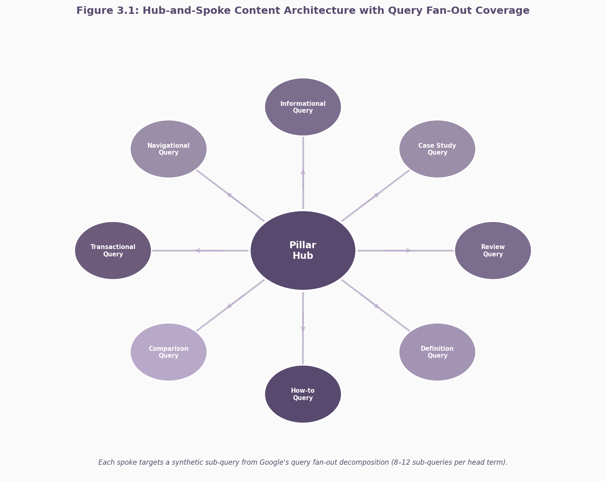

## 3. Content Depth and Topical Authority

Content richness is not a subjective editorial judgment in Google's ranking infrastructure. It is a mathematically computed property derived from vector embeddings, query decomposition, and semantic coverage metrics that operate at scale across billions of documents. The transition from keyword density to semantic coherence, which began with the Knowledge Graph in 2012 and accelerated through Hummingbird (2013), RankBrain (2015), BERT (2019), and MUM (2021), has reached a point where topical depth is now the dominant on-page ranking signal. The mechanisms that enforce this hierarchy are no longer theoretical; they are engineering fields confirmed by internal documentation, trial testimony, and patent filings.

### 3.1 How Google Measures Content Richness

#### 3.1.1 The API leak confirmed siteFocusScore, siteRadius, and siteEmbeddings as mathematical measures of topical concentration

The May 2024 Google Content Warehouse API leak exposed over 14,000 internal attributes, several of which directly operationalize topical authority as a measurable signal rather than a conceptual framework. The `QualityAuthorityTopicEmbeddingsVersionedItem` module contains three attributes of particular significance: `siteFocusScore`, which quantifies how concentrated a site is on a single topic; `siteRadius`, which measures how far an individual page's embedding deviates from the site's central theme; and `site2vecEmbeddingEncoded`, a compressed vector representation of the entire site's content that enables Google to compare topical identity across domains mathematically.[^1] These attributes transform topical authority from an abstract SEO concept into a computational quantity that can be optimized, diluted, or penalized.

The `siteFocusScore` functions as a specialist-versus-generalist discriminator. A site with a high `siteFocusScore` signals narrow, deep expertise; a low score indicates scattered topical coverage. `siteRadius` acts as a boundary enforcer: pages that deviate substantially from the site's central theme increase the radius and actively degrade the domain's perceived authority for its core topics.[^2] This creates a structural incentive for content pruning. When a site removes or consolidates off-topic pages, it reduces `siteRadius` and strengthens `siteFocusScore`—a direct, measurable improvement in Google's quality assessment. The `siteEmbeddings` and `pageEmbeddings` attributes store compressed vector representations of topics. Rather than matching keywords, these embeddings measure semantic relationships between concepts through cosine similarity in a high-dimensional vector space.[^3] This means two pages can discuss the same topic using entirely different vocabulary and still register as topically aligned if their entity relationships and contextual meanings are coherent.

The relationship between these signals and the broader E-E-A-T (Experience, Expertise, Authoritativeness, Trust) framework discussed in Chapter 2 is explicit. `siteFocusScore` and `siteRadius` map directly to the Expertise pillar, while `contentEffort`—an LLM-based estimation of human labor invested in content creation—serves as a proxy for Experience.[^4] Together, these signals form a quality stack that can gate a page before query-time ranking even begins. A page with strong individual metrics but a weak `siteFocusScore` can be disqualified by the `CompressedQualitySignals` module, which operates as a pre-ranking filter.

#### 3.1.2 Query fan-out architecture: Google's patent decomposes queries into 8–12 sub-queries, making cluster-based content structurally superior to single mega-articles

Google's patent US12158907B1, granted in December 2024, formalizes a retrieval architecture known as "query fan-out." Under this system, a single user query is decomposed into 8 to 12 synthetic sub-queries, each representing a distinct sub-intent or informational angle.[^5] The search system then retrieves documents against each sub-query in parallel and synthesizes the results into a unified response. This architecture is not limited to Google; every major generative AI search platform—ChatGPT, Perplexity, Gemini, and Google's own AI Mode—now employs a variant of query fan-out.

The structural implication for content strategy is decisive. A single 5,000-word article that addresses a head term comprehensively can only satisfy one or two sub-intents. A hub-and-spoke cluster with 15 to 25 spoke pages, each targeting a distinct sub-query, can satisfy 8 to 12 sub-intents simultaneously. Research from Position Digital (2025) found that content addressing five or more fan-out sub-intents has 3.2 times higher citation probability than single-intent pages.[^6] Surfer SEO's December 2025 analysis of 173,902 URLs found that pages ranking for fan-out queries are 161% more likely to be cited in AI Overviews, with a Spearman correlation of 0.77 between fan-out coverage and AI Overview citations.[^7] The counterintuitive finding is that coverage breadth across a cluster outperforms depth within a single page. Pages covering 26 to 50 percent of sub-queries across a cluster get cited more frequently than pages attempting 100 percent coverage within a single article.[^8]

#### 3.1.3 The Surfer 1M SERP study confirms topical coverage depth is the #1 on-page ranking factor

The empirical evidence for topical coverage as the dominant on-page signal comes from Surfer SEO's 1 million SERP study, published in July 2025. Analyzing one million unique search queries and the top 20 organic results per query, the study found that topical coverage depth—defined as the breadth and depth of related entities, facts, and subtopics included in a page—showed the strongest Spearman correlation with rankings of any on-page factor.[^9] The top 10 performing pages covered approximately 74 percent of the relevant facts and subtopics identified through competitor analysis; the bottom 10 averaged only 50 percent. A complementary analysis by Semrush, conducted across 300,000 SERPs, found that text relevance correlates at 0.47 with rankings—nearly double the strength of any authority metric.[^10] This finding reframes the hierarchy of ranking factors. While backlinks and domain authority remain significant, topical coverage depth operates as the primary on-page discriminator. A page with modest authority but comprehensive topical coverage can outrank a higher-authority page with thinner coverage.

#### 3.1.4 Word count is definitively NOT a ranking factor — Google officials confirm this is an SEO myth

Despite persistent correlation between longer content and higher rankings, Google has explicitly and repeatedly stated that word count is not a ranking factor. John Mueller, Google's Search Advocate, stated directly: "Word count is not a ranking factor. Save yourself the trouble." Danny Sullivan, Google's Search Liaison, reinforced this in 2023: "The best word count needed to succeed in Google Search is... not a thing! It doesn't exist."[^11] The confusion arises from correlation studies. Backlinko's widely cited research found that the average first-page result contains 1,447 words.[^12] However, this correlation reflects causation in reverse: longer content tends to rank higher because it more often covers topics comprehensively, not because the word count itself carries algorithmic weight. Yoast SEO confirms that "word count helps Google understand context and relevance, though it is not a direct ranking factor."[^13] The practical implication is that content strategists should abandon word count targets and instead optimize for topical completeness. A 1,200-word article that covers 74 percent of relevant subtopics will outperform a 3,000-word article that covers 50 percent, regardless of length.

[^1]: Hobo-Web, "Topical Authority: Site Radius & Site Focus Score from the Google Leak," 2026-06-24. https://www.hobo-web.co.uk/topical-authority/
[^2]: Search Engine Land, "Unpacking Google's massive search documentation leak," 2024-05-30. https://searchengineland.com/unpacking-googles-massive-search-documentation-leak-442716
[^3]: Kopp Online Marketing, "Google API Leak: Ranking factors and systems," 2024-07-11. https://www.kopp-online-marketing.com/google-api-leak-ranking-relevant-systems-and-metrics
[^4]: wise-relations.com, "Google API Leak 2024: Die echten Ranking-Signale," 2026-05-23. https://wise-relations.com/seo/google-api-leak/
[^5]: Astiva AI, "Query Fan-Out: How AI Search Breaks Traditional SEO," 2026-06-19. https://astiva.ai/blog/query-fanout
[^6]: Astiva AI, "Content Hubs for AI Visibility: 2026 Playbook," 2026-06-19. https://astiva.ai/blog/content-hubs-ai-visibility
[^7]: Ekamoira, "Query Fan-Out: Original Research," 2026-01-27. https://www.ekamoira.com/blog/query-fan-out-original-research-on-how-ai-search-multiplies-every-query-and-why-most-brands-are-invisible
[^8]: Astiva AI, "Content Hubs for AI Visibility," 2026-06-19.
[^9]: Surfer SEO, "Ranking Factors in 2025: Insights from 1 Million SERPs," 2025-07-21. https://surferseo.com/blog/ranking-factors-study/
[^10]: Lawrence Hitches, "AI Search Ranking Factors Guide," 2026-05-09. https://www.lawrencehitches.com/ai-search-ranking-factors/
[^11]: Rankability, "Is Word Count a Google Ranking Factor? Debunked 2025," 2025-01-01. https://www.rankability.com/ranking-factors/google/word-count/
[^12]: Backlinko, via Rankability, "Average first-page word count study," cited 2025.
[^13]: Yoast, "Word count and SEO: how long should an article or page be?," 2025-12-22. https://yoast.com/blog-post-word-count-seo/

### 3.2 The Hub-and-Spoke Architecture Advantage

The algorithmic signals described in Section 3.1 do not operate on isolated pages. They evaluate content as a network of interrelated topics, and the architectural model that best satisfies this evaluation is the hub-and-spoke cluster. In this architecture, a central pillar page (the hub) links to and receives links from multiple spoke pages, each addressing a specific sub-topic or sub-intent. The internal linking structure creates a semantic web that signals topical depth to both Google's ranking systems and generative AI retrieval engines.

*Figure 3.1* illustrates the hub-and-spoke architecture. The central pillar hub serves as the topical anchor, while eight spokes radiate outward, each targeting a distinct sub-query type generated by Google's query fan-out decomposition. Bidirectional links between the hub and each spoke create a dense semantic network that AI retrieval systems can traverse to identify authoritative sources. The spoke pages represent the eight most common sub-intent categories—informational, navigational, transactional, comparison, how-to, definition, review, and case study—that Google's patent identifies as the standard decomposition pattern for a single head query.

#### 3.2.1 Hub-and-spoke cluster architecture raises AI citation rates from ~12% to 41%

Industry research from multiple sources converges on a striking finding: hub-and-spoke internal linking raises AI citation rates from approximately 12 percent to 41 percent on pillar-topic queries.[^14] The mechanism is structural. AI retrieval systems evaluate content as a network of interrelated topics. A cluster with five or more interconnected pages on a topic signals topical depth in a way that isolated pages cannot replicate. The Yext 2025 AI Citation Study, analyzing 6.8 million AI citations across platforms, found that 86 percent of AI citations come from sites with five or more interconnected pages on a topic, and bidirectional internal linking increases citation probability by 2.7 times.[^15] This suggests that the cluster architecture itself is a citation signal independent of the content quality of any individual page. Clustered content also ranks persistently longer than standalone pieces—approximately 2.5 times longer—suggesting that the semantic network creates resilience against algorithmic updates and competitive pressure.[^16]

#### 3.2.2 Pages covering 5+ fan-out sub-intents have 3.2× higher citation probability than single-intent pages; covering 26–50% of sub-queries across a cluster outperforms 100% coverage in one page

The query fan-out architecture described in Section 3.1.2 creates a specific optimization constraint: content distribution across a cluster is more valuable than concentration within a single page. Research by Position Digital (2025) found that pages addressing five or more fan-out sub-intents achieve 3.2 times higher citation probability than single-intent pages.[^17] The optimal coverage strategy is counterintuitive: covering 26 to 50 percent of sub-queries across a cluster generates more citations than covering 100 percent of sub-queries within a single page. This finding challenges the "mega-article" approach that has dominated content marketing for the past decade. A single 10,000-word guide that comprehensively addresses every aspect of a topic provides only one retrieval entry point for query fan-out systems. In contrast, a cluster of 15 spoke pages, each addressing 2 to 4 sub-intents, provides 15 retrieval entry points. Google's parallel retrieval architecture can match more sub-queries against the cluster, increasing the probability that any given page in the cluster will be cited.

#### 3.2.3 Coffee site case study: zero initial domain authority → 87,000 monthly visitors and $15,200/month revenue in 14 months via topical cluster strategy

The theoretical advantages of cluster architecture translate into measurable business outcomes. A coffee site case study published by OrganicArbitrage in March 2026 documented growth from zero initial domain authority to 87,000 monthly visitors and $15,200 per month in revenue within 14 months, achieved entirely through a topical cluster strategy without backlink acquisition.[^18] The site deployed a hub-and-spoke architecture consisting of a 3,000-word pillar page and 18 spoke pages, each targeting a distinct sub-topic within the coffee domain.

| Metric | Isolated Single Page | Hub-and-Spoke Cluster | Differential |
|--------|---------------------|----------------------|-------------|
| AI Citation Rate (pillar queries) | ~12% | ~41% | +241% |
| Organic Traffic Lift (vs. baseline) | Baseline | 30–43% | +30–43% |
| Ranking Persistence (months) | Baseline | 2.5× longer | +150% |
| Time to First Ranking (new domain, no backlinks) | Often fails | 60–120 days | Structural |
| Pages Within 3 Clicks of Homepage (traffic multiplier) | Baseline | 9× more | +800% |
| Domain Authority Growth (HubSpot study) | Baseline | 49 → 60 | +22% |
| Page 1 Keyword Rankings (Conductor study) | Baseline | +328% | +328% |

The differential analysis reveals that cluster architecture is not merely an incremental improvement but a structural advantage. The 241 percent increase in AI citation rates represents a categorical shift from occasional visibility to consistent presence in generative search results. The nine-times traffic multiplier for pages within three clicks of the homepage demonstrates that cluster architecture improves crawl efficiency and link equity distribution in ways that isolated pages cannot replicate. The HubSpot study documented domain authority growth from 49 to 60 after cluster restructuring, and the Conductor study found a 328 percent increase in Page 1 keyword rankings after implementing hub-and-spoke architecture.[^19] These findings suggest that cluster architecture expands the total addressable keyword universe for a domain, not just the ranking of existing target terms. For a new domain with zero backlinks, the 60-to-120-day timeline to first rankings demonstrates that topical depth can compensate for the absence of traditional authority signals.

#### 3.2.4 Internal linking as the primary structural mechanism: 40–44 internal links per page with varied anchor text show the strongest traffic correlation; 5–10 contextual links per 2,000 words

The technical mechanism that makes hub-and-spoke architecture effective is internal linking. Research by Authority Hacker, analyzing over one million websites, found that proper internal linking boosts rankings by up to 40 percent, with pages within three clicks of the homepage generating nine times more SEO traffic than deeper pages.[^20] The optimal internal link density appears to be 40 to 44 unique internal links per page, with varied anchor text that includes relevant keywords rather than generic phrases. For content length, the recommended density is 5 to 10 contextual internal links per 2,000 words.[^21] These links should connect related topics within the cluster, creating bidirectional pathways between the hub and spokes and, where appropriate, lateral connections between spokes. The Cornell Design Group's research on topical authority through internal linking emphasizes that descriptive anchor text helps AI systems understand the relationship between linked pages, improving both traditional and AI search visibility. The internal linking structure serves a dual function. For Google's crawlers, it distributes PageRank and establishes topical hierarchy through `OnSiteProminence`, a signal that evaluates page significance by simulating traffic flow from the homepage.[^22] For AI retrieval systems, the anchor text and surrounding context provide semantic signals that help determine which pages to cite for specific sub-queries.

[^14]: FuelOnline / DigitalApplied / EcorpIT, "Hub-and-Spoke AI Citation Rates," 2026. https://ecorpit.com/best-internal-linking-tools-2026/
[^15]: Yext 2025 AI Citation Study, via Intercore, "Spoke Pages (Cluster Content)," 2026-02-10. https://intercore.net/education/spoke-pages-cluster-content/
[^16]: Whitehat SEO / SearchLab, "Cluster Content Ranking Persistence," 2026.
[^17]: Position Digital (2025), via Astiva AI, "Content Hubs for AI Visibility," 2026-06-19.
[^18]: OrganicArbitrage, "Topical Authority Case Study: From Zero to $15,000/Month in 14 Months," 2026-03-20. https://organicarbitrage.com/articles/case-study-topical-authority-zero-to-15k
[^19]: HubSpot, via Intercore, "Spoke Pages (Cluster Content)," 2026-02-10. https://intercore.net/education/spoke-pages-cluster-content/; SearchLab, "Content Marketing Statistics 2026," 2026-03-17. https://searchlab.nl/en/statistics/content-marketing-statistics-2026
[^20]: Authority Hacker, via Intercore, "Spoke Pages Cluster Content Guide," 2026-02-10. https://intercore.net/education/spoke-pages-cluster-content-guide/
[^21]: Koozai / Beasley Direct, "Internal Linking Best Practices," 2025-11-19.
[^22]: StanVentures, "Google SEO Leak 2024: Top 10 Ranking Factors Revealed," 2025-06-07. https://www.stanventures.com/news/top-10-google-ranking-factors-leaked-in-2024-284/

### 3.3 Information Gain and the End of the Skyscraper Technique

The signals discussed in Sections 3.1 and 3.2 measure topical coverage and architectural coherence. A separate but equally critical signal measures originality: Information Gain. Google's patent US11354342B2, granted in June 2022, formalizes a scoring system that rewards content providing net-new information beyond what existing top results already deliver. This signal has emerged as the primary differentiator between content that ranks and content that is ignored, and it has rendered the Skyscraper Technique—the dominant link-building methodology of the past decade—structurally obsolete.

#### 3.3.1 Google's Information Gain patent (US11354342B2, granted June 2024) rewards net-new information beyond what existing top results provide

The "Information Gain" patent, formally titled "Contextual Estimation of Link Information Gain," assigns a score to documents based on "additional information that is included in the document beyond information contained in documents that were previously viewed by the user."[^23] The patent uses the phrase "automated assistant" 69 times and "search engine" only 25 times, suggesting it was designed primarily for conversational AI systems but applies to ranking evaluation as well. The patent's mechanism is conceptually straightforward but computationally sophisticated. Google's systems compare the information content of a candidate document against the aggregate information content of documents already ranked in the top results for a query. If the candidate provides substantially new facts, data, frameworks, or perspectives not present in the existing corpus, it receives a high Information Gain score. If it merely reorganizes or paraphrases information already available in the top 10, it receives a low score. Industry analysis suggests the March 2026 core update operationalized Information Gain at scale, with pages containing proprietary data or first-hand case studies gaining 15 to 25 percent visibility, while templated and rewritten content dropped 30 to 50 percent.[^24]

#### 3.3.2 High Information Gain scores produce +15–22% visibility improvements; thin, templated content drops 30–50%

The empirical evidence for Information Gain as a ranking signal comes from multiple independent analyses. SE Ranking's March 2026 study found that sites publishing original data and unique perspectives gained an average of 22 percent visibility, while AI-paraphrased content that reshuffled existing information into new words lost 71 percent of traffic.[^25] Digital Applied's analysis of the March 2026 update documented a 15 to 25 percent visibility improvement for pages with proprietary data, and a 30 to 50 percent drop for thin, templated content.[^26] The mechanism is consistent with the consensus-Information Gain axis described in topical authority research. Google's systems enforce consensus as a quality floor—content must cover the same entities and facts as top-ranked pages to be considered relevant—but reward originality as a ranking differentiator.[^27] A page that hits every entity in the SERP but adds no new information scores high on topical coverage and zero on Information Gain. Conversely, a page with unique research but thin coverage may score high on Information Gain and low on topical coverage. The optimal strategy is to satisfy both: comprehensive coverage of consensus topics plus original contributions that extend beyond the existing corpus.

| Signal | Leaked Attribute / Patent | Measurement Mechanism | Strategic Implication |
|--------|--------------------------|----------------------|----------------------|
| Topical Focus | siteFocusScore | Vector embedding concentration across site | Specialist sites outperform generalists; prune off-topic content |
| Thematic Coherence | siteRadius | Page-to-site embedding deviation | Every page must align with the site's central theme |
| Semantic Coverage | siteEmbeddings, pageEmbeddings | Compressed topic vectors (site2vec) | Entity relationships matter more than keyword density |
| Content Effort | contentEffort | LLM-based labor and originality estimation | Human oversight and original research are required |
| Query Sub-Intent Coverage | US12158907B1 (query fan-out) | 8–12 synthetic sub-queries per head term | Cluster architecture is structurally superior to mega-articles |
| Information Gain | US11354342B2 | Novelty relative to existing top results | Net-new information is the primary ranking differentiator |
| Internal Link Equity | OnSiteProminence | Simulated traffic flow from homepage | Pages within 3 clicks of homepage generate 9× more traffic |

The table synthesizes the signals from the API leak and patent filings into an actionable framework. `siteFocusScore` and `siteRadius` function as boundary conditions that constrain what content a site can successfully rank for. `siteEmbeddings` and `pageEmbeddings` provide the semantic substrate that determines whether a page matches a query's intent. `contentEffort` gates the ranking process by evaluating whether the content demonstrates genuine investment. The query fan-out and Information Gain patents define the structural and qualitative requirements for visibility in the current algorithmic environment. Together, these signals form a coherent system that rewards sites with focused expertise, deep topical coverage, original contributions, and strategic internal architecture. The competitive moat created by Information Gain is sustainable because it requires genuine research, not optimization. Adding personal anecdotes, first-party data, original frameworks, or expert interviews produces Information Gain that AI systems cannot easily replicate.

#### 3.3.3 The Skyscraper Technique success rate plummeted from 10–20% to 1–3% because "more comprehensive" no longer equals "better" — originality is now the differentiator

The Skyscraper Technique, introduced by Brian Dean in 2013, was built on a simple premise: find the best content for a keyword, create something more comprehensive, and reach out to sites linking to the original. For a decade, this was the dominant link-building methodology in SEO. In 2025, the technique's success rate has collapsed from 10 to 20 percent to 1 to 3 percent for most practitioners.[^28] The failure is not tactical but structural. The original premise—that "more comprehensive" equals "better"—assumes a ranking system that rewards coverage depth alone. Google's shift toward Information Gain means that comprehensiveness without originality is now penalized, not rewarded. A page that adds 2,000 words to an existing 3,000-word guide but introduces no new information scores high on word count and low on Information Gain. The additional coverage may even dilute the signal by adding redundant content that the retrieval systems have already classified as low-value.

Search Engine Land's 2025 analysis confirms that "the content that earns links in 2025 offers something genuinely unavailable elsewhere: original research, exclusive access, proprietary tools, or insights that can only come from your unique position in the market."[^29] The outreach templates that defined the Skyscraper era—"I noticed you linked to [outdated resource]. I've created something 10x better"—are now instantly recognizable as spam by webmasters and ignored by the algorithmic systems that evaluate Information Gain. The strategic implication is that content creation must shift from "better than the top 10" to "different from the top 10." The competitive advantage is no longer editorial execution. The advantage is information access: proprietary data, first-hand experiments, expert networks, and original research that cannot be replicated by competitors. The Skyscraper Technique died because it optimized for a signal—coverage—that Google no longer uses as a primary differentiator.

[^23]: Search Engine Journal, "Google's Information Gain Patent," 2025-02-12. https://www.searchenginejournal.com/googles-information-gain-patent-for-ranking-web-pages/524464/
[^24]: Digital Applied, "Information Gain: Google's #1 Ranking Signal in 2026," 2026-04-18. https://www.digitalapplied.com/blog/information-gain-google-ranking-signal-april-2026
[^25]: LoudScale, "How to Improve Google EEAT for SEO," 2026-04-30. https://loudscale.com/blog/improve-google-eeat-seo/
[^26]: Digital Applied, "Information Gain: Google's #1 Ranking Signal," 2026-04-18.
[^27]: Advanced Web Ranking, "The Consensus-Information Gain Axis," 2026-06-26. https://www.advancedwebranking.com/blog/consensus-and-information-gain-for-ai-search-visibility
[^28]: Search Engine Land, "The skyscraper technique's surprising transformation in the AI era," 2025-11-27. https://searchengineland.com/guide/skyscraper-technique
[^29]: Search Engine Land, "The skyscraper technique's surprising transformation," 2025-11-27.
